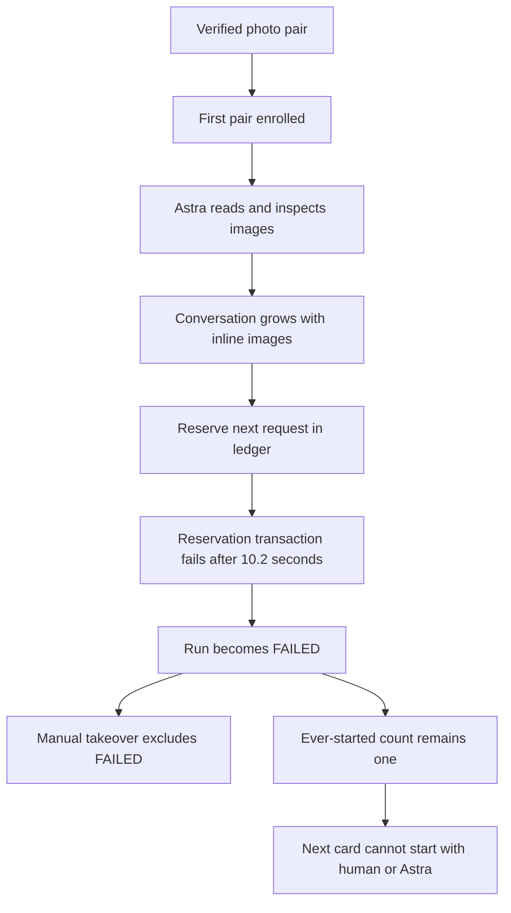
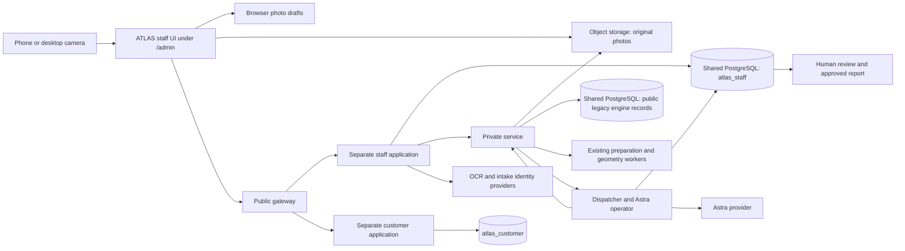

# ATLAS architecture dissection — failed fresh-card acceptance

**Assessment date:** September 11, 2026. **Examined release:** `89c55d916130d914f6a989197538c8bbd31c9594` (I). **Outcome:** deployment succeeded; real grading acceptance failed. This audit makes no new application deployment or production data change.

**Fresh Astra extra-high follow-up:** [matched timeout investigation](timeout-investigation.md) completed September 11 Pacific / September 12 UTC. Current-guard, exact-length isolated tests and the real stubbed operator loop passed; native read-only profiles confirm overhead without reproducing the incident. Server slow-statement/lock logging is enabled, but access to its historical logs remains unavailable. This narrows the diagnosis; it does not close the initiating-cause question or fix the serving application.

**Authenticated console follow-up:** Mark signed in. The [new investigation](database-console-followup.md) found aggregate lock-statement maxima up to 62.96 seconds and unlimited slow-query parameter logging absent from the local fixture. These establish long delays and a previously untested amplifier, not the incident's exact cause. Only recent log lines were visible. Mark will relay a prepared inquiry to DigitalOcean's AI assistant; no outside message or production change was made by this task.

**Provider reply and logging test:** Mark returned the AI reply reporting unavailable historical logs. The [review and controlled experiment](provider-reply-review.md) correct its setup advice and measure logging amplification separately. Both current-guard cases passed at the real threshold with no qualifying slow statements; a forced logging-cost sample does not reproduce the timeout. No production change occurred; the cause prerequisite remains open.

## Decision

Keep the existing grading, geometry, preparation, map and review engines. Substantially simplify the execution and persistence layer around them, and rebuild the capture scheduling path where necessary. The current evidence does **not** justify discarding the entire platform or inventing new grading engines.

The first fresh card failed during capture/identity orchestration, before any source preparation/grading operation was recorded. The surrounding workflow contains confirmed dead ends for both automatic continuation and manual takeover. Its repeated large-payload validation, global transaction lock and image transport paths provide concrete reasons for heaviness. This is larger than a wording fix or one SQL parsing optimization, but smaller than a complete V3 platform rebuild.

This is an evidence-backed map of the connected ATLAS paths and relevant shared database, with detailed source inventories below. It is not a claim that every line of every unrelated Ten Kings service has been proven correct, or that the deterministic grading engines have passed end-to-end acceptance on this fresh pair.

## What the failed test establishes

Two different cards matter. The phone-captured JPEG card is `b56f75a9-0483-433e-801f-d139f7716fe9`; the subsequently uploaded Charmander PNG pair is `9684574e-bd74-4228-8c82-ad40b78aa7e2`. Treating both as one failure conceals the capacity rule.

| Observation | Evidence and implication |
| --- | --- |
| First-pair enrollment worked | One `WORKSPACE_FIRST_PAIR_ADMITTED` event; first card owns an Astra run. The old manual UUID-admission problem is not the immediate blocker. |
| First run stopped | Run `ef58fb8f-67d8-4996-b53a-dad72fb53907`: `FAILED`, control state `RUNNING`, failure `ASTRA_DATABASE_TRANSACTION_FAILED`; card stored as `IN_PROGRESS` / `IDENTITY`. |
| All three provider attempts were applied | No fourth attempt exists. There is no unresolved provider attempt in this run at the observation time. No source preparation/grading operation was recorded. |
| Latest failure was before another provider call | At 18:31:29 UTC, ledger `reserve` failed with Prisma `P2028` after **10,215 ms**. The UI's generic “could not confirm its saved progress” does not distinguish request reservation from response saving. |
| Other ledger operations also failed | Earlier `reserve`, `applyTool`, `claim` and cleanup `stop` failures include transaction timeouts, 15-second runner timeouts and a 5-second pool wait timeout. This is broader than one response-save function. |
| Second card cannot start | It is `WAITING` / `PHOTOS`, revision7. The cohort permits only one distinct card ever started. The failed first card consumes that allowance. |
| First card cannot be taken over | Terminal `FAILED` is outside the allowed takeover states, even when its provider attempts are settled. The SQL guard also makes the failed run terminal. |
| Container did not crash | The live I process had zero restarts and no OOM. Its idle sample was 393.5 MiB of 2 GiB. This does not establish its peak CPU/memory during failure. |

### Failure chain

The reservation failure and the two dead ends are confirmed. Conversation growth is observed along this sequence; its exact contribution to the failure is not yet isolated. The precise SQL statement or lock wait accounting for the complete 10,215 ms remains unproven: existing app logs record operation/category/duration, not per-query timings. PostgreSQL `pg_stat_statements` is not installed in accessible `defaultdb`; subsequently obtained provider aggregates still lack incident timestamps. We should not substitute a plausible expensive query for that missing measurement.

## Why saving exists, and what is excessive

Recording request identity, results and completed stage changes supports restart recovery, prevents losing useful work and distinguishes a repeated command from a genuinely new paid request. Those are practical requirements. They do not require rechecking the whole database and all prior image bytes at every bookkeeping action.

The actual renewal cadence is an immediate lease renewal before external work and another approximately every **10 seconds** while waiting (`leaseMs / 3`, with a 30-second lease). UI polling is separate: card/activity reads follow a four-second delay, queue reads a six-second delay, and automatic pickup a five-second delay. These are not all “saves,” but they add repeated server/database work.

The current operator transaction generally:

1. Rechecks the database role and effective grants, including every application table column.
2. Takes the same global advisory transaction lock used by staff access.
3. Validates control and pilot records, reads and locks the run, and parses/canonicalizes/hashes its full continuation.
4. Locks and validates the workspace, then performs the requested operation.
5. Forces deferred constraints before commit, invoking the relevant SQL validation paths.

The full run's current continuation is **12,207,165 bytes**. Requests grew from **10,872 → 5,541,516 → 9,005,493 bytes** across the three attempts. Renewals still pass through full run validation even where their eventual UPDATE changes only lease metadata. SQL delivery checks also revisit retained inline images. Large immutable content and frequently changing coordination fields should not share this hot path.

The global lock serializes otherwise independent staff/operator transactions. Moving catalog checks to startup/release validation, using per-card or per-run coordination, keeping lease state small, and verifying immutable content once when admitted are concrete simplifications. Preserve authorization and correct ownership in the small per-command checks.

**Counterevidence matters:** an idle live profile of the coordinator's largest column-privilege SELECT took **91.7 ms**, returning 2,819 rows / about 466 KB as JSON. It is wasteful repeated work, but that result does not by itself explain a 10-second timeout. The existing local large-image PostgreSQL fixture passed both before and after I; it never reproduced this production failure. The prior isolated parser speedup therefore did not prove a faster or reliable real workflow.

## Capture and upload: where time goes

The owner's screenshot measures **35.3 seconds first-photo-to-queue**, including time between photographs:

| Reported segment | Time |
| --- | ---: |
| Front preparation | 1.4 s |
| Back preparation | 0.6 s |
| Upload and verification | **16.5 s** |
| OCR and identification provider segment | 6.4 s |
| Queue confirmation | 0.8 s |

These segments are not a complete additive trace. In particular, the displayed OCR/identification duration excludes earlier original-image retrieval, derivative creation and some database preparation. It is inappropriate to attribute the remaining time entirely to the user or to Astra inference.

The live database confirms Front **16,010,165 bytes** and Back **14,086,359 bytes** for the HEIC-imported PNGs: **30,096,524 bytes total** at the photographed pixel dimensions. A retained local test of the same named HEIC files measured **3,176,277 bytes** before conversion: **9.48 times as many upload bytes**, not a measured 9.48-times latency claim. Native phone JPEGs on the first card totaled about 15 MB; the PNG expansion does not explain that card's separate ledger failure.

Current ATLAS intake waits for both sides to be prepared. It then creates the card, plans Front and Back uploads in sequence while their PUT transfers overlap, waits for both transfers, verifies Front and then Back, identifies the pair and finally queues it. One intake orchestration slot covers the whole upload/identify/queue path across cards. Camera capture of the next card is allowed independently, but the active capture button awaits its initial local IndexedDB write.

Verification reads the original object and checks its bytes/dimensions. Identification then retrieves both originals again across the private-service-to-staff-app boundary and derives smaller images. Browser HEIC conversion already runs in workers, and IndexedDB already stores immutable photo blobs once. Repeated full-blob IndexedDB rewrites and a main-thread HEIC encoder are **not** established causes.

### Two Ten Kings comparisons, not one

| Path | Useful difference |
| --- | --- |
| Main Ten Kings inventory capture | JPEG capture; starts the Front upload while the person captures subsequent views; OCR runs outside blocking finalization. It is a Front/Back/Tilt inventory flow. |
| Speedster V2 capture | Independent Front/Back upload → verification → geometry chains run together; already-uploaded iPhone Shortcut images can avoid browser reupload. |
| Current ATLAS | Pair-level sequential control operations, sequential verification, an extra original-image retrieval path, identification before queue completion and pilot-specific admission. |

Recommended capture work: start each side's transfer as soon as that side is ready; give sides independent versioned receipts; run side verification/preparation concurrently; reuse verified image descriptors/derivatives; keep identification and next-card capture from blocking each other. For HEIC, evaluate a grading-qualified encoding/import route rather than mandating giant PNG transport.

A bounded local codec experiment retained the 3024×4032 pixel grid and produced a 7.35 MB JPEG 95 pair or 10.10 MB JPEG 98 pair from the 30.10 MB PNGs. This is an engineering option, **not proof that compression preserves every grading defect or color measurement**. Targeted edge/surface/color comparison is required before choosing that evidence encoding. Existing native JPEG acceptance shows that full-size PNG is not a universal input requirement.

## Current system map

### Automatic operation is incomplete beyond the happy path

The dispatcher can advance capture proposals → Front/Back preparation → initial deterministic report → Astra review → human review when preparation and map conditions succeed. It does not implement every middle-stage correction a human can make.

Report tools inspect and measure an existing centering boundary; they do not save an adjusted boundary. Identity/finding correction tools produce proposals for human review. A proposed missed-region inspection does not itself run detection and recompute the report. Source initialization can automatically resolve/register maps, so maps are not universally manual; an unaccepted map/preparation result can nevertheless stop the automatic path without a machine correction loop. Fixing the ledger alone cannot establish the requested full autonomy.

There is also a built-in inference latency floor: capture requires at least four serial Astra responses to read originals, propose Front boundary, propose Back boundary and submit preparation, with additional responses for identity/crops. The protocol accepts one tool call per response. The owner requested Astra MAX, not a separate MAX round trip for every small bookkeeping/proposal step. Combine a coherent capture assessment into one structured action when the evidence allows, and use the same deterministic action ports for human and machine corrections. Keep final human approval separate.

The ATLAS extraction and implementation introduced an independent staff app, private service bridge, additional roles/controls, workflow records and transport boundaries around the reused engines. A different hostname alone is not a plausible explanation. The audit compares the actual new request paths.

The live shared PostgreSQL database is about 2.14 GB, has a 25-connection maximum and contains 141 `public`, 59 `atlas_staff` and 9 `atlas_customer` ordinary tables; migration-ledger tables are included. The installed staff schema has 155 functions and 247 noninternal trigger instances. Counts measure surface area, not defect counts. The largest tables include unrelated legacy inventory data; no evidence supports deleting that data to repair this failure.

Only 17 connections were present in the idle sample, including the audit read and administrative/background sessions. This does not prove the pool had capacity during the earlier `P2024`. The container's cumulative 16.4 GB inbound network counter is also not a measured database-only traffic total.

Workspace, source, grading, image and operator controls were enabled in the live sample. Learning, NFC and identity-correction control tables had no configured rows in that read. The sole active reviewer had neither current certification nor trusted-learning qualification. The former is a later report-approval blocker, not the current capture/claim failure; the latter pertains to a separate learning workflow. Planned `CardIdentityCatalogV2`, `PackTypeV2`, `PackV2` and `ShipmentV2` models are absent from the current schema. Existing `CollectibleCardV2`, ownership and inventory records belong to the separate implemented Ten Kings domain; ATLAS report approval does not create them.

## Repair order and acceptance

| Priority | Concrete change | What must demonstrate success |
| --- | --- | --- |
| 1 | Make a settled transient database failure resumable and manually claimable through one consistent state transition. Preserve genuine unresolved-provider handling separately. | Inject failure before dispatch and after a settled tool result; resume without replaying an applied action; manual takeover remains available. |
| 2 | Separate small run/lease state from immutable prompts/images/receipts; use explicit small projections; remove full-payload validation from heartbeat/status paths; scope locks to actual contention. | Profile actual native transactions with 12 MB-plus realistic continuation and simultaneous desktop/phone observation; identify query, lock, transfer and JS time separately. No lease loss or expired transaction. |
| 3 | Bound provider context and image delivery instead of repeatedly accumulating inline image history. | Full card proceeds beyond identity through both sides and report without hitting the 12 MiB continuation/request limit. |
| 3 | Combine related capture proposals and implement human/machine parity for the required middle-stage correction actions. | Astra can correct a bad boundary, handle an accepted map disposition and invoke actual missed-region analysis/recomputation through the same tools, without requiring a human to perform each correction. Final approval remains human. |
| 4 | Pipeline per-side capture and eliminate repeated original transfer/processing. | Measure native JPEG and HEIC on the same phone/network: shutter availability, preparation, bytes transferred, verification, identification and queue separately, including p50/p95. |
| 5 | Replace pilot-shaped admission with the intended normal queue once the owner-selected acceptance boundary is satisfied or explicitly changed. | One failed/completed card does not consume normal capacity forever; next eligible card starts automatically. Test human and Astra claims. |
| 6 | Complete reviewer readiness and prove the whole workflow. | Actual fresh photos → autonomous grading → usable manual stage controls → final human review and approved report. Reopen/reload/mobile interruption must preserve correct stage/ownership. |

Use measured product budgets, not promises of “10×” or “100×.” Agree acceptance targets for capture latency and full grading duration after collecting an equivalent Ten Kings/ATLAS baseline with the same photos, network, device, model settings and workload. There is currently no controlled comparison establishing those factors.

The pilot's ten-card intake / one-distinct-card acceptance restriction is documented owner direction. Per-transaction whole-catalog scans, full-image heartbeat validation and an unrecoverable settled `FAILED` state are implementation choices. Those should not be defended as inherent grading requirements. Human final approval and customer/staff separation are actual product requirements and are not the source of this identity-stage timeout.

## Detailed dissection and evidence

- [Operator transactions, state transitions, timeouts and repair design](operator-dissection.md)
- [Capture/upload/Speedster comparison and codec experiment](capture-comparison.md)
- [Architecture, service/role map and IF/THEN rule inventory](architecture-rules.md)
- [Live database table inventory](database-inventory.md)
- [Protected receipt index and limitations](evidence.md)

No application behavior was changed during this audit. The deployed system still has the identified blockers. Prior release receipts are historical evidence, not proof that this fresh test passed. The next implementation should follow this integrated repair scope and demonstrate the complete real-card workflow before being described as fixed.
