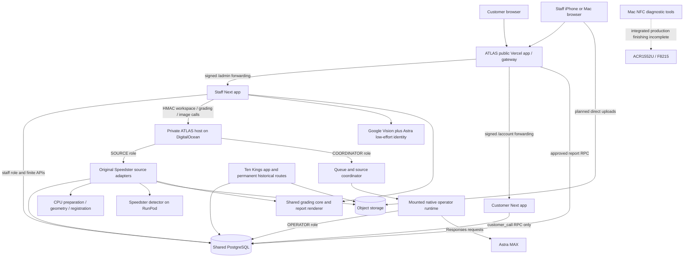
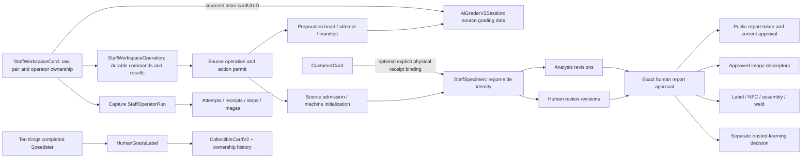

# ATLAS architecture, data, human workflow and rule audit

Read-only inspection, September 11, 2026. Source checkout: `bd6ff5d058cb4a53c542025d4b4715a5f934ad08`; deployed application source: `89c55d916130d914f6a989197538c8bbd31c9594`. The intervening head records documentation. No source, database, provider, account, host, card or hardware mutation was performed by this audit. File references below are relative to `/Users/markthomas/.codex/worktrees/ecd7/ten-kings-mystery-packs-clean` unless linked otherwise. The table appendix provides clickable source locations.

## Decision

**Keep the grading core, image evidence, report revisions and historical identities. Simplify and partly replace the workflow control around them. The evidence does not justify rebuilding the whole ATLAS/Ten Kings platform or minting a third card identity.**

The most immediate failures are concrete orchestration defects and pilot rules, not evidence that the deterministic grading formulas must be replaced:

1. A card that has ever started consumes the cohort's processing allowance forever. With the live allowance at one, the next waiting card cannot be claimed by either Astra **or a human**. This is an intentional implementation of the current owner-selected one-distinct-card pilot, but the screen does not make its lifetime meaning clear.
2. An Astra run that reaches terminal `FAILED` cannot be taken over manually, even if every paid attempt is settled. This is an implementation dead end. It blocks the already-admitted card, so it is not explained by the one-card pilot.
3. Ordinary application work repeatedly revalidates whole-database effective grants and exact deployment controls; staff transactions share one global advisory lock. Those mechanisms add database work and broad coupling around simple card operations. Their exact latency contribution needs measured isolation; their presence and scope are directly visible in code.
4. ATLAS has useful manual tools, but they are reachable only under an exact human claim and stage eligibility. The operator owns a different capture/report state machine and proposes review changes; the parent operator audit covers the remaining gap between proposing and actually operating every grading tool.

The recommended direction is a smaller shared workflow with a reliable human takeover path, retaining separate public/staff authority and the existing deterministic source tools. Do not hide the current failures by increasing timeouts alone, repeatedly rotating cohorts, inventing a budget, or deleting the previous requests.

## Live evidence and what it establishes

The parent produced two read-only receipts, which this audit opened:

- [Fresh card metadata at 18:54:14 UTC](/Users/markthomas/.codex/atlas-handoffs/atlas-fresh-start-20260911/fresh-progress-1789152854750.json): active cohort `ee83f95e-b3c5-47a9-8ccf-059612b97919`, `maxCards=10`, `processingLimit=1`, exactly one automatic enrollment event. Card `b56f75a9-0483-433e-801f-d139f7716fe9` is stored `IN_PROGRESS / IDENTITY`, revision 10. Run `ef58fb8f-67d8-4996-b53a-dad72fb53907` is `FAILED / CAPTURE_REVIEW`, revision 4, `controlState=RUNNING`, no lease, failure `ASTRA_DATABASE_TRANSACTION_FAILED`. Its three recorded attempts are all `APPLIED`; request sizes are 10,872, 5,541,516 and 9,005,493 bytes. The source-work list is empty. The second card, `9684574e-bd74-4228-8c82-ad40b78aa7e2`, is `WAITING / PHOTOS`, revision 7.
- [Current private-host diagnostics](/Users/markthomas/.codex/atlas-handoffs/atlas-architecture-audit-20260911/live-operator-failures-1789152997216.json): the final reserve operation logged Prisma `P2028` after 10,215 ms at 18:31:29 UTC. Earlier events include ledger timeouts, apply/claim transaction failures and one pool timeout. The current I container was running, had no OOM, no restart, and retained its source identity. A later quiet CPU/memory snapshot does not establish resource conditions at each failure.

The later [live catalog and controls at 19:02:57 UTC](/Users/markthomas/.codex/atlas-handoffs/atlas-architecture-audit-20260911/live-catalog-1789153377362.json) shows PostgreSQL 17.11, a 2,139,461,299-byte shared database, `max_connections=25`, and the current run continuation at **12,207,165 bytes**. Workspace, SOURCE, OPERATOR, grading bridge and image controls are enabled. Workspace claims/preparation/Astra/intake are true, with expiry September 16 at 20:41:57.762 UTC. The sole nonrevoked REVIEWER has **no currently valid certification or trusted-learning capability**. No control rows exist for NFC, trusted learning or identity correction: those are **unconfigured capabilities**, not false rows or accepted physical workflows.

The live installed catalog has 155 staff functions (116 SECURITY DEFINER), 11 customer functions and 41 public functions. Staff has 58 application tables plus its migration ledger. The parent's catalog reports 247 noninternal trigger instances; this is a different measure from distinct trigger names visible in static CREATE declarations.

These receipts establish actual new-card enrollment and model activity, but **no completed grading, report, human approval or physical finish**. They do not identify the exact SQL statement responsible for the final timeout. The original saved receipts and known/unknown charges remain evidence. Recovery of earlier retired test cards is canceled; this report does not reinstate it.

The zero-card observation was true at 14:33 UTC and is historical after the new capture. The current-state handoff now records the later failure; the dated original observation remains historical evidence.

## Product authority versus implementation choices

The full owner-approved blueprint was read. Its later ATLAS amendments narrowly supersede relevant earlier assumptions; they do not make every implementation guard a product requirement.

| Class | Actual authority | Audit interpretation |
|---|---|---|
| Product essentials | Blueprint lines 13–29, 76–83, 102–106 | Reuse deterministic grading; humans supply photographs; human or Astra can operate the middle stages; final review is a distinct queue; exact human approval publishes; trusted learning remains separate. |
| Application boundary | Blueprint lines 17, 49–61 | Separate public and staff builds/permissions remain required. The current staff target is `atlasgrading.com/admin`; customer accounts are separate. Sharing one hostname is not origin isolation. |
| Pilot controls | Blueprint lines 89–93, 117–135 | Ten queued cards, initially one distinct processed card, original expiry and nonmonetary limits remain. Those limits are temporary acceptance scope, not the desired permanent queue semantics. |
| Owner-removed barriers | Blueprint lines 108–120, 130–139 | SMS test count/cost/window limits and application processing dollar ceilings are removed. Automatic first-pair admission replaces manual UUID entry. Preserve accounting; do not infer a renewed budget or new permission requirement. |
| Required properties, implementation open | Blueprint lines 19, 202–223 | Durable state, leases, request idempotency, evidence retention, one writer and least code. The owner did not prescribe 58 staff tables, repeated full-catalog scans, exact front-end release hashes in every card command, or terminal-failure takeover refusal. |
| Later platform scope | Blueprint sections 3, 21, 25 | Packs, commerce, buyback, shipping, V1 supply freeze and unapproved infrastructure cannot be inferred from this grading audit. The physical-inventory journal amendments are narrow separate scope. |

## Running component map

This is one monorepo with shared PostgreSQL and object storage, but several application builds, database identities and worker boundaries. The diagram does not assert that every configured worker or finishing capability has passed real-card acceptance.

| Component | Implemented responsibility and boundary | Status and source evidence |
|---|---|---|
| `frontend/atlas-public` | Marketing, approved reports/images/traces, and forwarding `/admin` and `/account` to separate deployments using HMAC route proof. No staff session is granted by a public request. | I deployed. `middleware.js:5–25`; `lib/server/reader.mjs:9–58`. |
| `frontend/atlas-app` | Phone staff login; queue/Add Cards/workspace; manual tools; recorded Astra controls/activity; report correction/review/approval; finishing and operations surfaces. | I deployed; actual capture/model activity proven, whole-card workflow not accepted. `lib/server/runtime.mjs:27–86`; `lib/server/http.mjs:16–46`. |
| `frontend/atlas-customer` | Separate phone accounts, later profile/address, submissions and event-derived tracking. It invokes one database RPC and has no direct table access. | Implemented and separately deployed; I preserved its existing configuration rather than redeploying it. No new commercial/physical acceptance is inferred. `lib/server/database.mjs:3–45`. |
| `packages/atlas-site-router` | Exact path-zone selection, destination allowlist and signed forwarding proof. | Used by live public middleware; local router is a test counterpart, not another production service. |
| `backend/atlas-private` | Three private routes: workspace source/dispatch, grading/evidence bridge, operator images. Composes original source logic; exposes bounded health. | I running and source-verified. `src/runtime.ts:147–175`. |
| Private SOURCE role | Original preparation, session/capture/map loading, initial deterministic review, evidence reads, selected source writes. | A dedicated restricted client; not the broad Ten Kings owner credential. `src/runtime.ts:29–64,77–111`; `workspace-privileges.mjs:59–102`. |
| Private COORDINATOR and OPERATOR | Coordinator claims queue and advances source workflow; operator records MAX requests, receipts and steps. The operator artifact is mounted separately in the private container. | Both active in I; their detailed execution/timing is covered by the separate operator audit. `src/operator-host.mjs`; `workspace-privileges.mjs:103–125`; `atlas-operator/src/privileges.mjs:5–17`. |
| Speedster CPU/GPU paths | CPU physical geometry/preparation/map registration; GPU source-measured detection; deterministic source handlers retain execution and integrity authority. | Implemented/admitted paths; no source operation reached by the current failing run. Worker-specific readiness/latency needs the capture/worker audit. `atlasWorkspaceSourceHost.ts:45–90`; `runtime.ts:91–111`. |
| Object storage | Original full-resolution Front/Back and derived preparation evidence, scoped under an ATLAS source owner/session. Planned direct upload; server verification binds bytes/hash/size/type. | Live uploads retained. Private storage is scoped at `runtime.ts:79–82,138–145`; workspace direct grant/read ports at `workspace-runtime.mjs:46–59`. |
| Identity service | Smaller derived images, Google Vision OCR and separate `gpt-6-astra` low-effort structured identification. It does not replace original images or MAX grading policy. | Implemented/activated; `workspace-identification.mjs:19–57`. |
| `packages/atlas-grading-core` | Shared Speedster identity, geometry, scoring, traces/findings and deterministic report content. No database/provider/approval dependency. | Implemented and called by both source and staff. `src/report.ts:23–51`; `src/scoring.ts:15–28,93–111`. |
| `packages/atlas-report-view` | ATLAS report presentation from an approved or draft projection. | Implemented. Public publication is the human transaction, not a renderer action. |
| `packages/atlas-finishing` and Windows NFC helper | Signed exact approved-report job/result, label issue and physical-event linkage. | Software exists; no live NFC control row; current Mac target is not satisfied by the Windows implementation. `finishing-runtime.mjs:41–64`; `finishing.mjs:28–74`. |
| Trusted learning and identity correction | Candidate/decision and cross-source identity-correction software. | Implemented but no live control rows. Learning bank application is explicitly unimplemented. `learning.mjs:32–48,110–145`; `identity-correction-runtime.mjs`. |
| `packages/atlas-mac-nfc` | Native reader discovery/probe and controlled diagnostic URI write tools. | Hardware diagnostic proof exists; integrated automatic write/readback/permanent-lock queue is incomplete. Blueprint lines 39–47 and `docs/atlas/MAC_NFC.md`. |
| `frontend/nextjs-app` / `packages/database` | Existing Ten Kings product, historical reports/tokens, Speedster and card-platform writer. Private ATLAS bundles import original server modules, not the entire legacy page/API handler. | Existing production domain, preserved. `backend/atlas-private/src/runtime.ts:8–13`; public schema references below. |

## Card and evidence lineage

Important distinctions:

- A workspace card, a source grading session, a report specimen, a customer's submitted-card record and a permanent Ten Kings inventory card have different purposes. Multiple names alone do not prove duplicate inventory. Their transitions and overlapping snapshots do create reconciliation work.
- Raw-photo intake reserves source identity `atlas-{workspaceCardId}` / `atlas-staff-{creatorId}` (`workspace-runtime.mjs:122–133`). It does not mint a Ten Kings permanent card or certificate.
- `AiGraderV2Session` owns the original capture/review/grade data; ATLAS retains immutable analysis/report snapshots and separate human review revisions. The same specimen may have several revisions, but one current public approval pointer.
- ATLAS approval mints an `ar_...` public token and `ATLAS-...` report number and atomically writes approval, two approved-image descriptors and the current public pointer (`reports.mjs:110–134`). It does **not** call the Ten Kings `HumanGradeLabel` or `CollectibleCardV2` writer.
- Ten Kings completion has its own linked session, label, permanent `tk2c_...` identity and append-only ownership history. Issued Ten Kings URLs must remain readable. ATLAS customer submission is not Ten Kings account ownership or a new supply/commerce operation.
- Original images are retained in object storage. The operator also carries encoded images in bounded request continuations; this is a separate transport/accounting amplification concern, covered in the operator audit.

## Database inventory and roles

Source declarations across the 35 ATLAS migrations create **58 `atlas_staff` tables and 9 `atlas_customer` tables**. No `DROP TABLE` occurs in this chain. A source scan found 166 distinct SQL function names and 168 distinct trigger names; these are declaration-name counts, not a substitute for the parent's live catalog/signature count. The public migration chain remains the existing separate chain (live 95 migrations).

The count is not itself a correctness failure. The operational issue is how many independently mutable controls and state projections must agree for one user action.

| Data group | Tables and purpose | Authority / relation |
|---|---|---|
| Staff identity and sign-in | `StaffIdentity`, `StaffBrowser`, `StaffChallenge`, `StaffSession`, `StaffRateBucket` | Session→identity/browser/challenge; stored access version, role/revocation and browser/session expiry. Phone verification alone never grants certification/learning. |
| Global staff audit | `StaffAudit` | Append-only safe action/event evidence. Also hosts enrollment, maintenance and control records. This is reused, rather than creating a separate event table for every action. |
| Fourteen independent control tables | `StaffControl`, `PublicReaderControl`, `PublicMediaControl`, `StaffGradingBridgeControl`, `StaffOperatorControl`, `StaffOperatorImageControl`, `StaffIntakeControl`, `StaffNfcControl`, `StaffLearningControl`, `StaffIdentityCorrectionControl`, `SmsPilotControl`, `StaffWorkspaceControl`, `StaffWorkspaceSourceControl`, `StaffWorkspaceIdentificationControl` | Deployment/configuration/policy/roster/expiry/credential-bindings. Most are not workflow evidence and should not need changing for an unrelated visual/UI release. Their enabled status must be read live before claiming availability. |
| Ordinary workspace | `StaffWorkspaceCard`, `StaffWorkspaceOperation` | One mutable card projection plus immutable command/result events. Card canonical JSON repeats selected scalar fields and carries pair/claim/stage/pending facts; the database validates agreement and revision increments. Upload and identification requests/results also use the operation table. |
| Source worker accounting | `StaffWorkspaceInfrastructureReservation`, `StaffWorkspaceSourceOperation`, `StaffWorkspaceSourceActionPermit`, `StaffWorkspaceSourceAdmission` | Per-pilot infrastructure exposure; exact preparation/geometry/registration request and terminal result; exclusive machine permission for a source action; the admitted source/evidence that initializes the report. |
| Report-side card and access | `StaffSpecimen`, `StaffAssignment`, `StaffReviewRevision`, `StaffOperation` | Unique source type/id links a specimen to original evidence. Assignment binds a staff identity and capability/fence. Review revisions preserve checklist/disposition and human edits; operation IDs prevent duplicate commands. |
| Deterministic grading | `StaffAnalysisRevision`, `StaffGradingOperation`, `StaffGradingExecution`, `StaffMachineInitialization` | Immutable analysis inputs/report/admission; requested revision-specific grade changes; bridge dispatch/reservation result; explicit initial grading admission from source or elevated operations. |
| Astra execution | `StaffOperatorRun`, `StaffOperatorAttempt`, `StaffOperatorReceipt`, `StaffOperatorStep`, `StaffOperatorOutbox` | Run phase/state/continuation/lease; exact provider request and reservation; immutable returned response; one applied tool step and next input; durable terminal delivery. |
| Astra image/proposal history | `StaffOperatorImage`, `StaffOperatorImageDelivery`, `StaffProposalDecision` | Image lineage per run/step, proof that a request received an image, human disposition of exact machine proposals against analysis revision. |
| Recovery and elevated operations | `StaffOperationsGrant`, `StaffSourceAdmission`, `StaffOperationalResolution`, `StaffOperatorRecovery`, `StaffOperatorAttemptAbandonment` | Separate bounded human authority, historical-source intake, unresolved-operation disposition, exact receipt recovery and acknowledged unknown-attempt abandonment. These are not normal manual grading permissions. |
| Publication | `StaffReportApproval`, `StaffPublicReport`, `StaffApprovedImage` | Immutable exact human approval; stable public token/report number and current approved version; per-side approved descriptor. Public readers cannot inspect drafts by guessing IDs. |
| Physical finishing | `StaffLabelIssue`, `StaffNfcJob`, `StaffNfcVerification`, `StaffPhysicalFinish` | Exact approved label issue; signed bounded job; verified readback/lock receipt; explicit assembled/welded record. A label issue alone is not physical printing success. |
| Trusted-learning/correction | `StaffLearningCandidates`, `StaffTrustedLearningDecision`, `StaffIdentityCorrection` | Bound candidate preflight; separately approved/rejected learning decision; immutable source/report identity correction evidence. Learning approval remains pending bank application. |
| SMS accounting | `SmsPilotReservation` | Historical send request reservations and eventual reconciliation; removed limits do not erase these rows. |
| Customer | `CustomerControl`, `CustomerAccount`, `CustomerBrowser`, `CustomerChallenge`, `CustomerSession`, `CustomerRateBucket`, `CustomerSubmission`, `CustomerCard`, `CustomerCardEvent` | Distinct customer identity/session. Submission owns intake method/address snapshot; card optionally binds a real staff specimen; explicit receipt/action/shipment events and report/finishing joins determine tracker progress. |

Public source tables directly relevant to grading are `AiGraderV2Session`, `AiGraderV2PreparationHead`, `AiGraderV2PreparationAttempt`, `AiGraderV2PreparationManifest`, `AiGraderV2ColorGeometryEvidence`, `AiGraderV2InstrumentationEvent`, `AiGraderV2CardTypeMap`, `AiGraderV2CardTypeMapRevision`, `AiGraderV2LegacyMapLayoutAuthority`, `AiGraderV2MapRegistrationLesson`, `AiGraderV2MapFilterDecision`, `AiGraderV2MapFilterRestoreEvent`, `AiGraderV2LearningBank` and legacy capture-device records. `HumanGradeLabel`/`HumanGradeLabelSheet`, `CollectibleCardV2`, `CardOwnershipEventV2`, `CardInventoryEventV2` and `InventoryWorkflowEventV2` are the separately owned permanent Ten Kings/physical-inventory boundary. The blueprint's `PackTypeV2`, `PackV2`, `ShipmentV2` and `CardIdentityCatalogV2` models are absent from this current Prisma schema; they must not be described as implemented simply because their future design appears in the blueprint.

| Runtime principal | Actual allowed work | Excluded authority |
|---|---|---|
| Customer DB login | `atlas_customer.customer_call(text,jsonb,jsonb)` only | No table/sequence access; no staff grading or approval. `frontend/atlas-customer/lib/server/database.mjs:3–45`. |
| Public report DB login | Approved report/image/trace RPC projections | No draft/workspace/user/provider record access. `frontend/atlas-public/lib/server/reader.mjs:11–58`. |
| STAFF | Workspace/card commands, review revisions, approved reports/images, proposal decisions, finishing and learning decision records through guarded handlers | Cannot activate controls, train reviewer, assign a specimen, write legacy inventory/finance or directly mutate operator tables. `access/privileges.mjs:3–44`. |
| Human OPERATIONS | Current grant plus separate DB credential; roster/assignment, controlled historical-source admission, recovery/accounting and physical customer operations | Ordinary staff session is insufficient; no implicit grant from an admin UI. `operations-authority.mjs:141–199`. |
| SOURCE | Column-scoped original source preparation/analysis and selected ATLAS results; grading and worker ports | No arbitrary SQL, general inventory/ownership/payment writes, report approval or certification. `workspace-privileges.mjs:59–102`. |
| COORDINATOR | Selected workspace updates/events, run creation and fixed source permit/queue RPCs | No general source/public table access or human approval. `workspace-privileges.mjs:103–125`. |
| OPERATOR | Attempt/receipt/step/image/outbox and run/lease updates | No human sessions, certification, public approval, intake, invoice settlement or legacy business writes. `atlas-operator/src/privileges.mjs:3–17`. |

## Rule inventory: condition → action, refusal and recovery

`CORE` means an approved product/security/evidence invariant; `PILOT` means current bounded acceptance scope; `MECHANISM` means replaceable implementation choice; `DEFECT` means an observable conflict or dead end. A useful invariant does not make every current implementation necessary.

| Rule | If / condition | Current result and recovery | Class and source |
|---|---|---|---|
| Sign-in | Valid verified phone; current roster entry; current browser/session/access/control versions | Reviewer/observer session. Missing/revoked/mismatched state requires ordinary sign-in; customer signup does not create staff authority. | CORE; `auth.mjs:33–64`. |
| SMS | Exact active destination/provider/control binding and ordinary rate rules | Send reservation remains; SMS test count/dollar/seven-day window no longer stops the request. Destination admission still can. | CORE + retained PILOT roster; migration `20260911040000:33–85`. |
| Exact deployment identity | Runtime deployment/release/config differs from `StaffControl` | Entire staff transaction refuses; every browser/session also carries control revision. | MECHANISM; `database.mjs:7–24`; `auth.mjs:39–44`. |
| Privilege census | Any effective table/column/function right differs from the allowed set | Transaction refuses before card work. Repeated across staff, customer, public, SOURCE and operator adapters. | CORE least privilege, MECHANISM repeated census; `privileges.mjs:56+`; `workspace-privileges.mjs:149+`. |
| Global staff serialization | Any staff transaction starts | One `atlas-staff-access-v1` advisory lock serializes independent staff work and several SQL guards. | MECHANISM, not a product requirement; `database.mjs:12`; workspace intake migration `:71`. |
| Queue size | Active cohort already has ten cards | Cannot create another active draft. Old cohorts remain historical and cannot be fetched through current cohort reads. | PILOT; `workspace-store.mjs:33–47`; intake SQL `:75–81`. |
| Verified pair | Original upload descriptors/bytes, both sides and pair hash do not agree | No queue/claim. Recover exact upload/result; no guessed photo association. | CORE; `workspace-intake.mjs:95–115,440–467`. |
| First-pair enrollment | First valid queue receipt; all relevant controls/expiry/cohort agree; limit exactly one; no previous started card/enrollment; previous roster entirely retired | Trigger installs only that exact card as bridge roster and emits audit. Later waiting cards do not extend it. | PILOT mechanism; migration `20260911090000:29–50,101–118`. |
| Distinct-card cap | Number of cohort records with non-null `startedAt` ≥ processing limit | Human and Astra claims refuse. Completion/failure does not free this allowance; DB prevents removing `startedAt`. | PILOT; `workspace-intake.mjs:151–177,465–467`; intake SQL `:88–97`. |
| Capacity values | Control changes `processingLimit` | Database accepts only 1 or 10, although JavaScript validates an integer range. First-pair trigger additionally requires 1. | PILOT-shaped MECHANISM; intake SQL `:15`; enrollment SQL `:29`. |
| Identity readiness | Waiting pair lacks accepted category/current-pair identity disposition | Astra is held; human claim does not require identity readiness and may supply it if capacity allows. | CORE evidence + MECHANISM staging; `workspace-intake.mjs:145–176`. |
| Astra admission | Active staff/workspace/bridge/operator; matching mode/policy/pilot/roster counts; original pair/identity; model/capture tools; available distinct-card and Astra ownership slot | Start unavailable; precise roster reason only for missing admitted card, otherwise generic unavailable. | Mixed CORE/PILOT/MECHANISM; readiness SQL `20260911070000:20–39`. |
| Automatic pickup | Eligible FIFO card and exact human queue receipt; no prior active/attention Astra card retaining ownership | Saves ordinary run/claim/event. An earlier retained Astro card can make poller return null rather than selecting another card. | CORE no double ownership, PILOT cap; automatic pickup SQL `:44–90`. |
| Manual ownership | Reviewer owns a HUMAN claim with current capture/claim fence and revision | Only that human can edit. Observers can watch. Astra ownership excludes manual tools until takeover. | CORE exclusive writes; `workspace-manual.mjs:84–123`. |
| Identity editing | No prepared side and no linked specimen | SAVE_IDENTITY available; accepted change clears preparation/centering/map. Once prepared, separate correction contract is needed. | CORE invalidation, MECHANISM stage gate; manual `:95–106,130–151`. |
| Boundaries / centering | Valid physical boundary; prepared side; valid printed-frame geometry | Save boundary, prepare, then calculate deterministic centering. No model-supplied numeric grade. | CORE; manual `:119–151`; core scoring `:15–28`. |
| Map transition | Both sides prepared/centering bound; current map resolves or registration succeeds | Initialize report. Failed lookup/blocked registration may offer explicit continue-without-map if neither side is UNKNOWN. | CORE provenance + allowed recovery; manual `:101–106`. |
| Pending source action | Saved external request has no terminal result/projection | Other manual changes held. Read exact retained status; no new request identity to guess past it. | CORE idempotency; manual `:75–78,119–123,156+`. |
| Pause | Active run and no unresolved work | PAUSED and cleared lease; if unresolved, PAUSE_REQUESTED retains request/accounting. | CORE; control SQL `20260910060000:201–216`. |
| Resume / STEP | Active PAUSED run, same original claimant/access/control, current pilot deadline, pending=0 and settled | Resume existing continuation or give one-step budget. | CORE fences + PILOT/time mechanisms; control SQL `:188–199`. |
| Takeover, active settled | Active run, valid reviewer session, current card revision and claim fence, settled | Marks old run TAKEN_OVER, advances human claim fence, retains proposals/receipts; no OPERATIONS grant required. | CORE and required escape; operator JS `:307–325`; control SQL `:175–210`. |
| Takeover, terminal FAILED | Run FAILED/NEEDS_RECAPTURE/NEEDS_EXPERT, even when all attempts settled | UI canTakeOver=false; SQL rejects before takeover branch. No ordinary manual route to the same card. | DEFECT; readiness SQL `:92–114`; control SQL `:185–186`. |
| Uncertain external work | DISPATCHED/RECEIVED/UNKNOWN attempt or ACTIVE/UNKNOWN permit, or machine source projection pending | `held=true`, takeover/resume denied; costs remain. Specialized exact-result recovery or reviewed abandonment applies. | CORE no blind duplicate; readiness SQL `:54–90`. |
| Recovery authority | Special abandonment/recovery requested | Separate exact eligibility plus current HUMAN OPERATIONS grant and ≤5-minute login where required; ordinary login is not that grant. | MECHANISM for elevated recovery; `operations-authority.mjs:155–173`; abandonment SQL. |
| Accounting-only | Application policy is ACCOUNTING_ONLY | Historical reservations/results/liabilities continue; application dollar ceiling does not refuse processing. Nonmonetary constraints remain. | Owner correction, blueprint `:117–120`; migration `20260911060000_processing_dollar_limits_removed`. |
| Deterministic report | Saved source grade differs from recomputation of current quads and measured findings | Report unavailable; do not render a plausible grade. Finalization does not approve. | CORE; `grading-core/src/report.ts:23–51`. |
| Human approval | Analysis/review/evidence exact; no pending work/proposals; canReview assignment; certification valid; login ≤15 minutes; checklist complete | Atomically saves exact approved revision/public pointer/images. Otherwise descriptive approvalBlock. | CORE approval, MECHANISM freshness/checklist implementation; `reports.mjs:34–43,79–135`. |
| Public report | Requested token/version resolves to authorized immutable approval | Only public projection and authorized media/trace. Unknown/private data is absent; no card-ownership authority. | CORE; public reader `:11–58`. |
| Finishing | Current approval, trained assigned human, ≤15-minute login, no unresolved grading; NFC control/runtime keys agree | May issue exact label/job, accept signed matching readback/lock, then explicit assembly/weld events. No device or printing success invented. | CORE linkage/physical acts + MECHANISM freshness/config; finishing `:28–98`. |
| Trusted learning | Current approved report, separate learning capability, ≤5-minute login, exact nonexpired candidate bundle | Records APPROVED_PENDING_APPLICATION or REJECTED. No bank application exists; all replies say `applicationAvailable:false`. | CORE separate permission; learning `:32–48,110–145`. |
| Customer progress | Real receipt, analysis/review, exact approval, matched assembly/weld, shipping events exist | Tracker derives stage from those records, not elapsed time. Shipping records additionally require actual current finishing linkage. | CORE; customer migration `:194–229,463–475`. |

## Why the human path is inaccessible in the current test

The UI is not merely hiding a working unrestricted API.

**“Grade this card” on the waiting second card:** `pages/grading.jsx:46` and `components/CardGradingWorkspace.jsx:96` disable it unless `capabilities.humanClaim===true`. That capability is `waiting`, calculated from reviewer role, `WAITING`, no claim, current claims/expiry and the ever-started count in `workspace-intake.mjs:151–177`. `POST /admin/api/staff/workspace/cards/{id}/claim` dispatches to `intake.claim` through `http.mjs:95–117`. That method repeats the cap at `:465–467`, for either HUMAN or ASTRA. SQL's `workspace_card_guard` repeats it on first `startedAt` and forbids resetting that timestamp. The live first card consumed the only distinct-card allowance. A failed run does not release it. This is why an idle worker does not make the button usable.

**“Take over manually” on the first card:** `WorkspaceActivity.jsx:116` uses `control.canTakeOver` and pending-work state. The API projection at `workspace-operator.mjs:195–196` requires SQL `canTakeOver` plus settled status. Latest SQL calculates active only for QUEUED/RUNNING/WAITING_TOOL/UNKNOWN/PREPARATION_READY (`20260911070000:92`). FAILED is displayed as NEEDS_ATTENTION but is not active. The mutating function independently excludes FAILED (`20260910060000:185–186`). Thus even direct API use by the same signed-in reviewer cannot recover this settled failed run through ordinary takeover. The card is still stored IN_PROGRESS and its claim remains ASTRA. The projected display can say NEEDS_ATTENTION without changing those underlying facts (`workspace-runtime.mjs:143–156`).

**What is absent:** there is no ordinary “release this failed Astra claim and continue manually” transition for this case. Initial HUMAN claim only accepts WAITING/no claim; manual tools require HUMAN ownership; takeover only accepts the active state subset. These three restrictions form a closed loop.

**A later human blocker is already present:** the sole live reviewer's certification is not currently valid. Even after processing succeeds, `reports.mjs:39–41` will refuse Approve; `finishing.mjs:28–33` similarly refuses finishing mutations. Ordinary SMS sign-in grants neither capability. The owner should see this readiness state before spending time grading a card; certification authority must be configured from a real owner/staff decision, never invented by the machine.

**Minimum correct repair:** permit a current reviewer to atomically fence and replace the claim for a settled terminal failed run, preserving its source pair, completed steps, charges and immutable failure record. A separate decision is needed for moving the pilot to additional distinct cards: expose the owner-selected pilot cap clearly, and change it only as part of the owner's intended next-card scope. Do not pretend the current `processingLimit` is concurrency, and do not let new first-pair enrollment rewrite an in-flight policy.

## What to keep, simplify, remove and redesign

| Decision | Concrete recommendation | Reason / limit |
|---|---|---|
| Keep | Existing grading/scoring/geometry/trace functions and deterministic report adapter | They already isolate the trusted arithmetic. Replacing them would create a grading-validation project without addressing the proven SQL/control failure. |
| Keep | Immutable originals, exact image lineage, preparation manifests, original proposals and human corrections | Required to establish what was inspected and what changed; also protects retries and future evaluation. |
| Keep | Public/staff/customer authorization separation, scoped machine privilege, exact human approval and separate trusted learning | Approved trust boundaries. Sharing a hostname is not a reason to merge authority. |
| Keep | Unique operation IDs, short transactions, revision/claim fences, append-only approval/accounting history | Essential for concurrent edits, network interruption and uncertain external results. |
| Simplify | Move full effective-grant census to runtime startup/connection admission and an explicit schema/security-generation recheck; keep small per-action identity/record checks | PostgreSQL already enforces granted rights. Enumerating all application schemas/columns on each ordinary operation is a replaceable cost, not equivalent to authenticating the current card. Changes must retain protection against credentials gaining unexpected authority. |
| Simplify | Separate protocol/algorithm compatibility from UI build/deployment metadata | An unchanged grading contract should not require rewriting seven business control bindings and invalidating every browser/claim because a UI build changed. Keep release identity as evidence and gate incompatible contracts explicitly. |
| Simplify | Consolidate active pilot settings into one coherent read model and one validation result | Several controls repeat release/cohort/pilot/expiry facts. A single activation snapshot plus explicit feature capability makes unavailable reasons easier to explain. Retained old records stay immutable. |
| Simplify | Short per-card or per-purpose locks instead of one global staff mutex for unrelated operations | Keep same-card transaction atomicity. Measure contention before deciding pool/concurrency settings; no broad unlock without a concurrency proof. |
| Remove from ordinary user journey | Manual UUID roster binding, operational recovery forms, forced alternate-browser loops, opaque technical pending panels | Owner already rejected these as normal intake behavior. Keep diagnostics and exceptional recovery behind staff operations when actually needed. |
| Remove from permanent product semantics | Cohort rotation as the way to get the next card graded; lifetime one-card cap disguised as capacity | Retain the current acceptance scope until changed; a production queue needs separate queue size, concurrent execution and optional acceptance-sample limits. |
| Redesign now | Failed/attention state and takeover transitions | Every reachable machine state needs a known user outcome. All-settled local failure must allow human continuation of the same card. Unknown external side effects need quarantine/accounting retention without trapping unrelated manual work indefinitely. |
| Redesign | One shared stage/command contract for HUMAN and MACHINE, with actor-specific permission | The same deterministic prepare/measure/review/report ports should serve both. Different actors may have different allowed actions, but a second inconsistent card progression makes rescue difficult. |
| Redesign selectively | Reduce overlap between workspace operations, source permits/operations and run state where they represent the same command | Preserve original receipts and source hashes. Prefer one command row/journal with attempt/results and one explicit current card projection over multiple independent truth sources. Determine exact schema delta only after a vertical slice; do not bulk-drop tables. |
| Defer | New V3 identities, migrations of historical public reports, new comps/NFC cloud services, packs/commerce frameworks | These do not solve the current card's failure and are outside the approved immediate grading scope. |

There is no requirement to collapse all running processes into one. Public/staff build separation is owner-approved, GPU detection has a real hardware boundary, and a durable private operator may need a host beyond a serverless request. The simplification target is repeated authority work and competing state machines, not arbitrary service-count reduction.

## Repair versus replacing the workflow layer: evidence-based test

Use a bounded vertical slice, keeping all current evidence and a separately chosen new acceptance scope. It must demonstrate:

1. A verified pair can be claimed manually and reach deterministic report/human review using the actual existing tools.
2. The same ports can be operated by Astra without extra MAX calls for deterministic bookkeeping.
3. Injected local transaction failure after an applied result resumes the same result or allows human takeover; it never dispatches a duplicate model request.
4. A truly unknown paid request keeps its accounting, while the UI accurately shows whether the same card or another permitted card can be worked manually.
5. An unrelated UI release and an ordinary network/session interruption preserve the card's workflow and recorded results.
6. Measurements record provider time, preparation/detector time, SQL/lock time, JSON/image movement and human review separately. Set a latency target from measured stages; do not promise Speedster-equivalent elapsed time from synthetic tests.

If these require a small coherent transition fix and removal of repeated census work, repair the current orchestration. If every change still requires synchronized edits to several state machines, copied canonical payloads and stored functions, replace that orchestration incrementally behind the same card/evidence/report interfaces. In either case, a clean-room rewrite of grading arithmetic, existing identities, customer accounts or permanent public reports is not supported by this evidence.

The operator and capture/worker audit reports should supply the detailed provider-turn count, database query amplification, image pipeline and actual worker-readiness findings. This report's own performance conclusion is intentionally narrower: the newest proven failure is database-side execution/transaction handling before any source preparation, and the current human recovery graph is incomplete.

## Verification boundary

Read the mandatory context/runbooks, complete blueprint and relevant latest handoffs; inspected source, latest replacing migration bodies, schema relationships and private read-only receipts. **This is a bounded architecture and rule inspection, not a line-by-line correctness proof of every function, SQL trigger, historical subsystem or deployment.** No tests or paid model/worker calls were run for this documentation-only audit. Existing synthetic success does not establish fresh-card completion. Table inventories below are generated from current committed schema/migration declarations; the parent's live catalog remains the authority for actual installed objects, ACLs and enabled controls.

## Clickable evidence index

| Evidence | Source |
|---|---|
| Owner-approved blueprint | [docs/specs/TEN_KINGS_V2_FINAL_MASTER_BLUEPRINT.md:13](/Users/markthomas/.codex/worktrees/ecd7/ten-kings-mystery-packs-clean/docs/specs/TEN_KINGS_V2_FINAL_MASTER_BLUEPRINT.md:13) |
| Grade-this-card button | [frontend/atlas-app/components/CardGradingWorkspace.jsx:96](/Users/markthomas/.codex/worktrees/ecd7/ten-kings-mystery-packs-clean/frontend/atlas-app/components/CardGradingWorkspace.jsx:96) |
| Queue capability projection | [frontend/atlas-app/lib/server/access/workspace-intake.mjs:151](/Users/markthomas/.codex/worktrees/ecd7/ten-kings-mystery-packs-clean/frontend/atlas-app/lib/server/access/workspace-intake.mjs:151) |
| Claim write check | [frontend/atlas-app/lib/server/access/workspace-intake.mjs:451](/Users/markthomas/.codex/worktrees/ecd7/ten-kings-mystery-packs-clean/frontend/atlas-app/lib/server/access/workspace-intake.mjs:451) |
| Database ever-started guard | [frontend/atlas-app/prisma/migrations/20260910010000_workspace_intake/migration.sql:67](/Users/markthomas/.codex/worktrees/ecd7/ten-kings-mystery-packs-clean/frontend/atlas-app/prisma/migrations/20260910010000_workspace_intake/migration.sql:67) |
| Latest takeover/readiness projection | [frontend/atlas-app/prisma/migrations/20260911070000_workspace_capture_readiness/migration.sql:43](/Users/markthomas/.codex/worktrees/ecd7/ten-kings-mystery-packs-clean/frontend/atlas-app/prisma/migrations/20260911070000_workspace_capture_readiness/migration.sql:43) |
| Takeover SQL mutation | [frontend/atlas-app/prisma/migrations/20260910060000_workspace_capture_claim/migration.sql:162](/Users/markthomas/.codex/worktrees/ecd7/ten-kings-mystery-packs-clean/frontend/atlas-app/prisma/migrations/20260910060000_workspace_capture_claim/migration.sql:162) |
| Takeover UI | [frontend/atlas-app/components/WorkspaceActivity.jsx:116](/Users/markthomas/.codex/worktrees/ecd7/ten-kings-mystery-packs-clean/frontend/atlas-app/components/WorkspaceActivity.jsx:116) |
| Takeover API projection and mutation | [frontend/atlas-app/lib/server/access/workspace-operator.mjs:187](/Users/markthomas/.codex/worktrees/ecd7/ten-kings-mystery-packs-clean/frontend/atlas-app/lib/server/access/workspace-operator.mjs:187) |
| Automatic first-pair enrollment | [frontend/atlas-app/prisma/migrations/20260911090000_workspace_first_pair_enrollment/migration.sql:10](/Users/markthomas/.codex/worktrees/ecd7/ten-kings-mystery-packs-clean/frontend/atlas-app/prisma/migrations/20260911090000_workspace_first_pair_enrollment/migration.sql:10) |
| Automatic queue pickup | [frontend/atlas-app/prisma/migrations/20260911020000_workspace_automatic_pickup/migration.sql:9](/Users/markthomas/.codex/worktrees/ecd7/ten-kings-mystery-packs-clean/frontend/atlas-app/prisma/migrations/20260911020000_workspace_automatic_pickup/migration.sql:9) |
| Staff transaction/global lock | [frontend/atlas-app/lib/server/access/database.mjs:7](/Users/markthomas/.codex/worktrees/ecd7/ten-kings-mystery-packs-clean/frontend/atlas-app/lib/server/access/database.mjs:7) |
| Staff privilege census | [frontend/atlas-app/lib/server/access/privileges.mjs:56](/Users/markthomas/.codex/worktrees/ecd7/ten-kings-mystery-packs-clean/frontend/atlas-app/lib/server/access/privileges.mjs:56) |
| Source/coordinator grants and census | [packages/atlas-service-bridge/src/workspace-privileges.mjs:59](/Users/markthomas/.codex/worktrees/ecd7/ten-kings-mystery-packs-clean/packages/atlas-service-bridge/src/workspace-privileges.mjs:59) |
| Operator grants | [packages/atlas-operator/src/privileges.mjs:3](/Users/markthomas/.codex/worktrees/ecd7/ten-kings-mystery-packs-clean/packages/atlas-operator/src/privileges.mjs:3) |
| Private composition | [backend/atlas-private/src/runtime.ts:29](/Users/markthomas/.codex/worktrees/ecd7/ten-kings-mystery-packs-clean/backend/atlas-private/src/runtime.ts:29) |
| Private worker transport | [frontend/nextjs-app/lib/server/atlasWorkspaceSourceHost.ts:45](/Users/markthomas/.codex/worktrees/ecd7/ten-kings-mystery-packs-clean/frontend/nextjs-app/lib/server/atlasWorkspaceSourceHost.ts:45) |
| Public forwarding | [frontend/atlas-public/middleware.js:5](/Users/markthomas/.codex/worktrees/ecd7/ten-kings-mystery-packs-clean/frontend/atlas-public/middleware.js:5) |
| Customer function-only DB access | [frontend/atlas-customer/lib/server/database.mjs:3](/Users/markthomas/.codex/worktrees/ecd7/ten-kings-mystery-packs-clean/frontend/atlas-customer/lib/server/database.mjs:3) |
| Approved public report reader | [frontend/atlas-public/lib/server/reader.mjs:9](/Users/markthomas/.codex/worktrees/ecd7/ten-kings-mystery-packs-clean/frontend/atlas-public/lib/server/reader.mjs:9) |
| Workspace composition/manual ports | [frontend/atlas-app/lib/server/access/workspace-runtime.mjs:110](/Users/markthomas/.codex/worktrees/ecd7/ten-kings-mystery-packs-clean/frontend/atlas-app/lib/server/access/workspace-runtime.mjs:110) |
| Manual stage eligibility | [frontend/atlas-app/lib/server/access/workspace-manual.mjs:79](/Users/markthomas/.codex/worktrees/ecd7/ten-kings-mystery-packs-clean/frontend/atlas-app/lib/server/access/workspace-manual.mjs:79) |
| Workspace aggregate persistence | [frontend/atlas-app/lib/server/access/workspace-store.mjs:20](/Users/markthomas/.codex/worktrees/ecd7/ten-kings-mystery-packs-clean/frontend/atlas-app/lib/server/access/workspace-store.mjs:20) |
| Finite staff API routing | [frontend/atlas-app/lib/server/http.mjs:16](/Users/markthomas/.codex/worktrees/ecd7/ten-kings-mystery-packs-clean/frontend/atlas-app/lib/server/http.mjs:16) |
| Identity provider settings | [frontend/atlas-app/lib/server/access/workspace-identification.mjs:19](/Users/markthomas/.codex/worktrees/ecd7/ten-kings-mystery-packs-clean/frontend/atlas-app/lib/server/access/workspace-identification.mjs:19) |
| Authentication and deployment fences | [frontend/atlas-app/lib/server/access/auth.mjs:33](/Users/markthomas/.codex/worktrees/ecd7/ten-kings-mystery-packs-clean/frontend/atlas-app/lib/server/access/auth.mjs:33) |
| Fresh elevated operations | [frontend/atlas-app/lib/server/access/operations-authority.mjs:141](/Users/markthomas/.codex/worktrees/ecd7/ten-kings-mystery-packs-clean/frontend/atlas-app/lib/server/access/operations-authority.mjs:141) |
| Grading and human approval | [frontend/atlas-app/lib/server/access/reports.mjs:34](/Users/markthomas/.codex/worktrees/ecd7/ten-kings-mystery-packs-clean/frontend/atlas-app/lib/server/access/reports.mjs:34) |
| Finishing authority | [frontend/atlas-app/lib/server/access/finishing.mjs:28](/Users/markthomas/.codex/worktrees/ecd7/ten-kings-mystery-packs-clean/frontend/atlas-app/lib/server/access/finishing.mjs:28) |
| NFC activation settings | [frontend/atlas-app/lib/server/access/finishing-runtime.mjs:41](/Users/markthomas/.codex/worktrees/ecd7/ten-kings-mystery-packs-clean/frontend/atlas-app/lib/server/access/finishing-runtime.mjs:41) |
| Trusted learning pending application | [frontend/atlas-app/lib/server/access/learning.mjs:32](/Users/markthomas/.codex/worktrees/ecd7/ten-kings-mystery-packs-clean/frontend/atlas-app/lib/server/access/learning.mjs:32) |
| Identity correction activation | [frontend/atlas-app/lib/server/access/identity-correction-runtime.mjs:1](/Users/markthomas/.codex/worktrees/ecd7/ten-kings-mystery-packs-clean/frontend/atlas-app/lib/server/access/identity-correction-runtime.mjs:1) |
| Canonical scoring | [packages/atlas-grading-core/src/scoring.ts:93](/Users/markthomas/.codex/worktrees/ecd7/ten-kings-mystery-packs-clean/packages/atlas-grading-core/src/scoring.ts:93) |
| Canonical deterministic report | [packages/atlas-grading-core/src/report.ts:23](/Users/markthomas/.codex/worktrees/ecd7/ten-kings-mystery-packs-clean/packages/atlas-grading-core/src/report.ts:23) |
| ATLAS schema | [frontend/atlas-app/prisma/schema.prisma:1](/Users/markthomas/.codex/worktrees/ecd7/ten-kings-mystery-packs-clean/frontend/atlas-app/prisma/schema.prisma:1) |
| Original source/session/card schema | [packages/database/prisma/schema.prisma:3542](/Users/markthomas/.codex/worktrees/ecd7/ten-kings-mystery-packs-clean/packages/database/prisma/schema.prisma:3542) |
| Customer status and shipping gates | [frontend/atlas-app/prisma/migrations/20260909020000_customer_accounts/migration.sql:194](/Users/markthomas/.codex/worktrees/ecd7/ten-kings-mystery-packs-clean/frontend/atlas-app/prisma/migrations/20260909020000_customer_accounts/migration.sql:194) |
| SMS test limits removed | [frontend/atlas-app/prisma/migrations/20260911040000_sms_test_limits_removed/migration.sql:33](/Users/markthomas/.codex/worktrees/ecd7/ten-kings-mystery-packs-clean/frontend/atlas-app/prisma/migrations/20260911040000_sms_test_limits_removed/migration.sql:33) |
| Processing dollar limits removed | [frontend/atlas-app/prisma/migrations/20260911060000_processing_dollar_limits_removed/migration.sql:1](/Users/markthomas/.codex/worktrees/ecd7/ten-kings-mystery-packs-clean/frontend/atlas-app/prisma/migrations/20260911060000_processing_dollar_limits_removed/migration.sql:1) |
| Mac NFC status | [docs/atlas/MAC_NFC.md:1](/Users/markthomas/.codex/worktrees/ecd7/ten-kings-mystery-packs-clean/docs/atlas/MAC_NFC.md:1) |

## Complete ATLAS table declaration appendix

These are source declarations. The parent live-catalog artifact supplies current row counts, sizes and installed objects. A customer table being created in the staff migration chain does not grant the customer application staff permissions.

| Schema / table | Original creation declaration |
|---|---|
| `atlas_customer.CustomerAccount` | [20260909020000_customer_accounts:19](/Users/markthomas/.codex/worktrees/ecd7/ten-kings-mystery-packs-clean/frontend/atlas-app/prisma/migrations/20260909020000_customer_accounts/migration.sql:19) |
| `atlas_customer.CustomerBrowser` | [20260909020000_customer_accounts:29](/Users/markthomas/.codex/worktrees/ecd7/ten-kings-mystery-packs-clean/frontend/atlas-app/prisma/migrations/20260909020000_customer_accounts/migration.sql:29) |
| `atlas_customer.CustomerCard` | [20260909020000_customer_accounts:94](/Users/markthomas/.codex/worktrees/ecd7/ten-kings-mystery-packs-clean/frontend/atlas-app/prisma/migrations/20260909020000_customer_accounts/migration.sql:94) |
| `atlas_customer.CustomerCardEvent` | [20260909020000_customer_accounts:103](/Users/markthomas/.codex/worktrees/ecd7/ten-kings-mystery-packs-clean/frontend/atlas-app/prisma/migrations/20260909020000_customer_accounts/migration.sql:103) |
| `atlas_customer.CustomerChallenge` | [20260909020000_customer_accounts:36](/Users/markthomas/.codex/worktrees/ecd7/ten-kings-mystery-packs-clean/frontend/atlas-app/prisma/migrations/20260909020000_customer_accounts/migration.sql:36) |
| `atlas_customer.CustomerControl` | [20260909020000_customer_accounts:6](/Users/markthomas/.codex/worktrees/ecd7/ten-kings-mystery-packs-clean/frontend/atlas-app/prisma/migrations/20260909020000_customer_accounts/migration.sql:6) |
| `atlas_customer.CustomerRateBucket` | [20260909020000_customer_accounts:77](/Users/markthomas/.codex/worktrees/ecd7/ten-kings-mystery-packs-clean/frontend/atlas-app/prisma/migrations/20260909020000_customer_accounts/migration.sql:77) |
| `atlas_customer.CustomerSession` | [20260909020000_customer_accounts:64](/Users/markthomas/.codex/worktrees/ecd7/ten-kings-mystery-packs-clean/frontend/atlas-app/prisma/migrations/20260909020000_customer_accounts/migration.sql:64) |
| `atlas_customer.CustomerSubmission` | [20260909020000_customer_accounts:82](/Users/markthomas/.codex/worktrees/ecd7/ten-kings-mystery-packs-clean/frontend/atlas-app/prisma/migrations/20260909020000_customer_accounts/migration.sql:82) |
| `atlas_staff.PublicMediaControl` | [20260908060000_approved_report_images:44](/Users/markthomas/.codex/worktrees/ecd7/ten-kings-mystery-packs-clean/frontend/atlas-app/prisma/migrations/20260908060000_approved_report_images/migration.sql:44) |
| `atlas_staff.PublicReaderControl` | [20260908040000_public_report_reader:3](/Users/markthomas/.codex/worktrees/ecd7/ten-kings-mystery-packs-clean/frontend/atlas-app/prisma/migrations/20260908040000_public_report_reader/migration.sql:3) |
| `atlas_staff.SmsPilotControl` | [20260909030000_sms_pilot_budget:8](/Users/markthomas/.codex/worktrees/ecd7/ten-kings-mystery-packs-clean/frontend/atlas-app/prisma/migrations/20260909030000_sms_pilot_budget/migration.sql:8) |
| `atlas_staff.SmsPilotReservation` | [20260909030000_sms_pilot_budget:48](/Users/markthomas/.codex/worktrees/ecd7/ten-kings-mystery-packs-clean/frontend/atlas-app/prisma/migrations/20260909030000_sms_pilot_budget/migration.sql:48) |
| `atlas_staff.StaffAnalysisRevision` | [20260908030000_graded_reports_and_approval:11](/Users/markthomas/.codex/worktrees/ecd7/ten-kings-mystery-packs-clean/frontend/atlas-app/prisma/migrations/20260908030000_graded_reports_and_approval/migration.sql:11) |
| `atlas_staff.StaffApprovedImage` | [20260908060000_approved_report_images:3](/Users/markthomas/.codex/worktrees/ecd7/ten-kings-mystery-packs-clean/frontend/atlas-app/prisma/migrations/20260908060000_approved_report_images/migration.sql:3) |
| `atlas_staff.StaffAssignment` | [20260908020000_staff_access_and_review:125](/Users/markthomas/.codex/worktrees/ecd7/ten-kings-mystery-packs-clean/frontend/atlas-app/prisma/migrations/20260908020000_staff_access_and_review/migration.sql:125) |
| `atlas_staff.StaffAudit` | [20260908020000_staff_access_and_review:96](/Users/markthomas/.codex/worktrees/ecd7/ten-kings-mystery-packs-clean/frontend/atlas-app/prisma/migrations/20260908020000_staff_access_and_review/migration.sql:96) |
| `atlas_staff.StaffBrowser` | [20260908020000_staff_access_and_review:38](/Users/markthomas/.codex/worktrees/ecd7/ten-kings-mystery-packs-clean/frontend/atlas-app/prisma/migrations/20260908020000_staff_access_and_review/migration.sql:38) |
| `atlas_staff.StaffChallenge` | [20260908020000_staff_access_and_review:48](/Users/markthomas/.codex/worktrees/ecd7/ten-kings-mystery-packs-clean/frontend/atlas-app/prisma/migrations/20260908020000_staff_access_and_review/migration.sql:48) |
| `atlas_staff.StaffControl` | [20260908020000_staff_access_and_review:7](/Users/markthomas/.codex/worktrees/ecd7/ten-kings-mystery-packs-clean/frontend/atlas-app/prisma/migrations/20260908020000_staff_access_and_review/migration.sql:7) |
| `atlas_staff.StaffGradingBridgeControl` | [20260908050000_scoped_grading_bridge:3](/Users/markthomas/.codex/worktrees/ecd7/ten-kings-mystery-packs-clean/frontend/atlas-app/prisma/migrations/20260908050000_scoped_grading_bridge/migration.sql:3) |
| `atlas_staff.StaffGradingExecution` | [20260908050000_scoped_grading_bridge:15](/Users/markthomas/.codex/worktrees/ecd7/ten-kings-mystery-packs-clean/frontend/atlas-app/prisma/migrations/20260908050000_scoped_grading_bridge/migration.sql:15) |
| `atlas_staff.StaffGradingOperation` | [20260908030000_graded_reports_and_approval:29](/Users/markthomas/.codex/worktrees/ecd7/ten-kings-mystery-packs-clean/frontend/atlas-app/prisma/migrations/20260908030000_graded_reports_and_approval/migration.sql:29) |
| `atlas_staff.StaffIdentity` | [20260908020000_staff_access_and_review:22](/Users/markthomas/.codex/worktrees/ecd7/ten-kings-mystery-packs-clean/frontend/atlas-app/prisma/migrations/20260908020000_staff_access_and_review/migration.sql:22) |
| `atlas_staff.StaffIdentityCorrection` | [20260908140000_identity_correction:38](/Users/markthomas/.codex/worktrees/ecd7/ten-kings-mystery-packs-clean/frontend/atlas-app/prisma/migrations/20260908140000_identity_correction/migration.sql:38) |
| `atlas_staff.StaffIdentityCorrectionControl` | [20260908140000_identity_correction:8](/Users/markthomas/.codex/worktrees/ecd7/ten-kings-mystery-packs-clean/frontend/atlas-app/prisma/migrations/20260908140000_identity_correction/migration.sql:8) |
| `atlas_staff.StaffIntakeControl` | [20260908090000_operations_authority:29](/Users/markthomas/.codex/worktrees/ecd7/ten-kings-mystery-packs-clean/frontend/atlas-app/prisma/migrations/20260908090000_operations_authority/migration.sql:29) |
| `atlas_staff.StaffLabelIssue` | [20260908110000_finishing:53](/Users/markthomas/.codex/worktrees/ecd7/ten-kings-mystery-packs-clean/frontend/atlas-app/prisma/migrations/20260908110000_finishing/migration.sql:53) |
| `atlas_staff.StaffLearningCandidates` | [20260908130000_trusted_learning:19](/Users/markthomas/.codex/worktrees/ecd7/ten-kings-mystery-packs-clean/frontend/atlas-app/prisma/migrations/20260908130000_trusted_learning/migration.sql:19) |
| `atlas_staff.StaffLearningControl` | [20260908130000_trusted_learning:6](/Users/markthomas/.codex/worktrees/ecd7/ten-kings-mystery-packs-clean/frontend/atlas-app/prisma/migrations/20260908130000_trusted_learning/migration.sql:6) |
| `atlas_staff.StaffMachineInitialization` | [20260908100000_machine_initialization:3](/Users/markthomas/.codex/worktrees/ecd7/ten-kings-mystery-packs-clean/frontend/atlas-app/prisma/migrations/20260908100000_machine_initialization/migration.sql:3) |
| `atlas_staff.StaffNfcControl` | [20260908110000_finishing:7](/Users/markthomas/.codex/worktrees/ecd7/ten-kings-mystery-packs-clean/frontend/atlas-app/prisma/migrations/20260908110000_finishing/migration.sql:7) |
| `atlas_staff.StaffNfcJob` | [20260908110000_finishing:70](/Users/markthomas/.codex/worktrees/ecd7/ten-kings-mystery-packs-clean/frontend/atlas-app/prisma/migrations/20260908110000_finishing/migration.sql:70) |
| `atlas_staff.StaffNfcVerification` | [20260908110000_finishing:93](/Users/markthomas/.codex/worktrees/ecd7/ten-kings-mystery-packs-clean/frontend/atlas-app/prisma/migrations/20260908110000_finishing/migration.sql:93) |
| `atlas_staff.StaffOperation` | [20260908020000_staff_access_and_review:151](/Users/markthomas/.codex/worktrees/ecd7/ten-kings-mystery-packs-clean/frontend/atlas-app/prisma/migrations/20260908020000_staff_access_and_review/migration.sql:151) |
| `atlas_staff.StaffOperationalResolution` | [20260908120000_operational_resolution:4](/Users/markthomas/.codex/worktrees/ecd7/ten-kings-mystery-packs-clean/frontend/atlas-app/prisma/migrations/20260908120000_operational_resolution/migration.sql:4) |
| `atlas_staff.StaffOperationsGrant` | [20260908090000_operations_authority:3](/Users/markthomas/.codex/worktrees/ecd7/ten-kings-mystery-packs-clean/frontend/atlas-app/prisma/migrations/20260908090000_operations_authority/migration.sql:3) |
| `atlas_staff.StaffOperatorAttempt` | [20260908070000_operator_ledger:45](/Users/markthomas/.codex/worktrees/ecd7/ten-kings-mystery-packs-clean/frontend/atlas-app/prisma/migrations/20260908070000_operator_ledger/migration.sql:45) |
| `atlas_staff.StaffOperatorAttemptAbandonment` | [20260911050000_capture_attempt_abandonment:6](/Users/markthomas/.codex/worktrees/ecd7/ten-kings-mystery-packs-clean/frontend/atlas-app/prisma/migrations/20260911050000_capture_attempt_abandonment/migration.sql:6) |
| `atlas_staff.StaffOperatorControl` | [20260908070000_operator_ledger:3](/Users/markthomas/.codex/worktrees/ecd7/ten-kings-mystery-packs-clean/frontend/atlas-app/prisma/migrations/20260908070000_operator_ledger/migration.sql:3) |
| `atlas_staff.StaffOperatorImage` | [20260908080000_operator_images_and_proposals:3](/Users/markthomas/.codex/worktrees/ecd7/ten-kings-mystery-packs-clean/frontend/atlas-app/prisma/migrations/20260908080000_operator_images_and_proposals/migration.sql:3) |
| `atlas_staff.StaffOperatorImageControl` | [20260908080000_operator_images_and_proposals:17](/Users/markthomas/.codex/worktrees/ecd7/ten-kings-mystery-packs-clean/frontend/atlas-app/prisma/migrations/20260908080000_operator_images_and_proposals/migration.sql:17) |
| `atlas_staff.StaffOperatorImageDelivery` | [20260908080000_operator_images_and_proposals:11](/Users/markthomas/.codex/worktrees/ecd7/ten-kings-mystery-packs-clean/frontend/atlas-app/prisma/migrations/20260908080000_operator_images_and_proposals/migration.sql:11) |
| `atlas_staff.StaffOperatorOutbox` | [20260908070000_operator_ledger:89](/Users/markthomas/.codex/worktrees/ecd7/ten-kings-mystery-packs-clean/frontend/atlas-app/prisma/migrations/20260908070000_operator_ledger/migration.sql:89) |
| `atlas_staff.StaffOperatorReceipt` | [20260908070000_operator_ledger:67](/Users/markthomas/.codex/worktrees/ecd7/ten-kings-mystery-packs-clean/frontend/atlas-app/prisma/migrations/20260908070000_operator_ledger/migration.sql:67) |
| `atlas_staff.StaffOperatorRecovery` | [20260910090000_workspace_receipt_recovery:7](/Users/markthomas/.codex/worktrees/ecd7/ten-kings-mystery-packs-clean/frontend/atlas-app/prisma/migrations/20260910090000_workspace_receipt_recovery/migration.sql:7) |
| `atlas_staff.StaffOperatorRun` | [20260908070000_operator_ledger:17](/Users/markthomas/.codex/worktrees/ecd7/ten-kings-mystery-packs-clean/frontend/atlas-app/prisma/migrations/20260908070000_operator_ledger/migration.sql:17) |
| `atlas_staff.StaffOperatorStep` | [20260908070000_operator_ledger:76](/Users/markthomas/.codex/worktrees/ecd7/ten-kings-mystery-packs-clean/frontend/atlas-app/prisma/migrations/20260908070000_operator_ledger/migration.sql:76) |
| `atlas_staff.StaffPhysicalFinish` | [20260908110000_finishing:115](/Users/markthomas/.codex/worktrees/ecd7/ten-kings-mystery-packs-clean/frontend/atlas-app/prisma/migrations/20260908110000_finishing/migration.sql:115) |
| `atlas_staff.StaffProposalDecision` | [20260908080000_operator_images_and_proposals:30](/Users/markthomas/.codex/worktrees/ecd7/ten-kings-mystery-packs-clean/frontend/atlas-app/prisma/migrations/20260908080000_operator_images_and_proposals/migration.sql:30) |
| `atlas_staff.StaffPublicReport` | [20260908030000_graded_reports_and_approval:81](/Users/markthomas/.codex/worktrees/ecd7/ten-kings-mystery-packs-clean/frontend/atlas-app/prisma/migrations/20260908030000_graded_reports_and_approval/migration.sql:81) |
| `atlas_staff.StaffRateBucket` | [20260908020000_staff_access_and_review:87](/Users/markthomas/.codex/worktrees/ecd7/ten-kings-mystery-packs-clean/frontend/atlas-app/prisma/migrations/20260908020000_staff_access_and_review/migration.sql:87) |
| `atlas_staff.StaffReportApproval` | [20260908030000_graded_reports_and_approval:57](/Users/markthomas/.codex/worktrees/ecd7/ten-kings-mystery-packs-clean/frontend/atlas-app/prisma/migrations/20260908030000_graded_reports_and_approval/migration.sql:57) |
| `atlas_staff.StaffReviewRevision` | [20260908020000_staff_access_and_review:137](/Users/markthomas/.codex/worktrees/ecd7/ten-kings-mystery-packs-clean/frontend/atlas-app/prisma/migrations/20260908020000_staff_access_and_review/migration.sql:137) |
| `atlas_staff.StaffSession` | [20260908020000_staff_access_and_review:72](/Users/markthomas/.codex/worktrees/ecd7/ten-kings-mystery-packs-clean/frontend/atlas-app/prisma/migrations/20260908020000_staff_access_and_review/migration.sql:72) |
| `atlas_staff.StaffSourceAdmission` | [20260908090000_operations_authority:39](/Users/markthomas/.codex/worktrees/ecd7/ten-kings-mystery-packs-clean/frontend/atlas-app/prisma/migrations/20260908090000_operations_authority/migration.sql:39) |
| `atlas_staff.StaffSpecimen` | [20260908020000_staff_access_and_review:108](/Users/markthomas/.codex/worktrees/ecd7/ten-kings-mystery-packs-clean/frontend/atlas-app/prisma/migrations/20260908020000_staff_access_and_review/migration.sql:108) |
| `atlas_staff.StaffTrustedLearningDecision` | [20260908130000_trusted_learning:48](/Users/markthomas/.codex/worktrees/ecd7/ten-kings-mystery-packs-clean/frontend/atlas-app/prisma/migrations/20260908130000_trusted_learning/migration.sql:48) |
| `atlas_staff.StaffWorkspaceCard` | [20260910010000_workspace_intake:20](/Users/markthomas/.codex/worktrees/ecd7/ten-kings-mystery-packs-clean/frontend/atlas-app/prisma/migrations/20260910010000_workspace_intake/migration.sql:20) |
| `atlas_staff.StaffWorkspaceControl` | [20260910010000_workspace_intake:4](/Users/markthomas/.codex/worktrees/ecd7/ten-kings-mystery-packs-clean/frontend/atlas-app/prisma/migrations/20260910010000_workspace_intake/migration.sql:4) |
| `atlas_staff.StaffWorkspaceIdentificationControl` | [20260911010000_workspace_identification:6](/Users/markthomas/.codex/worktrees/ecd7/ten-kings-mystery-packs-clean/frontend/atlas-app/prisma/migrations/20260911010000_workspace_identification/migration.sql:6) |
| `atlas_staff.StaffWorkspaceInfrastructureReservation` | [20260910040000_workspace_source_ledger:18](/Users/markthomas/.codex/worktrees/ecd7/ten-kings-mystery-packs-clean/frontend/atlas-app/prisma/migrations/20260910040000_workspace_source_ledger/migration.sql:18) |
| `atlas_staff.StaffWorkspaceOperation` | [20260910010000_workspace_intake:45](/Users/markthomas/.codex/worktrees/ecd7/ten-kings-mystery-packs-clean/frontend/atlas-app/prisma/migrations/20260910010000_workspace_intake/migration.sql:45) |
| `atlas_staff.StaffWorkspaceSourceActionPermit` | [20260910040000_workspace_source_ledger:57](/Users/markthomas/.codex/worktrees/ecd7/ten-kings-mystery-packs-clean/frontend/atlas-app/prisma/migrations/20260910040000_workspace_source_ledger/migration.sql:57) |
| `atlas_staff.StaffWorkspaceSourceAdmission` | [20260910050000_workspace_report_admission:4](/Users/markthomas/.codex/worktrees/ecd7/ten-kings-mystery-packs-clean/frontend/atlas-app/prisma/migrations/20260910050000_workspace_report_admission/migration.sql:4) |
| `atlas_staff.StaffWorkspaceSourceControl` | [20260910040000_workspace_source_ledger:4](/Users/markthomas/.codex/worktrees/ecd7/ten-kings-mystery-packs-clean/frontend/atlas-app/prisma/migrations/20260910040000_workspace_source_ledger/migration.sql:4) |
| `atlas_staff.StaffWorkspaceSourceOperation` | [20260910040000_workspace_source_ledger:27](/Users/markthomas/.codex/worktrees/ecd7/ten-kings-mystery-packs-clean/frontend/atlas-app/prisma/migrations/20260910040000_workspace_source_ledger/migration.sql:27) |
