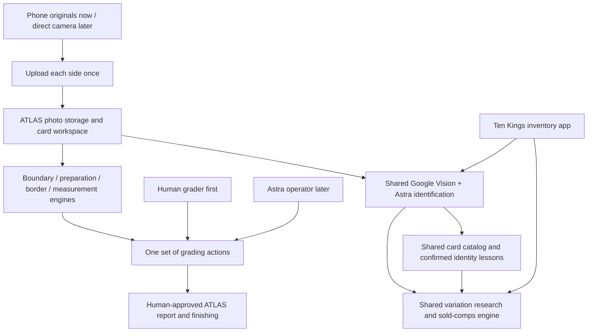

# ATLAS Speedster — consolidated rebuild plan

**September 11, 2026 Pacific · Discussion draft · No application changes or deployment**

This brings the engine inspection, incident evidence, Ten Kings consultation and Mark's decisions into one plan. The opening comparison is the short version. The later sections explain the workflow and engineering details. Recommendations below are proposals, not newly approved grading rules. Mark requested discussion of each stage before building; that remains the next product-design step.

## The recommendation in one minute

**Build a clean manual grading workspace around the useful engines. Reuse the current Ten Kings identification and research engines. Then let Astra operate the same grading tools.**

The photographs stay in the workspace: **Front left, Back right**. Upload each original once. Moving a line sends coordinates. Moving to another stage selects the next tools. Neither requires another original upload.

Keep the existing grading calculations. Keep SAM 3 as the precise-mask baseline while testing whether Astra improves defect finding and classification. Share card identity/variation knowledge between the companies; keep their physical inventory and financial records separate.

| Area | What is built today / problem | Recommended rebuild / expected benefit |
| --- | --- | --- |
| Phone photos | HEIC becomes full-size PNG before upload; the observed pair expanded from 3.18 MB to 30.10 MB. Upload scheduling also waits behind identification. | Upload the selected original as-is, decode on the server, and separate photo transfer from model work. Removes that client-side byte expansion and cross-card waiting; actual speed still needs measurement. |
| Working screen | Separate geometry steps; current ATLAS dragging lacks the older Speedster snapping. | One Front/Back workspace with engine proposals, zoom and shared snapping. Fewer navigation/confirmation actions. |
| Repeated processing | Several wrappers read, hash, copy and validate the same immutable images. | Verify once at intake; use immutable references and reuse unchanged results. Engines still read pixels when needed. |
| Card identification | The newer Ten Kings flow is already refined; earlier ATLAS comparisons used an older implementation. | Extract the current eight-field Google Vision + Astra engine and its separate variation/comps engine. Preserve their prompts, field meanings and evidence. |
| Astra coordination | Growing image-filled conversation, multiple transaction layers, global locking, and a confirmed failed-run takeover dead end. | Small stage inputs/results and per-card actions. Long model/image work stays outside database transactions. Exact timeout cause still needs a measured reproduction. |
| Queue | A one-distinct-card pilot rule blocked the next card after the first failed. | Independent jobs with no product card-count/spend allowance. A failed card does not stop another card. Hardware and provider capacity determine throughput. |
| Defect finding | Narrow image heuristics choose candidates/types before SAM traces them. Some saved corrections cannot create newly typed candidates. | Compare the existing finder with Astra plus relevant corrected examples; retain precise masks and deterministic measurement. Choose from measured accuracy and time. |
| Learning | Fixed model weights; external Memory can influence proposals/ranking, but next-card freshness and relabeling have limitations. | Publish deliberate corrections as small reusable lessons; the next relevant engine call reads the new version. Do not replay old card histories. |
| Recovery | Some terminal states trap the card even when provider attempts are settled. | Continue from the last committed stage. Discard stale machine edits after human takeover. An uncertain provider request must not block manual editing or other cards. |

These are reasons to simplify the application around the engines. They are not evidence that every existing engine is accurate or that a new build is already fast.

## What stays, what is new, what is shared

Ten Kings saves its inventory in Ten Kings. ATLAS saves its grading work in ATLAS. The shared engines return findings; neither app must create an inventory item in the other company to use them.

**Start with shared code packages and a small shared knowledge connection.** Sharing code does not require introducing another network service. Each app supplies its own photo access and save functions. Version the package so both can adopt an improvement deliberately without copying and diverging. Do not merge the Ten Kings release branch wholesale into ATLAS.

| Reuse/extract | Rebuild as a small ATLAS adapter | Leave outside the clean grading dependency graph |
| --- | --- | --- |
| `@atlas/grading-core`: geometry, scoring, traces, findings, report calculation | Card workspace, stage scheduling, result persistence and human approval | Old `@atlas/operator` ledger, pilot/cohort dispatch and `atlasWorkspace*` orchestration |
| CPU functions in `card_geometry.py`, `color_geometry.py`, `defect_math.py`, required preparation functions | Decode/read originals, store derived results, run CPU work independently | GPU-loading application startup merely to call CPU geometry |
| Existing SAM checkpoint/runtime and useful segmentation/Memory functions | Detector input/output adapter and measured image-state reuse | Old session/history reconstruction and calibrated-bank admission wrappers imported wholesale |
| `gradient-snap.ts`, useful geometry/trace controls | Combined Front/Back interface using the same action contracts | The old all-purpose CaptureWorkspace and capture administration UI |
| Current Ten Kings identity/research contracts, prompts and SoldComps helpers | ATLAS photo references, supported field mapping and background research trigger | Inventory card writes, quantity/location/cost/accounting updates, inventory worker caps |
| Report content, approved-report/label binding and relevant NFC protocol primitives | ATLAS approved snapshot, a versioned Mac protocol/profile and qualified hardware connection | Unrelated inventory, packs, sales, customer migration and commercial platform work |

Historical Memory examples/maps are optional imports, not a prerequisite to constructing the shell. A compatible active snapshot may be easy to reuse; reconstructing the old application's history is not the plan. Choosing a no-Memory baseline requires an explicit new adapter mode: deleting the current bank would leave existing admission code broken.

The current NFC validator identifies GoToTags 4.37.0.1 and Windows enrollment. A Mac adapter cannot truthfully claim that identity. Reuse the report binding and useful primitives, then implement the versioned Mac profile, qualified permanent-lock behavior and hosted completion acknowledgement as later acceptance work. This is not a completed engine that only needs a new button.

## A card's journey

“Manual first” means a human controls the workflow. It can still use automatic identity, geometry proposals and detector assistance. It does not need the autonomous operator to function.

The new manual adapter should also keep exact trace editing and CPU measurement usable when AI assistance is unavailable. A detector failure must not become an automatic “no defects” or perfect grade; the human must still inspect and confirm the findings.

| Stage | What the grader sees and does | What runs automatically |
| --- | --- | --- |
| 1. Add photos | Select native iPhone Front and Back originals. Start the next pair when ready. | Upload a selected side immediately. Preserve pair identity. Verify/decode the completed side and make previews. |
| 2. Card details | Fields fill as evidence arrives; corrections remain editable. | After both sides are ready, run the current Ten Kings identifier. Start variation/comps research in the background. Neither is a gate on opening geometry tools. |
| 3. Physical edge | Front left, Back right; adjust engine-proposed outer edges only if needed. | Both side proposals run independently. Show which line is the physical edge. |
| 4. Printed border and centering | In the same workspace, inspect the inner printed border and displayed centering. | Straighten each side from its physical edge; propose its printed frame; calculate centering. Stable prepared views may start defect detection while the human checks borders. |
| 5. Defects | Inspect Front/Back findings, zoom, change a type, remove a false finding or add/reshape an exact trace. | Produce candidate findings/masks and measure them. Recompute the affected side after corrections. Display resulting grading impact. |
| 6. Draft report | See identity, centering, measured defects, subgrades and final calculated grade together. | Existing grading math produces the draft. Comp research can continue independently; its uncertainty is not a made-up grading result. |
| 7. Human approval | Review the displayed report and confirm the exact version. | Commit one approved snapshot. Later edits create a changed draft; they do not silently change the approved result. |
| 8. Finishing | Print the label, use the selected Mac NFC station, assemble and confirm the physical work. | Derive label/report URL from the approved snapshot; execute and verify the deterministic NFC protocol. Physical completion requires actual device/human evidence. |

The existing completion logic accepts remaining UNREVIEWED findings in bulk. Proposed presentation: make a visible **confirm the displayed findings** action support that behavior, without requiring a click on every defect. The exact wording and whether that is combined with report approval need Mark's review. We must not quietly change scoring semantics or mistake automatic draft creation for human approval.

### One screen still has real calculation dependencies

For each side: **original → physical edge → straightened image → printed border → centering**.

Show both side pipelines together. A printed frame can be projected back onto the original for a combined overlay, with the correct saved transform. “Both at once” does not mean finding a printed border on a rectified image that does not yet exist. Local dragging stays responsive; save at meaningful edits/confirmation rather than writing every mouse movement. An unfinished drag lost before saving may need repeating.

Once physical geometry and inspection views are stable, defect inference can overlap printed-border review. Optional map filtering needs the matching identity/map alignment before its result is adopted. A map arriving later must not silently remove a human's marked defect.

| If this changes… | Recalculate / invalidate this… | Preserve this… |
| --- | --- | --- |
| Pan, zoom, screen size, Front/Back view selection | Display only | All grading results and originals |
| Printed border on Front | Front centering and dependent grade/report | Both originals, prepared pixels, SAM masks, Back work |
| Physical edge on Front | Front preparation, border/centering, map registration and dependent masks/report | Original bytes and valid Back work |
| A defect type, removal or exact trace on Front | Affected-side mask overlap/area allocation, subgrades and report | Source/prepared photos and valid Back work |
| One photo is replaced | That side's image-dependent results; pair-dependent identity/research | Unchanged original and genuinely independent results on the other side |
| Card identity is corrected | Matching references/maps/research and report identity; category/rule-dependent calculations where applicable | Unrelated prepared pixels; do not rerun every image operation by default |
| A new lesson/map is published | Use it on the next applicable new action | The reproducible result of an already completed action; no surprise regrading |
| An approved report's inputs change | New draft and a new human approval | The previous approved snapshot and its physical identity |

Changing/removing a defect can change ownership of overlapping pixels. Re-run the measurement function for that side; do not simply subtract a displayed penalty.

## Photo quality without repeated uploads

The examples supplied by Mark are **3024 × 4032**: about **12.2 million pixels per side**. That describes those files, not every iPhone mode. Retain the actual selected original, its dimensions/orientation/color metadata and content hash. Do not upscale smaller captures and label them native quality.

The clean intake needs an explicit **server HEIC decoder**. Current `decode_preparation_source` accepts only JPEG, PNG and WebP, and current browser intake converts HEIC to PNG. Direct HEIC is proposed work, not an already supported backend feature. Verify orientation, color handling, bit depth and fine-defect visibility on the actual uploaded files. Future camera RAW/DNG handling depends on the selected camera/SDK; a common intake interface alone does not implement that decoder.

Proposed path:

1. Allocate a card pair and independent side upload identities. Begin Front when it is available; do not wait for Back to construct one combined HTTP request.
2. Upload the original directly to controlled object storage. Receive/verify it once near storage. The existing provider checksum probe was not reliable enough to trust HEAD blindly.
3. Record the immutable object reference, actual checksum and decode metadata. Prevent overwrite of an accepted object; replacement is a new version.
4. Use that verification/decode pass to create small display/identification derivatives. Keep original pixels available for grading, zoom and targeted crops.
5. Engine work uses those references and named transforms. It does not shuttle originals through the browser, several application proxies and database conversation history.

Originals and useful derived images are different assets. “Upload once” refers to the user sending each original once during normal successful intake. It does not promise zero server reads, zero derivative storage or no retransmission after an interrupted transfer. A lost completion reply should look up the same upload before sending the bytes again.

Current grading works on **1270 × 1778** rectified images and **1350 × 1858** inspection views, with WebP quality 92 derivatives. Preserve those dimensions/scoring conventions for extraction comparison; then separately evaluate native-resolution crops for fine defects. Highest-quality source storage does not prove every model or measurement currently uses full native detail. Crop masks need tested transforms/resampling back to the measurement grid; magnification cannot give that grid finer area precision. Changing its resolution is a separate engine/version decision.

Use lightweight previews in the browser and load high-detail regions when needed. Do not permanently decode every full-resolution pair merely to show queue thumbnails. Phone transfer, CPU image work, model requests and the next card's intake must be independently scheduled.

## Reuse the current Ten Kings identity and market engines

Consultation with **Complete Ten Kings financial app** established the current successful source: collect physical inventory, application commit `bb10f235d5bddd2ca30ba19e5389e80d43cd2fec`. It supersedes the earlier comparison to the older 17-field CardAsset OCR route.

### Fast identification

Both photos → parallel Google Vision OCR → one Astra request → eight fields, with confidence and supporting evidence:

**Name · Category · Manufacturer · Card number · Year · Set name · Variant · Card type**

Reuse the deployed `gpt-6-astra` low-reasoning identifier behavior and its handling of printed evidence. A fast printed variant suggestion is not the complete parallel research process. Preserve human-edited fields, card-number formatting and the distinction between manufacturer and licensor. Identification recognition includes Other trading cards; the current grading core supports a narrower category/size contract.

### Background variation and sold comps

Reuse the newer Astra research engine, with its current medium-reasoning behavior, catalog/photo references and SoldCompsAPI evidence. It returns research; the application decides how to display/adopt it. Preserve actual matched listing evidence and deterministic price arithmetic. Current estimation requires at least two independent suitable sold listings; unknown Best Offer amounts do not become invented sold prices.

The consultation observed one research run at **35.7 seconds**, mostly Astra time. Its set was missing from the catalog, so variant/value remained unresolved. This proves neither instant research nor universal identification. Let the grader continue while this work runs.

The new source already allows replaceable photo/reference loading functions. Its current reference adapter does not yet connect the older reference-image library, and automatic missing-checklist discovery/import and cross-company learning are not deployed. These connections are focused new work; do not advertise them as already working.

Do not copy the inventory app's 1400-pixel grading-source policy, one-minute job pickup, worker caps or save requirements into ATLAS. Reuse the engine's inputs/outputs and proven behavior through an ATLAS adapter. Low/medium reasoning on these named engines does not silently replace the existing MAX grading-operator policy; new defect/geometry reasoning settings need evaluation.

### What can be shared

| Shared card knowledge | Remains company- or physical-copy-specific |
| --- | --- |
| Card design identity, manufacturer/set/card number, variant definitions and distinguishing features | Which company owns a particular physical copy, quantity and location |
| Deliberately corrected identity aliases and relevant reusable reference examples | Purchase costs, customer data, sales, stock movements and accounting |
| Sold listing evidence, matching logic and when evidence was retrieved | Each company's adopted valuation and commercial decisions |
| Shared engine code and relevant knowledge versions | ATLAS findings, grading progress, final approvals and damage on this copy |

Example: Ten Kings confirms a distinguishing feature of a parallel. The next matching ATLAS identification can use that example. ATLAS does not receive Ten Kings stock, and a scratch on the photographed copy does not become part of the card design. An individual serial number is not a universal variant number. Refresh market evidence by identity, condition/grade and retrieval time; a historical sold price is not a permanent current value.

## Defect detection: evaluate Astra plus SAM, preserve the math

**Do not replace SAM wholesale before a comparison.** The best candidate architecture to test divides the jobs:

| Job | Recommended baseline / candidate |
| --- | --- |
| Find suspected defects and classify their type | Existing finder as baseline; Astra with relevant human-corrected examples as the candidate |
| Trace exact affected pixels | SAM 3 and exact trace/editing tools |
| Measure defect area, centering and grade | Existing deterministic calculations |
| Propose card-map design regions | Astra proposals refined/aligned with geometry tools |

Current OpenCV heuristics offer at most eight ordinary candidate regions per view and assign four initial defect types. SAM receives those candidate boxes and traces them. This can restrict what SAM ever sees; it is not proof of how many real defects have been missed. Evaluate candidate recall separately from mask accuracy.

**Correction to “SAM never learns”:** current model weights stay fixed during grading, but external Memory already affects proposals and ranking. SAM supports offline fine-tuning; that is a separate training job, not something the current application performs after each card. [Official SAM training support](https://github.com/facebookresearch/sam3/blob/main/README_TRAIN.md).

A newly verified limitation is more specific: relabeling a finding saves a positive lesson for the corrected type, but current Memory matching scores the type the detector already proposed. Only `SMART_MARK_POSITIVE` lessons create new boxes; `DETECTOR_RELABELED_POSITIVE` does not. Thus relabeling to a type outside the ordinary four does not itself make the finder start proposing that type. Astra classification with retrieved correction examples is a candidate improvement; it needs a targeted next-card test.

Astra's image reasoning should not be the unchecked authority for exact pixel boundaries. Its output must name an image/coordinate frame, then use segmentation/measurement tools and inspect the result when needed. OpenAI documents limits in precise spatial localization. [Official image-analysis guidance](https://developers.openai.com/api/docs/guides/images-vision).

Test the same representative cards with the current finder and Astra-assisted finder. Include faint defects, long scratches, large damage, crowded findings, reflective surfaces and printed artwork. Measure missed defects, false positives, correct type, exact affected area, grade impact, elapsed time and human correction effort. Compare both cold and warm operation. Do not choose a faster model path that quietly loses relevant damage.

Optimizations supported by source inspection, to measure before adopting:

- Reuse an image's SAM encoding across manual strokes and saved marks. Automatic scan already reuses an encoding per view; do not claim that as a new fix.
- Avoid pairwise full-frame mask work only when appropriately expanded bounds cannot interact. Preserve the existing four-pixel cross-view fusion tolerance and exact pixel totals.
- Run CPU geometry without waiting for a SAM/GPU process to initialize.
- Measure view loading, GPU wait, encoding, prompts, transfers, Memory lookup and mask fusion separately. The current combined timer cannot identify which dominates.

## Learning that reaches the next relevant card

Three things must remain distinct:

1. **Shared identity knowledge:** what design/parallel this is, with supporting examples; useful to both companies.
2. **Grading lessons:** confirmed damage, false positives and corrected types, scoped to the right image/model/design context.
3. **Card maps:** reusable artwork/border regions aligned to that card design; not a blanket permission to erase defects inside a region.

Using the same API credentials does not make later Astra calls remember earlier corrections. The application must supply relevant saved context to each new call. [Official conversation-state guidance](https://developers.openai.com/api/docs/guides/conversation-state#manually-manage-conversation-state).

Proposed small loop: **deliberate correction → save the lesson and its source → publish a new knowledge version → retrieve relevant lessons for the next applicable action**. Existing deliberate human correction/learning decisions provide the confirmation event; do not add a second approval ceremony. Machine guesses must remain distinguishable from human-confirmed facts. The exact grading-lesson approval point remains part of stage review; sharing identity knowledge does not authorize sharing every type of data.

Publish corrections directly from the action/result, rather than rediscovering them by scanning old completed sessions under the certificate/label lock. If company data and shared knowledge live in different databases, publication needs a small idempotent pending-publication record; it is not an atomic cross-database transaction by assumption. A card correction can save successfully while shared publication is pending. Show that distinction and retry publication automatically.

The acceptance rule is specific: **after publication is acknowledged, the next relevant new lookup must use that version**. An already-running request may finish on its original version. A publication outage cannot honestly be described as instant learning; it also must not block unrelated grading. Preserve the human correction even when a SAM fingerprint cannot be produced; retry that specific unpublished lesson rather than silently discarding it. A schema label such as Memory V2 is not a freshness version: use a content revision/hash.

Keep reusable image encodings separate from knowledge-dependent results. An unchanged image/model can reuse its encoding. Candidate ranking/filter/classification must use the selected knowledge version. Retries of the same action retain their exact inputs/version; a new card resolves current knowledge rather than blindly using the prior card's cached bank.

Historical metadata found 559 Memory examples from 48 cards, about 0.54 MB, plus four current maps. Their size alone is not a reason to discard them. Import a compatible snapshot only if useful and simple; otherwise start an explicit baseline and add new lessons. Do not rebuild the old history system to save a small bank, and do not delete live data as a planning shortcut.

New examples do not by themselves establish calibrated SAM similarity behavior. Reuse a compatible calibration policy or evaluate a new one before enabling their SAM-based matching. Until then, retain the examples and call SAM explicitly without Memory; confirmed visual examples can separately feed the Astra evaluation. Never mark an uncalibrated bank calibrated simply to pass admission.

## A much smaller execution and saving model

This is a **provisional design to review**, not a finalized replacement Astra architecture. Mark's requirement to identify the initiating operator failure still applies before implementing that replacement.

Use one set of stage actions. The human interface calls those actions; Astra later calls the same actions with structured inputs. The server runs the work independently of a browser tab. Closing the phone does not stop an already accepted server job.

The database stores small working facts: current stage, references to inputs/results, relevant input versions, action identity, active ownership/lease and current approval. Images, masks and large provider results belong in object storage. These are logical records, not a promise of an arbitrary table count or a new universal event platform.

A typical long-running action has three parts:

1. In a short transaction, claim that card/action and record the input fingerprint and owner generation. Before a potentially paid dispatch, persist a stable external-attempt identity and dispatch state.
2. Outside the transaction, read images, call the engine/provider and store the receipt/result independently of whether it is still applicable to the card.
3. In a short transaction, apply the result only if its required inputs and writer authority are still current. Enforce one application per action; a repeated request returns/reconciles that action instead of invoking the provider again.

Do not hold a database transaction or pooled connection while waiting for image decoding or OpenAI. Status refreshes read compact state; they do not rerun admission, reconstruct an image-filled conversation or dispatch work. A lease heartbeat can update small ownership fields independently; it is not a full grading save every second.

A whole-card revision alone is too coarse: research can still be valid after unrelated border work. Use an action-specific input fingerprint, plus atomic per-card updates. Research depends on photos/identity; preparation depends on that side's photo/physical geometry. Merge only still-applicable, unedited fields. Human takeover changes the writer generation, preventing a late machine response from overwriting human work.

Start with the existing managed storage/database infrastructure and a small long-running worker role; avoid a new broker or many microservices merely to move stage names. Keep ATLAS-owned records/access separate and profile aggregate database connections before selecting deployment counts. Multiple HTTP/model requests do not need to keep the same number of database connections open. Claims skip locked or not-yet-eligible jobs; retry delays release worker capacity. Keep intake responsive while ensuring deeper research is eventually served. A job's need for input does not become a terminal failure of the entire card.

### What happens when something goes wrong

| Situation | Proposed behavior |
| --- | --- |
| Front uploaded; phone closes before Back | Keep Front. Reopen the pair and add Back. Bytes never received still need uploading. |
| Upload succeeded; completion reply was lost | Reconcile the same upload identity. Do not upload a second copy merely because the reply was lost. |
| Identity/research fails | Leave editable fields and grading tools usable; retry independently when known safe, or reconcile its original attempt if dispatch may have occurred. Do not invent identity/value. |
| A geometry proposal is poor | Human or Astra adjusts with the same precise tool; rerun only dependent work. |
| Worker stops during a local calculation | Lease expires; resume/recompute the unfinished action from retained inputs. Completed stages stay completed. |
| Database temporarily unavailable | Retain durably stored output and retry the same receipt while available; do not pretend an unsaved edit is saved. Resume the same action when access returns. |
| Result storage is unavailable and the process also dies | If the provider cannot retrieve the response, its outcome may remain unconfirmed. Do not promise that an unpersisted result survived; preserve completed earlier stages and allow manual continuation. |
| OpenAI result exists but reply/receipt is uncertain | Reconcile the original provider/action identity where supported. Do not blindly duplicate the paid request or claim guaranteed exactly-once delivery. Manual work and other cards remain available. |
| Human takes over while Astra is working | Fence the old writer immediately. Retain any late result as a receipt, but do not apply stale edits. |
| One card needs attention | Isolate that card/action. Another grader/card continues. |
| Provider capacity is temporarily full | Queue/retry eligible work with pacing. Show waiting truthfully; this is not an app card-count allowance. |
| Report changes after approval | New draft requires approval before new label/finishing use; old approved output stays identifiable. |

Progress messages should say the actual stage or problem: “Uploading Back,” “Finding borders,” “Checking a previous response,” or “Retrying the saved result.” A generic “could not save progress” must not conceal whether the failure happened before a provider request or after it.

### Astra's actual tools, later

Proposed vocabulary: inspect a named image/crop; adjust or confirm a quad; propose/save an exact trace; change a defect type; remove/restore findings; preview the report. These tools accept coordinates and return updated geometry/overlays. Astra should not simulate mouse movements in the browser.

Each geometric call identifies side, exact image/hash, coordinate space and relevant base version. Physical quads use oriented-original coordinates; printed frames use rectified-card coordinates; exact traces use the established integer-pixel grid and crop transform. Preserve current conversion conventions, including source-width/height versus trace-width-minus-one/height-minus-one mapping.

Run deterministic preparation automatically when its inputs are ready. Do not buy an Astra request merely to authorize that bookkeeping. Give each reasoning stage the necessary photos, overlays, candidate findings and compact relevant lessons, rather than the entire growing history. Batch related Front/Back review when useful; use separate calls/crops when detail or a changed dependency requires them. The fastest useful call count must be measured, not decreed as one call for every task.

## Root cause: known facts and remaining proof

The failed fresh run stopped in IDENTITY **before preparation, SAM, Memory or maps ran**. Its fourth request was never dispatched. The latest reservation transaction failed with P2028 after **10,215 ms**. Other observed operations also had transaction/pool failures. The card then hit a confirmed terminal-state takeover dead end; the next card hit the one-distinct-card pilot rule.

ATLAS is the application's name. Both the inspected ATLAS operator and current Ten Kings identifier/research use OpenAI's Responses API with `gpt-6-astra`; there is no distinct “ATLAS API” responsible for this failure. The observed failing reservation was in our application's coordination layer before the next provider dispatch.

**Fresh Astra extra-high investigation, September 11 Pacific / September 12 UTC:** the requested independent investigation is complete; its [measurements, source review and remaining evidence gap](../audits/2026-09-11/timeout-investigation.md) are now part of this plan. It matched the retained **12,207,165-byte** continuation, current guards, real one-connection operator pool and staff status readers while keeping the ten-second deadline. It also exercised the real operator loop with a stub response. No model calls or production data changes were made.

| Fresh evidence | Meaning for the rebuild |
| --- | --- |
| Isolated reservation: **23 ms** with a small continuation versus **634–731 ms** at retained size, including up to four status readers | Remove image bodies from coordination records. Preserve original photo quality. This demonstrates overhead, not a reproduced ten-second failure. |
| Real operator loop: **3.728 s**, including **612 ms** reservation, with one activity reader | The matched local sequence passes. It does not establish production reliability. |
| Actual I/managed-DB read: full row **650–1,094 ms**, compact diagnostic projection **about 6 ms**; related server image validation **1,088 ms** | Compact progress/lease reads avoid demonstrated work. The projection is not the production status endpoint; live read-only profiles exclude reservation writes/full trigger behavior. |
| Reader advisory-lock calls took **709–740 ms**, with backend waits independently corroborated; operator lock call at most **17 ms** | Remove the shared staff/operator lock from independent status/cards. These ordinary tested readers did not reproduce the operator timeout. |
| Earliest failure preceded the final continuation size | Do not assign the whole incident to the final 12.2 MB payload. |

These are diagnostic samples across a disposable Mac PostgreSQL 17.10 instance and bounded read-only measurements on production PostgreSQL 17.11, not an end-to-end capacity benchmark. The exact historical statement/wait and a PostgreSQL crash remain **unproven**. The operator has one pooled connection and a five-second pool wait, versus a ten-second transaction and fifteen-second outer operation deadline; these can amplify a slow operation but do not identify its initiating cause.

**Resolution carried into the rebuild:** keep images/results separate from small action records; use card/action ownership rather than a global waiting line; keep status reads compact; move broad role-structure checks out of routine transactions while preserving command authorization; allow fenced manual continuation after failure; and let other cards proceed independently. Add bounded, redacted phase timings so an error identifies pool wait, lock/query, local processing, commit or provider work. This does not need a new audit platform or a database write for every progress refresh.

**Still required before the replacement operator:** obtain the existing database slow-statement/lock logs for September 11, 15:34–15:43 and 18:30–18:32 UTC, or capture an instrumented representative failure and its correction. Server logging is enabled to syslog, but the available SQL account cannot read those files, `pg_stat_statements` is absent, and DigitalOcean reached sign-in in both available browsers. The app's original log omitted exception detail. If historical logs cannot settle the cause, use a bounded stub-provider reproduction with per-query/pool/lock/CPU/commit measurements. A known gap is not a passed prerequisite. Forced timeouts can validate recovery; merely extending a timeout or obtaining another passing local run cannot establish the historical cause.

## Build order and evidence that each part is ready

| Order | Deliverable | Evidence required before calling it ready |
| --- | --- | --- |
| A. Finish stage decisions and failure trace | Reviewed workflow/engine contracts; initiating-failure evidence, with any remaining gap visibly unresolved | No silent changes to scoring, full-bleed treatment, photo quality or human approval. An unresolved failure cause does not pass the replacement-operator prerequisite. |
| B. Clean engine entry points | Selected pure modules and narrow adapters in a new shell | Same fixtures produce the same deterministic geometry, traces, measurements, grades and report content; no old orchestration imports |
| C. Manual grading path | Native originals → combined geometry → defects → approved report | Actual iPhone files and manual card completion; corrections, reload, second card and simultaneous independent graders work |
| D. Shared Ten Kings engines and learning | Current identifier/research connected without inventory writes | Eight fields preserved; exact variant/sold evidence behavior; next relevant lookup sees an acknowledged correction from either company; neither inventory is exposed |
| E. Detector comparison | Current finder versus Astra-assisted finder using the same tools | Quality, timing and human correction comparison; keep current baseline until another wins |
| F. Astra stage integration | Astra calls the proven manual actions after the owner's initiating-cause prerequisite is met | Stage-by-stage acceptance, takeover, lost-reply and worker-restart behavior; card B completes while card A is uncertain or repeatedly fails |
| G. Production and physical finishing | Serving build, real device flow and load behavior | Actual report/label/NFC/assembly evidence; measured normal and busy latency, errors and concurrency |

Identity connection can land during C; it should not delay the first proof that a person can operate the grading engines. Independent extraction/manual work can progress after the relevant stage discussion while the separate operator-cause investigation continues. That does not waive Mark's prerequisite for implementing the replacement operator. Defect experiments can run alongside manual UI work once extraction parity is established. A full production rollout is not implied by this planning document.

Benchmark on the same originals, phone/network and task settings. Separate human capture time from upload/verification, queue wait, OCR, model time, preparation, GPU wait, correction response and report generation. Record typical and slow-tail times. Compare one and ten simultaneous cards using supplied or designated test work; do not promise ten will take the same time as one without capacity evidence. Use a same-quality upload baseline rather than comparing ATLAS originals to Ten Kings convenience JPEGs as if they were equal workloads.

The inspected SAM service serializes prompts under one processor lock. Parallel card jobs do not remove that physical bottleneck: measure it and size worker/GPU capacity accordingly. This differs from an arbitrary rule allowing only one card ever to start. Confirm retries release capacity and do not starve fresh cards or deeper research.

Keep existing scoring constants, 70/30 Front/Back weighting, four-subgrade averaging and rounding. Test coordinate orientation/mirrors, unchanged-side preservation, overlapping masks, trace remove/type-change/undo, stale results and exact approved report linkage. Reusing existing tests is useful; a large test count alone did not prove the previous production workflow worked.

## Decisions still needing the stage-by-stage discussion

The recommendation is complete enough to review. These are genuine product/accuracy decisions, not questions that require Mark to choose databases or job libraries:

1. **Borderless/full-bleed cards:** how the grading system defines centering when there is no ordinary printed frame. Current math requires positive opposing border totals; absence cannot become an invented perfect score.
2. **Supported card sizes/categories:** the core currently assumes standard 63.5 × 88.9 mm SPORTS/POKEMON cards. Recognizing Other trading cards is broader than supporting their grading geometry.
3. **Inspection detail:** acceptance of current prepared views plus original zoom/crops versus changes to the measurement image pipeline. Original retention is already decided.
4. **Astra confirmation:** which geometric/defect conditions allow automatic continuation, what it should inspect more closely and what requires a human. These rules must follow measured capability.
5. **Review and learning:** the visible bulk-findings approval behavior and the exact deliberate event that publishes grading lessons. Identity corrections can be shared without making every model guess a lesson.
6. **Detector choice:** retain the current finder or adopt an Astra-assisted alternative after the same-card comparison. Historical bank/map import is an optional implementation choice based on usefulness and effort.

The next owner review should begin with the combined boundary/border screen and then proceed through defects and final review. A decoder choice, queue library or cache implementation should not become an unnecessary owner decision.

## Evidence and source map

- [Incident, actual timings and acceptance failure](../audits/2026-09-11/README.md); [operator details](../audits/2026-09-11/operator-dissection.md); [fresh Astra extra-high timeout investigation](../audits/2026-09-11/timeout-investigation.md); [capture evidence](../audits/2026-09-11/capture-comparison.md).
- [Engine behavior and read-only Memory/map inventory](../audits/2026-09-11/engine-review.md).
- [Manual-first discussion](MANUAL_FIRST_GRADING_DISCUSSION.md) and [current Ten Kings consultation/source correction](SHARED_CARD_ENGINES_DISCUSSION.md).
- [Existing isolated grading package](../../../packages/atlas-grading-core/README.md); [extraction manifest](../../../packages/atlas-grading-core/extraction-manifest.json); [scoring](../../../packages/atlas-grading-core/src/scoring.ts); [remeasurement](../../../packages/atlas-grading-core/src/review.ts:382).
- [Current image decoder](../../../backend/ai-grader-speedster-service/preparation_evidence.py:73); [preparation](../../../backend/ai-grader-speedster-service/preparation_core.py:153); [geometry and standard dimensions](../../../packages/atlas-grading-core/src/geometry.ts:9).
- [Memory proposal sources](../../../backend/ai-grader-speedster-service/sam_memory_v2.py:332); [type-conditioned matching](../../../backend/ai-grader-speedster-service/sam_memory_v2.py:402); [relabel lesson harvesting](../../../frontend/nextjs-app/lib/ai-grader-v2/learning-harvest-v2.ts:248).
- [Snapping](../../../frontend/nextjs-app/lib/ai-grader-v2/gradient-snap.ts:119); [trace coordinate mapping](../../../packages/atlas-grading-core/src/trace-editor.ts:216); [review actions](../../../packages/atlas-grading-core/src/review-action-contract.ts:49).
- [Current Ten Kings identifier](/Users/markthomas/tenkings/codex-staff-inventory-release-20260910/frontend/nextjs-app/lib/server/staffInventoryIdentification.ts:251); [research engine](/Users/markthomas/tenkings/codex-staff-inventory-release-20260910/frontend/nextjs-app/lib/server/staffInventoryResearch.ts:39).
- [Existing finishing sequence](../../../frontend/atlas-app/lib/server/access/finishing.mjs:217); [Mac NFC acceptance limits](../MAC_NFC.md).

New in this consolidation: explicit server-HEIC work; side-specific invalidation; overlap of defect work with printed-border review; the relabeled-Memory limitation; version-aware cross-company knowledge publication; action-specific result applicability; complete manual/report/finishing scope; and a finite acceptance sequence. No model benchmarks, live writes, application implementation or deployment were performed for this planning continuation.

Subsequent owner-requested timeout follow-up added matched isolated database/runner tests and bounded live read-only profiles. It confirms overhead and logging limitations, narrows unsupported causal claims, and leaves the initiating-cause prerequisite visibly unresolved. No application implementation or deployment followed from these measurements.
