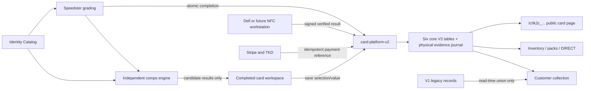

# Ten Kings V2 — Final Master Product and Architecture Blueprint

**Status:** Owner-approved final product and architecture planning authority  
**Owner:** Mark Thomas / Ten Kings  
**Prepared:** 2026-08-04  
**Owner approved:** 2026-08-06  
**Canonical repository path:** `docs/specs/TEN_KINGS_V2_FINAL_MASTER_BLUEPRINT.md`  
**Primary system:** `https://collect.tenkings.co`  
**Purpose:** Define the complete future Ten Kings card platform while keeping the immediate execution priority on finishing AI Grader V2 “Speedster.”

This owner-approved document replaces the earlier Fable 5 draft as the current V2 planning authority. It incorporates Mark’s decisions, the verified V1 NFC and comps workflows, and the actual Speedster V2 completion contract. It is a product and architecture blueprint, not authorization to deploy, migrate, disable V1, or begin the later platform phases.

---

## 1. Executive Decision

Ten Kings will build a clean V2 card platform beside V1.

- **Speedster is completed first.** No broader V2 pack, online-machine, kiosk, buyback, or shipping implementation begins until the Speedster completion scope in this blueprint is accepted.
- **The full V2 picture is designed now.** This prevents Speedster from creating another temporary card structure that must be replaced later.
- **Every real completed Speedster grade becomes the permanent V2 card.** Speedster will not create V1 `CardAsset` or `Item` records.
- **V1 becomes a frozen supply system, not a deleted system.** It stops creating new cards and packs after cutover, but old customer collections, reports, NFC/QR URLs, Live Rips, shipping rights, and buyback rights continue working.
- **The V2 card platform starts small:** six core lifecycle/reference tables plus the narrowly approved physical-evidence journal in Section 3.5, one write module for lifecycle records, no copied Speedster media, no NFC-tag inventory table, no comps table, and no mutable inventory counters.

The execution order is:

1. Finish the active Speedster core grading work.
2. Add the minimum permanent-card foundation Speedster requires.
3. Add the simple Card Identity Catalog and human parallel/variant helper.
4. Add the independent, movable eBay sold-comps engine.
5. Add the Dell-first F8215 NFC workflow and permanent card page.
6. Declare Speedster complete only after the acceptance gates pass.
7. Then build the broader Card Platform V2 in phases.

---

## Current-System Context (Why V2 Exists)

Ten Kings already has a working but older card platform. It is a Node/pnpm monorepo with a Next.js public/admin application, Prisma, shared PostgreSQL, Vercel web delivery, DigitalOcean-hosted services, Stripe, TKD wallet/ledger, Locations, customer collections, inventory, mystery packs, kiosks, Live Rip, OBS, and Mux.

The V1 card domain grew over time instead of from one simple lifecycle contract. Its card behavior is distributed across structures such as:

- `CardAsset` for card/media/review identity;
- `Item` for inventory/customer ownership behavior;
- pack and pack-slot records;
- KingsReview and Bytebot jobs;
- separate comparable-sale/evidence/valuation records;
- NFC tag, programming-attempt, and audit records;
- multiple admin, service, and kiosk write paths;
- mutable or duplicated counters/projections that can drift.

The overall Prisma schema now contains roughly 125 models across the whole product. That number is not itself the problem; the card-lifecycle problem is that several systems can write overlapping card, pack, inventory, and ownership facts while the same physical card is represented in more than one place.

Speedster V2 is materially cleaner. Its permanent grading authority is centered on:

- `AiGraderV2Session` for identity, capture, reviewed defects, grade report, report slug, and slab-image keys;
- `HumanGradeLabel` for certificate order, exact label identity, subgrades, and final grade;
- existing permanent object-storage keys and the public Speedster report.

The current Speedster completion transaction already durably commits the completed session, permanent report slug, and Human Grade label. The V2 card hook is deliberately added to that exact core transaction rather than recreating V1 CardAsset/Item behavior afterward.

V2 therefore does **not** rebuild the whole website. It replaces only the card-lifecycle domain while preserving the working foundations around it:

- Live Rip and Mux stay;
- Locations stay;
- auth/Twilio stay;
- Stripe and TKD stay;
- existing storage stays;
- V1 customer history and physical URLs stay;
- the Dell’s proven NFC hardware/software foundation stays;
- the SerpAPI account and safe request lessons stay.

The purpose of V2 is to establish one permanent card, one ownership history, one write path, and live row counts—without forcing a risky migration of the small number of existing V1 customer collections.

---

## 2. Foundation Principles

These principles are ordered. When two goals conflict, the earlier principle wins.

### 2.1 Least code possible

- A nullable field is preferred over a new table when it represents one fact about one record.
- A JSON snapshot is preferred over a collection of tables when the data is read and replaced as one bounded unit.
- One reusable screen with filters is preferred over several almost-identical screens.
- One local workstation helper is preferred over another hosted service.
- Do not add future placeholders unless the future feature is already approved in this blueprint.

### 2.2 One write path

Exactly one module, `card-platform-v2`, owns writes to:

- `CollectibleCardV2`
- `CardOwnershipEventV2`
- `PackTypeV2`
- `PackV2`
- `ShipmentV2`
- `CardInventoryEventV2` — the 2026-09-07 physical-evidence amendment below
- `InventoryWorkflowEventV2` — the September 8 purchased-lot/loading-batch evidence journal below

Every admin page, API route, payment webhook, NFC completion, online machine, DIRECT sale, buyback, and shipping action calls this module. Nothing else writes these tables directly.

`CardIdentityCatalogV2` has its own single catalog writer because it is reference/catalog data, not card lifecycle data.

The comps engine never writes application tables. It returns results to its caller. Saving those results calls `card-platform-v2`.

### 2.3 Count, never track

Inventory availability is always a database count of qualifying rows. There is no mutable `inventoryCount`, `availableCount`, or duplicate stock counter.

### 2.4 Permanent identity from creation

The V2 card token and URL are minted in the grade-completion transaction. Nothing temporary is written to an NFC tag or printed on permanent media.

### 2.5 The grade is authoritative and independent

- NFC does not affect a grade.
- Comps do not affect a grade.
- Market value does not affect a grade.
- Inventory state does not affect a grade.
- Failure of an NFC write or comps lookup never erases or changes a completed grade.

### 2.6 Payment before reveal or physical dispense

The customer never sees the mystery card and the machine never dispenses it before payment success. Every payment path is idempotent and has an explicit retry or compensation contract.

### 2.7 V1 is preserved, not extended

V1 remains available for historical customer rights and permanent physical URLs. It does not receive new V2 cards, new pack supply, or new KingsReview work.

### 2.8 Reuse working foundations

The following remain in place unless a later approved blueprint explicitly changes them:

- Speedster grading, capture, SAM, learning, measurement, label, and report logic
- Existing authentication and Twilio sign-in
- Existing Stripe account and payment foundation
- Existing TKD wallet and ledger
- Existing `Location` records
- Live Rip, OBS, and Mux
- Existing object storage
- Existing Dell hardware setup
- Existing SerpAPI account and secret

---

## 3. Scope Boundaries

### 3.1 Build now to finish Speedster

- Permanent `CollectibleCardV2` creation at valid Speedster completion
- Permanent `/c/<tk2c_token>` card page
- Idempotent backfill for qualifying completed Speedster cards created before the V2 card hook
- Card Identity Catalog upload and human parallel/variant helper
- Independent eBay sold-comps engine
- Internal comps review, selection, arithmetic-average market value, and optional public display
- Dell-first F8215 NFC programming, exact readback, and permanent lock
- Multi-workstation-compatible NFC protocol, with only the Dell enabled initially
- Completed-card workspace driven by V2 card facts instead of session booleans

### 3.2 Build later, after Speedster is complete

- Inventory lifecycle and reusable card lists
- Pack types and one-card mystery packs
- DIRECT sale channel
- Location assignment
- Online mystery pack machine
- V2 collection and vault behavior
- 80%-of-market-value TKD buyback
- Live-rate, multi-card shipping with a $1-per-card Ten Kings fee
- V1 supply freeze and V2 website cutover

### 3.3 Explicitly deferred

- Physical vending-machine pack identification
- NFC location check-in
- Physical pack check-in workflow
- Buyback of cards physically held by customers
- Exact reference image for every card/parallel combination
- Published odds
- Promo inserts
- Marketplace, trading, and gifting
- NFC/QR ownership claims
- External business grading

### 3.4 Reused unchanged

- Auth and phone verification
- TKD wallet/ledger foundation
- Stripe foundation
- Locations
- Live Rip/Mux/OBS
- Golden Tickets, Stocker, Set Ops, Kings Hunt, Support/Queen
- Speedster’s grading internals

---

### 3.5 Owner-approved physical inventory evidence amendment — 2026-09-07

Mark explicitly authorized the complete local build of a durable V2 physical inventory source and read-only Financial Story pull. This is a narrow exception to the prior physical-evidence/build-order deferral; it does not declare Speedster, P1/P2, kiosk automation, or customer commerce accepted. The September 7 pass performed no deployment, production migration, backfill, real inventory write, server restart, commit or push. The subsequent September 8 completion/activation request is recorded in Section 3.6; do not treat the historical local-only scope as a fresh build-permission requirement.

Add one table, `CardInventoryEventV2`, owned exclusively by `packages/database/src/cardPlatformV2.ts`. Its immutable, content-hashed events document opening/acquisition, one-card packing/unpacking, custody movements, successful physical sales, and explicit corrections. A transaction-scoped PostgreSQL lock assigns committed sequence numbers using `MAX + 1`; rollback consumes no number. There is no mutable stock counter. Permanent-card ownership/lifecycle/location projections and any ownership transfer are committed with their physical evidence, with database append-only and projection guards. Existing graded-card, label, report, media, identity-correction, comps, NFC, V1, wallet, and payment code is preserved.

The source accepts exact permanent V2 card IDs, one-card physical pack IDs, acquisition lots/cycles, separately sourced product IDs, and explicit custody evidence. `machine:<external-device-id>` is independent of the existing Location UUID. Multiple devices can occupy one Location and multiple products/batches can occupy one device. Neither identity is inferred from names, prices, grades, market values, recipes, or HAHA/Location resemblance. The launch custody-to-Location binding is immutable; moving the same machine to a new site requires a separately reconciled custody-identity cutover or a later relocation extension, never silent rebinding.

Only house inventory and documented anonymous `EXTERNAL` transfers are included. An operator-recorded sale requires explicit successful-payment and completed-dispatch evidence; this is evidence entry, not payment collection, vend control, fulfilment discovery, or a claim that the source verifies external documents. Refunds document money only. Returns/reacquisitions require sourced house title, and do not initiate TKD/cash buyback. Account-owned vault/shipping cards, V1 stock, aggregate ungraded lots, multi-card packs, shrinkage/loss, customer shipping/buyback/claims, machine hardware identification, NFC check-in, and automatic sale synchronization remain excluded. Physical pack assignment is recorded in this journal; it does not implement or replace `PackV2`/`PackTypeV2` commerce.

Acquisition components preserve permanent identity, lot, acquisition cycle, and exact integer cents or an explicit unknown reason. Price, valuation, expected margin, and recipe targets never become cost. The financial wire format is the strict schema-v1 contract in `tk-financial-story/ledger-core/inventory/contract.ts`; `stock_id` is the originating opening/receipt/pack event ID. Actor, recording time, and global source sequence are server-owned. Export `GET /api/integrations/financial/inventory-events` is authenticated by a separate read-only bearer capability, fixes its high-water snapshot across pages, caps results, and rejects gaps/hash/schema drift. It grants no admin/write access. The financial app pulls outbound; no webhook or financial credential is introduced here.

The implementation/runbook is [V2 physical inventory evidence](V2_PHYSICAL_INVENTORY_EVIDENCE_20260907.md). The exact reviewed SQL is now prepared for publication in Prisma migration `20260907190000_card_inventory_events_v2`, with the original proposal bytes retained for comparison. The purchased-lot journal is prepared as `20260908190000_inventory_workflow_events_v2`. Publication preparation is not production schema activation; release still requires target-environment verification and real machine/product/batch evidence under Mark's September 8 activation authority. Empty history never proves zero stock or complete coverage.

---

### 3.6 Owner-required purchased-lot and machine-batch workflow — 2026-09-08

Mark directs completion of inventory-to-Story costs, inventory controls, connection activation and end-to-end proof. The operational entry point must precede grading: employees receive unprocessed purchases at HQ, then process/pack and deliver stock to machines. Processing state, planned assignment and physical custody are distinct. Purchases are bulk lots of about 500–2,000 cards at one total cost or individual cards at documented individual costs. Intended selling price is separate from acquisition basis and from actual sale proceeds.

Exact fulfilled pack/card identity is not available today; RFID is future. Machine/product sales quantities and stocking times, with explicit vault-door loading assignments, must support loading-batch assessment without fabricating individual card sales. A fully reconciled batch can establish aggregate sold cost; partial mixed-cost consumption and cross-month cost timing remain unknown or explicitly allocated. Prior stock, overlapping loads, returns and removals must be accounted for. No automatic FIFO, valuation-derived cost, target-margin substitution or invented machine mapping is permitted.

This requirement extends the earlier ungraded-lot/build-order deferral, not the permission to rewrite legacy V1 identities, duplicate stock writers, execute machine hardware/payment actions or change grading policy. Reuse appropriate intake/processing UI and identity links while documenting the new acquisition/stock lineage before persistent integration. Full raw receiving, source batch storage/export and guided controls are now implemented and tested in the isolated source candidate; the financial release coordinator records its separate integration and Story coverage proof. Actual release still requires verified compatible artifacts/schema, scoped credentials and the normal applicable checks; isolated tests do not establish real stock completeness.

The persistent implementation is specified in [purchased lots and loading-batch workflow](V2_PURCHASED_LOT_WORKFLOW_20260908.md). It adds one separate append-only `InventoryWorkflowEventV2` journal through the same sole writer. Its intake roster uses durable bookkeeping unit IDs, never fictitious graded cards; optional permanent-card links require the real eligible card, mutually exclusive exact-journal tracking, and exclusion from separate commercial lifecycle changes. Purchases, explicit complete-roster cost assignments and sourced cost corrections, processing, one-card packing, planned reservation, asking price, custody, loading, sales/count observations, returns/refunds and referenced completeness/attribution assertions are immutable evidence. Historical counted stock may establish its actual machine opening without invented prior HQ custody, a load or a zero count; later backdated evidence must preserve complete causal replay. The schema-v2 financial endpoint shares the platform source authority but has its own contiguous sequence and snapshot namespace. Aggregate sales never create identified unit-sale or ownership events. This records implementation scope authorized by the September 8 continuation; compatible release and real physical evidence remain required.

The first acquisition foundation is [the pure cost-assignment preview](V2_ACQUISITION_COST_ASSIGNMENT_20260908.md): unassigned costs, individually documented amounts, or an explicitly chosen cent-conserving equal/per-card allocation. The helper itself neither records purchases nor reserves cost. Its persistent sole-writer integration now atomically binds the accepted lot, complete roster, method/version and evidence; later corrections cite and supersede the exact prior authority rather than duplicating or overwriting a purchase. The full Node 22 candidate production build and scoped disposable source tests pass as recorded in the implementation specification. No live source activation has occurred in this source assignment.

The September 8 completion review also requires a bounded receipt-entry correction: an unused erroneous `purchase_received` may be cancelled by a new sourced `purchase_cancelled` event with original receipt identity and reason. Cancellation preserves the original lot/cycle/roster identities permanently, removes its available holdings and never creates a replacement purchase. Cost/price documentation may precede cancellation; reservation, processing, pack, custody or other physical use prevents it. Historical opening stock and used stock cannot be cancelled through this control. This narrow correction supersedes the local build freeze; source and financial tests and the compatible production build must be repeated before release.

---

### 3.7 Owner-approved held-stock corrections — 2026-09-09

Mark's September 9 financial-completion authority requires usable corrections for known unsold stock already processed or moved. Extend the existing schema-2 `InventoryWorkflowEventV2` journal with additive `stock_corrected` evidence through the same sole `cardPlatformV2.ts` writer. Its payload contains selected `unit_ids`, a complete unique `expected_states` roster of `{unit_id,state_event_id}`, a sourced `reason`, and exactly one `correction`: processing stage/product, one-card pack membership or unpacking, or explicit current HQ/transit custody. The existing event envelope retains evidence, server actor, recording time and source sequence. No table or migration is added.

Only explicitly identified, currently held units outside an active machine batch qualify. Exact latest physical-event anchors and complete causal replay reject stale or backdated corrections. Processing and custody remain separate facts. A packed product correction preserves the current pack; changing pack membership uses the packing variant, and retired pack IDs remain reserved. Receipt/lot/cycle identities, roster quantity, acquisition cents, permanent-card links and all prior evidence remain unchanged. A permanent-card link cannot be demoted below processed. The earlier unused-receipt cancellation remains available under its original restrictions.

Aggregate machine sales cannot establish which card remains held. Loaded or otherwise ambiguous stock must first have actual identified physical removal/return evidence; neither that movement nor an exact sold identity may be invented to enable correction. Custody correction may identify only a sourced `hq:` with an existing Location or named `transit:` destination, preserving immutable custody-to-Location meaning. No HQ, machine, Location, product mapping, acquisition basis or ownership inference is authorized. No new HQ address is created or published by this control.

The existing `/admin/physical-inventory` workspace provides **Correct held stock**, current-state/prior-event review and the ordinary preview/record/exact-retry path. Source and Financial Story independently validate the variant and preserve correction provenance through subsequent loading-batch and Story cost evidence. Both consumers must support the variant before operational use; it neither posts financial transactions nor invents a real pilot. The [holding-correction specification](V2_INVENTORY_HOLDING_CORRECTIONS_20260909.md) records isolated proof and release limits.

The September 8 inventory release is now live: fresh September 9 metadata identifies main `e291263fda444f6147a995132f9aacfac9f8b69d` and READY Vercel deployment `dpl_FJxzTH4CEteY2xuQjADCrzii5zjn` serving `collect.tenkings.co`. This supersedes the earlier sections' historical candidate-only activation status, not their business-evidence boundaries. The September 9 correction candidate is prepared separately for normal exact-head checks and coordinator acceptance; this amendment does not claim it is deployed or that real stock coverage is complete.

---

### 3.8 Staff inventory continuation — September 10, 2026

Mark explicitly requests implementing and activating intuitive batch/individual inventory entry, descriptive names/categories/photos, acquisition costs, expected sale prices/profit/margins, actual/planned locations and automatic Financial Story reads. This supersedes the earlier operator-UI-only scope for these specific capabilities. The existing immutable workflow journal gains `item_described` metadata for received bookkeeping units. It does not create a graded identity or duplicate stock. Staff-friendly commands compose existing events in one sole-writer transaction. Private photos reuse storage; names and categories describe stock without changing authoritative grading identity. Expected profit is expected sale proceeds less acquisition cost, before fees and overhead, and is never actual revenue. Financial imports are automatic, outbound and read-scoped; financial confirmation and evidenced sold-cost recognition stay separate. Reuse existing authenticated staff/admin authority; no staff member, HQ address, physical count or sale is invented. See [staff inventory plan](../plans/2026-09-10-staff-inventory.md).

Mark's September 10 follow-up extends this staff workspace with iPhone HEIC/HEIF display-photo conversion on the device, separate native camera/photo-library controls and a mobile form with safe-area actions. The Locations page offers a list/map choice using the existing Google Maps setup. Pins use saved coordinates or an authenticated read-only lookup of the saved address, with address-match provenance; the lookup does not edit Locations or expose internal HQ through public APIs. Map inventory values retain the distinction between held stock, historical loading rosters and actual counts. No financial contract, journal semantics, schema or staff authority changes are part of this extension. See [mobile photos and map plan](../plans/2026-09-10-staff-mobile-photos-map.md).

Mark's next September 10 correction authorizes rapid individual-card intake: default single card, paired front/back camera, Google OCR plus GPT-6 Astra descriptive suggestions, optional browser-geolocation matching to existing staff locations, manual cost/price and confirmed-save continuation to the next card. Initial condition selection and prominent opening-stock/purchase choices leave the normal flow. Descriptive metadata may add optional back-photo and typed card details without creating a graded identity; old event bytes remain compatible. Saved fields are staff-reviewed descriptions, never inferred financial actuals. See [rapid card intake plan](../plans/2026-09-10-rapid-card-intake.md).

## 4. Target System Shape



There is one shared PostgreSQL database and the existing Next.js application. V2 is a clean domain inside the monorepo, not another collection of microservices.

---

## 5. The Six Core V2 Tables

The approved core system uses six new tables:

1. `CollectibleCardV2`
2. `CardOwnershipEventV2`
3. `PackTypeV2`
4. `PackV2`
5. `CardIdentityCatalogV2`
6. `ShipmentV2`

Section 3.5 additionally authorizes the append-only `CardInventoryEventV2` physical-evidence journal. It is not an inventory counter, pack-sales engine, or second ownership ledger.

There is intentionally:

- no `CardMediaV2` table;
- no `PhysicalLinkV2` or NFC-tag inventory table;
- no comps table;
- no comp-result table;
- no inventory-counter table;
- no pack-slot table;
- no shipment-item junction table.

Speedster remains the permanent owner of its media and public grade-report data. `CollectibleCardV2.speedsterSessionId` is the stable bridge to those immutable records and storage keys.

### 5.1 `CollectibleCardV2`

One row per physical Ten Kings V2 graded card.

| Field | Rule |
|---|---|
| `id` | Primary key |
| `speedsterSessionId` | Required and unique |
| `humanGradeLabelId` | Required and unique |
| `publicReportSlug` | Required and unique; copied from Speedster completion |
| `publicToken` | Required and unique; server-generated `tk2c_` token |
| `category` | `SPORTS` or `POKEMON`; extensible later |
| `playerName` | Sports identity; nullable for Pokémon |
| `cardName` | Pokémon identity; nullable for Sports |
| `year` | Exact Speedster label identity |
| `manufacturer` | Exact Speedster value; nullable when not applicable |
| `productSet` | Exact Speedster product/set value |
| `parallel` | Exact confirmed value; nullable for base cards |
| `insert` | Exact confirmed value; nullable |
| `cardNumber` | Exact confirmed value; nullable only when genuinely absent |
| `gradeSnapshot` | Immutable JSON containing final grade, subgrades, formula/rule version, and certificate identity |
| `currentOwnerType` | `HOUSE`, `ACCOUNT`, or `EXTERNAL` |
| `currentOwnerId` | Required only for `ACCOUNT`; null for `HOUSE` and anonymous `EXTERNAL` ownership |
| `saleMode` | `PACK` or `DIRECT`; defaults to `PACK` |
| `lifecycleState` | Controlled state defined in Section 12, including `VOID` |
| `locationId` | Nullable FK to the existing `Location` table; single source of current custody location |
| `marketValueCents` | Operator-confirmed market value; nullable |
| `marketValueConfirmedAt` | Nullable |
| `marketValueConfirmedByAdminId` | Nullable |
| `directPriceCents` | Nullable; required before DIRECT listing |
| `compsSnapshot` | Nullable bounded JSON snapshot defined in Section 10 |
| `compsPublic` | Boolean, default false |
| `nfcVerifiedAt` | Nullable; physical finishing fact |
| `nfcVerifiedByAdminId` | Nullable |
| `nfcVerifiedByWorkstationId` | Nullable safe workstation key identifier, not a secret |
| `shipmentId` | Nullable FK added when shipping is built; allows many cards to point to one shipment |
| `createdByAdminId` | Admin who completed the Speedster card |
| `createdAt`, `updatedAt` | Timestamps |

Rules:

- Identity and `gradeSnapshot` are copied once from the authoritative Speedster completion.
- Comps, market value, NFC verification facts, ownership, lifecycle, location, and shipping may change only through `card-platform-v2`.
- `publicToken` never changes.
- No image bytes or duplicate media metadata are stored here.
- The public token is a convenient permanent link, not cryptographic proof that a chip, slab, or card is authentic.

### 5.2 `CardOwnershipEventV2`

Append-only ownership and commercial ledger for V2 cards.

| Field | Rule |
|---|---|
| `id` | Primary key |
| `cardId` | Required FK |
| `fromOwnerType`, `fromOwnerId` | Nullable only for initial creation |
| `toOwnerType`, `toOwnerId` | Required according to owner-type rules |
| `reason` | `GRADED_CREATED`, `PACK_PURCHASE`, `DIRECT_PURCHASE`, `BUYBACK`, or `ADMIN_CORRECTION` |
| `referenceType` | Examples: `STRIPE_PAYMENT`, `TKD_LEDGER`, `KIOSK_PAYMENT`, `SYSTEM_CREATION`, `BUYBACK_ACQUISITION` |
| `referenceId` | Idempotency reference; unique with `referenceType` when commercially applicable |
| `pricePaidCents` | Customer purchase price in USD cents when applicable |
| `tkdAmountCents` | TKD buyback amount when applicable |
| `channel` | `ONLINE`, `KIOSK`, `STORE`, or `ADMIN` when applicable |
| `actorAdminId` | Nullable for customer/system actions |
| `createdAt` | Immutable timestamp |

Rules:

- Rows are never updated or deleted.
- The ownership-transfer function writes the event and `CollectibleCardV2.currentOwner*` in the same transaction.
- Purchase idempotency is enforced here so PACK and DIRECT use the same commercial rule.
- A `BUYBACK` event uses `referenceType=BUYBACK_ACQUISITION` and the acquisition ownership event’s ID as `referenceId`; their unique constraint permits only one buyback per acquisition.
- The current owner fields are a read projection; this event ledger is the history.

### 5.3 `PackTypeV2`

One row per category and price tier.

| Field | Rule |
|---|---|
| `id` | Primary key |
| `category` | `SPORTS` or `POKEMON` |
| `tierPriceCents` | Initially 2500, 5000, 10000, 25000, or 50000 |
| `name` | Admin-controlled display name |
| `description` | Admin-controlled display copy |
| `designAssetKey` | Stable storage key for pack artwork |
| `active` | Boolean |
| `createdAt`, `updatedAt` | Timestamps |

Unique constraint: `(category, tierPriceCents)`.

There is no odds field and no promo-insert field. Those are added only if and when their product contracts are approved.

### 5.4 `PackV2`

One row per one-card mystery pack assignment.

| Field | Rule |
|---|---|
| `id` | Primary key |
| `packTypeId` | Required FK |
| `cardId` | Required FK; exactly one card in this pack |
| `state` | `AVAILABLE`, `SOLD`, or `VOID` |
| `saleEventId` | Nullable unique FK to the completed purchase ownership event |
| `createdAt`, `updatedAt` | Timestamps |

Rules:

- Every pack contains exactly one graded card forever.
- There is no global permanent unique constraint on `cardId`. A card sold, bought back, and returned to inventory may enter a new pack.
- A partial unique constraint allows only one active `AVAILABLE` pack for a card.
- Location is not duplicated on the pack. The card’s `locationId` is the single source of location truth.
- Price paid, payment reference, buyer, and channel live in the linked ownership event, not as duplicate pack fields.
- No per-pack QR or NFC record is created in this phase.

### 5.5 `CardIdentityCatalogV2`

One row per uploaded manufacturer/Pokémon product set. This is a deliberately compact human-review catalog, not a replacement for all historical Set Ops machinery.

| Field | Rule |
|---|---|
| `id` | Primary key |
| `category` | `SPORTS` or `POKEMON` |
| `year` | Required normalized display value |
| `manufacturer` | Required normalized display value |
| `productSet` | Required normalized display value |
| `normalizedYear` | Required normalized uniqueness value |
| `normalizedManufacturer` | Required normalized uniqueness value |
| `normalizedProductSet` | Required normalized uniqueness value |
| `cards` | Bounded JSON array of cleaned card identities and allowed variant names |
| `variants` | Bounded JSON array of official base/parallel/variant names and optional representative-image metadata |
| `sourceFileName` | Safe display name |
| `sourceChecksumSha256` | Required; SHA-256 defined in Section 8.2 |
| `uploadedByAdminId` | Required |
| `active` | Boolean |
| `createdAt`, `updatedAt` | Timestamps |

Unique active identity: `(category, normalizedYear, normalizedManufacturer, normalizedProductSet)`.

The table is written only through `card-identity-catalog-v2`.

### 5.6 `ShipmentV2`

Added only when the shipping phase begins. One shipment may contain multiple cards because each selected card points to the shipment through `CollectibleCardV2.shipmentId`.

| Field | Rule |
|---|---|
| `id` | Primary key |
| `ownerId` | Required authenticated customer |
| `status` | `PAID`, `PACKING`, `SHIPPED`, or `CANCELLED` |
| `addressSnapshot` | Required immutable JSON of the paid shipping address |
| `carrier` | Required |
| `serviceCode` | Required chosen speed/service |
| `serviceLabel` | Required display value |
| `carrierQuoteCents` | Required |
| `tenKingsFeeCents` | Exactly `$1.00 × number of cards` |
| `totalPaidCents` | Carrier quote plus Ten Kings fee |
| `stripePaymentRef` | Required and unique |
| `trackingNumber` | Nullable until shipped |
| `labelStorageKey` | Nullable |
| `paidAt`, `shippedAt` | Timestamps |
| `createdAt`, `updatedAt` | Timestamps |

There is no shipment-item table. Cards in a shipment are queried by `shipmentId`.

---

## 6. Speedster Completion Contract

### 6.1 What changes

The existing durable Speedster completion transaction already owns:

- final reviewed defects;
- final grade report;
- workflow transition to `COMPLETED`;
- permanent public report slug;
- Human Grade label and certificate sequence.

New Speedster sessions cross one strict category-aware identity boundary before persistence. Sports identity carries `playerName` and its Sports-only fields but never `cardName`; Pokémon identity carries `cardName` and never `playerName`, `manufacturer`, or `insert`. The boundary rejects unknown fields, trims surrounding whitespace, preserves operator-entered letter case, and does not add a global normalization, fallback, gate, table, or duplicate state.

Card Map filtering has a separate immutable, versioned contract. Legacy v1 revisions continue to use their exact saved polygons. V2 revisions separate content labels from explicit filter authority, default text/logo/border authority on and artwork/foil authority off, and apply deterministic 0.6 mm physical-card padding while retaining the full-contour rule. The intended release gate is a compatible, truth-complete 50-card calibration replay bound to exact FAMILY and EXACT revision identities. On 2026-08-12 Mark explicitly waived that gate for the current Production activation under sole-grader review and the removed-findings audit; authority `OWNER_WAIVER_2026_08_12` does not represent the still-inconclusive replay as passed. Activation creates new immutable revisions and does not alter completed grades, reports, labels, images, identity, or existing map revisions.

Inside that same database transaction, call:

`cardPlatformV2.createCardFromSpeedster(tx, sessionId, humanGradeLabelId)`

That function creates:

1. One `CollectibleCardV2` row.
2. One `CardOwnershipEventV2` row from no owner to `HOUSE` with reason `GRADED_CREATED`.
3. The permanent `tk2c_` token.

This is core completion, not an optional finishing tool. If card creation fails, the grade/label transaction fails visibly with no partial label/card state.

### 6.2 What does not join the completion transaction

- No SerpAPI call
- No NFC hardware operation
- No GoToTags operation
- No file copy
- No PhotoRoom or other external media operation
- No inventory transition
- No pack creation

Existing presentation-image work may continue after durable completion. The permanent card references the Speedster session, so it does not need copied media rows.

### 6.3 Idempotency

- `speedsterSessionId` and `humanGradeLabelId` are unique.
- Retrying completion returns the existing V2 card.
- It can never create a second permanent card for the same grade.
- The same transaction verifies that the stored card identity and label match the source session.

### 6.4 Backfill

After the V2 card schema exists, run one idempotent dry-run-first backfill for qualifying historical Speedster V2 sessions.

A qualifying session must:

- be `COMPLETED`;
- have a permanent public report slug;
- have a valid `HumanGradeLabel` linked by `sourceSessionId`;
- have a complete final grade snapshot;
- not be an abandoned, discarded, fixture, demo, or known test session;
- not already have a `CollectibleCardV2` row.

The dry run reports exact counts and IDs. It copies no image files and changes no grade. The real run is idempotent and requires explicit approval after review of the dry-run list.

### 6.5 Remove incorrect session finishing facts

After the V2 completed-card UI reads from the card record:

- remove `nfcDone` from `AiGraderV2Session`;
- remove `compsDone` from `AiGraderV2Session`;
- remove `inventoryDone` from `AiGraderV2Session`.

Derived replacements:

- NFC verification fact: `CollectibleCardV2.nfcVerifiedAt IS NOT NULL`
- Inventory state: `CollectibleCardV2.lifecycleState`

There is no dual-write transition. The UI moves to the new source, then the old booleans are removed in a reviewed migration.

---

## 7. Permanent Card Page

Canonical public URL:

`https://collect.tenkings.co/c/<tk2c_token>`

Rules:

- The route renders the existing authorized Speedster public-report view; it does not copy or fork the report design.
- The route resolves `publicToken` to `CollectibleCardV2`, then to the permanent Speedster report slug/session.
- At launch it shows only the grade report and, when explicitly enabled, the clean public comps section.
- The URL does not redirect the customer to a temporary grading-workflow URL.
- The token never changes when an NFC tag is replaced or a report presentation evolves.
- Missing, private, invalid, or unavailable cards expose no internal IDs, storage keys, admin data, or workstation details.
- A card in `VOID` state returns the same plain not-found response as an unknown card.
- The route is public but the token is not proof of ownership or cryptographic authenticity.

Future customer actions may be added to the page only after their own approved phase. The permanent tag never needs rewriting for those additions.

---

## 8. Card Identity Catalog and Parallel/Variant Helper

Correct identity is a prerequisite for useful comps. The first version is intentionally human-guided.

### 8.1 Authority model

- Mark supplies pre-cleaned manufacturer or Pokémon lists.
- The uploaded official names are the naming authority.
- eBay photographs are representative visual examples only.
- The system does not automatically declare the card’s variant from an eBay image.
- The grading admin makes the final identity selection.

### 8.2 Simple upload format

The admin performs one set upload using two pre-cleaned CSV files. The UI collects or verifies:

- category;
- year;
- manufacturer;
- product/set name.

The upload contains two simple files:

#### `cards.csv`

Required/allowed columns:

- `card_number`
- `player_name` for Sports or `card_name` for Pokémon
- `insert_or_subset` optional
- `allowed_variants` optional, using a documented delimiter when only some variants apply

#### `variants.csv`

Required/allowed columns:

- `variant_name`
- `variant_type`: `BASE`, `PARALLEL`, or `VARIANT`
- `representative_search_query` optional

If a source file already expresses card/variant combinations, the pre-cleaner may populate `allowed_variants`. A blank value means the set-level variant list is available to the card. CSV is the launch format; do not add spreadsheet, PDF, OCR, or arbitrary-manufacturer parsers until the clean CSV path is proven.

The upload flow is:

1. Choose/confirm set metadata.
2. Upload `cards.csv` and `variants.csv` together.
3. Validate columns, duplicates, blank required values, and variant references.
4. Preview card and variant counts plus blocking errors.
5. Publish only after a clean preview.

Re-upload replaces the active catalog payload only after an explicit confirmation. The source checksum and uploader remain recorded. Delete is unnecessary; archive by setting `active=false`.

`sourceChecksumSha256` is the SHA-256 of the exact bytes of both uploaded files concatenated in this documented order: `cards.csv` first, then `variants.csv`.

### 8.3 Representative image seeding

For each official parallel/variant in a set:

1. Build one eBay query from year, manufacturer, product/set, and official variant name.
2. Fetch candidate images through the existing SerpAPI foundation.
3. Present candidates to an admin.
4. Admin approves or replaces one quality image.
5. Store the source listing URL and one stable internal reference image/storage key when approved.

Do not seed every player/card for every parallel initially.

Example: if 100 cards in one Pokémon set have a `Cosmos Holo` version, V2 initially stores one approved representative `Cosmos Holo` image for that set.

Every representative image must display this meaning clearly:

> Representative parallel/variant example. The player or card shown may differ from the card being graded.

Missing representative images do not block identity selection. The official text list remains usable.

### 8.4 Admin lookup workflow

When an admin does not know a card’s parallel/variant:

1. Click `Parallel / Variant Help` in Speedster identity entry.
2. Filter by `SPORTS` or `POKEMON`.
3. Filter by year and manufacturer.
4. Select or narrow the product/set. Manufacturer and year alone are not sufficient because one manufacturer releases several products in a year.
5. Filter by player/card name and card number.
6. Show the matching base, insert, parallel, and variant options.
7. Show the official name and representative image when available.
8. Admin selects the correct option.
9. Speedster stores that exact official value in the existing identity fields.

The helper may use partial input to narrow candidate sets, but it never silently changes the identity.

### 8.5 Future expansion

If the representative-image approach proves useful, exact card/parallel images may be added later. The first release creates no schema, background job, or promise to seed the remaining images.

---

## 9. Independent Comps Engine

### 9.1 Architectural boundary

The comps engine is its own monorepo package/module with a stable API. It is not a separate deployment or microservice.

It has no dependency on:

- `CollectibleCardV2` IDs;
- Speedster session state;
- CardAsset;
- Item;
- KingsReview;
- Bytebot;
- grading calculations.

Its input is card identity plus optional search instructions. Its output is candidate market data. That allows the workflow to call it at the beginning, middle, end, or from a standalone research page without rebuilding the engine.

Initial placement: automatically after a valid card completes, followed by manual review in the completed-card workspace.

If moved earlier later:

- identity-only searches may run before the final grade exists;
- the final grade can re-rank cached candidates or supply a later grade-specific query;
- only the thin workflow adapter changes.

### 9.2 Input contract

```text
category
playerName or cardName
year
manufacturer
productSet
parallel
insert
cardNumber
targetGrade (optional)
queryOverride (optional)
offset/cursor
requestedResultCount
```

Serial numbering is deliberately excluded from the default search query.

### 9.3 Default query

The UI displays the exact editable query above `Find Comps`.

When a final grade is available, the default query uses the confirmed label identity and places the grade target at the end. PSA is the primary external grading comparison. The query builder remains deterministic and visible; there is no hidden AI-generated query.

When no final grade exists, the query uses confirmed card identity without inventing one.

### 9.4 SerpAPI contract

- Source: eBay sold listings only.
- SerpAPI engine: eBay search.
- Filter: sold items only; do not combine sold and merely completed/unsold listings.
- Reuse the existing `SERPAPI_KEY` and proven safe HTTP, retry, pagination, and redaction patterns.
- Do not reuse V1 CardAsset/Item/Bytebot/KingsReview persistence.
- Parse and retain listing title, link, image, sold price, sold date, condition, and safe source identifiers when returned. If the provider returns shipping information, discard it at the engine boundary.
- Since eBay/SerpAPI does not provide a dedicated “most recently sold” sort contract, sort parsed sold results by sold date inside the engine. Results without a usable sold date go last in their group.

### 9.5 Variant/parallel mini-engine

This is deterministic normalization and ranking, not automatic grading or visual identification.

The engine:

1. Starts from the human-confirmed official identity.
2. Normalizes punctuation, spacing, common manufacturer abbreviations, and grader names.
3. Parses listing titles for card number, product/set tokens, parallel/variant name, grader, numeric grade, and raw/graded status.
4. Gives the confirmed parallel/variant strong match weight.
5. Treats contradictory parallel names as a serious mismatch.
6. Keeps all returned candidates visible for human review rather than pretending low-confidence results do not exist.
7. Shows a concise match score/reason internally.

Manufacturer/Pokémon catalog names are the canonical vocabulary. The representative images help the human confirm identity before the comps engine runs; the engine does not compare the graded card image to the eBay image in V1.

### 9.6 Ordering

For a Ten Kings card graded at numeric grade `G`:

1. PSA results at grade `G`
2. Other PSA grades, with PSA 10 down through the remaining numeric grades, excluding `G`
3. BGS, SGC, and CGC graded results
4. Raw/ungraded results

Within each group, order by most recent sold date. Identity/variant match quality is used inside the group to prevent clearly contradictory variants from outranking correct ones with similar dates.

No automatic claim is made that a Ten Kings grade is equivalent to PSA, BGS, SGC, or CGC. The groups are market-reference organization only.

### 9.7 Results and pagination

- Show 30 candidate sold results initially.
- `Fetch 30 More` appends another 30, for 60 total.
- Dedupe by stable listing/product identity or normalized listing URL.
- Preserve the exact query and retrieval time.
- The engine may internally request a SerpAPI-supported page size and return only the requested 30-result window.

### 9.8 Human selection

Each result has one simple `Include` control.

There are no launch controls for:

- good match;
- bad match;
- wrong card;
- wrong variant;
- training feedback.

Selecting a result for value calculation is not a learning label.

### 9.9 Market value calculation

The suggested market value is the arithmetic mean of the **sold prices** of the included comps.

Example:

```text
$100 + $110 + $90 = $300
$300 / 3 selected comps = $100 suggested market value
```

Shipping is not displayed, saved in the V2 comps snapshot/public evidence, or used in the arithmetic market-value calculation.

The system never writes the suggested value automatically. The admin confirms the final `marketValueCents`.

If no comps are included:

- save no invented value;
- do not interpret the value as zero;
- allow the card to remain complete;
- render no public comps section, status, placeholder, or “no comps available” text.

### 9.10 Snapshot and cache

`CollectibleCardV2.compsSnapshot` stores one bounded current snapshot:

- exact query;
- retrieval date/time;
- engine version;
- search source;
- result image;
- title;
- sold price;
- sold date;
- listing link/source identity;
- parsed grader/grade/raw status;
- match score and reason;
- included flag;
- included results;
- calculated arithmetic average;
- observed selected-price range;
- admin-confirmed market value metadata.

The snapshot is reused forever until an admin deliberately presses `Refresh` or runs an edited query. A rerun replaces the current candidate snapshot only after a confirmation if the card already has selected comps. Grades and certificates are never affected.

### 9.11 Automatic trigger

After durable Speedster completion succeeds, the browser may automatically call the comps engine once. This call:

- occurs after the grade/card transaction;
- does not hold the completion response open;
- creates no job/queue table;
- may fail silently into a clear `Find Comps` retry state;
- never changes the grade or card identity.

There is always a visible `Find Comps` or `Refresh` button.

### 9.12 Public report

The complete snapshot is admin-only.

`compsPublic` defaults false. An admin must explicitly enable public display.

When enabled, the public card report displays only a clean luxury-design section below the grade and evidence:

- the graded card image;
- the selected-comp average value in large, bright-green text;
- the selected sold comps in a list, each showing the comp image, sold price, and sold date;
- a link from every shown comp to its actual eBay sold listing.

It does not expose:

- query internals;
- engine version;
- match scores/reasons;
- rejected/unselected candidates;
- SerpAPI identifiers or secrets;
- internal inventory notes.

---

## 10. NFC: Dell First, Multi-Workstation Ready

### 10.1 Launch hardware and software

Reuse the proven V1 physical workflow:

- Dell Windows workstation
- ACS ACR1552U reader/writer
- FEIJU F8215 tags
- GoToTags Desktop 4.37.0.1
- existing Windows helper installer, loopback-security, workstation-signing, readback, and permanent-lock lessons

NTAG215 is not part of the first V2 scope.

### 10.2 What is reused and what is not

Reuse:

- F8215/GoToTags adapter behavior;
- ACR1552U reader qualification;
- exact URL readback validation;
- permanent-lock confirmation;
- one-operation-at-a-time local gate;
- workstation non-exportable signing key pattern;
- safe loopback browser/helper boundary;
- repeatable Windows installer foundation.

Do not reuse:

- V1 `CardAsset` or `Item` relations;
- V1 report-linked NFC tables;
- V1 NFC programming-attempt database table;
- V1 NFC audit-event table;
- raw chip UID tracking;
- failed-tag inventory;
- replacement-token workflow;
- cryptographic-authenticity marketing claims.

### 10.3 Minimal V2 programming protocol

1. Grade completion has already minted the permanent card token and URL.
2. An authenticated admin opens the standalone NFC V2 screen directly or enters it from a permanent card's Speedster Finish workspace. NFC V2 does not depend on any AI Grader V1 screen or V1 NFC workflow.
3. On the same Windows workstation that is physically connected to the reader and running the local helper, the admin clicks `Program NFC`.
4. The server returns a short-lived, signed job describing the exact card ID, token, URL, expiry, and safe nonce. No database attempt row is required.
5. The browser sends the signed job to the authorized local helper.
6. The helper validates the signature, domain, token shape, F8215 profile, and local operation gate.
7. Admin confirms a fresh F8215 and prepares the operation.
8. Admin clicks `Start Encoding` once in GoToTags and places one fresh tag on the ACR1552U.
9. GoToTags writes, reads back, and permanently locks the exact URL.
10. The helper signs the verified terminal result with that workstation’s non-exportable key.
11. The authenticated server verifies the original job, card/token, workstation allowlist, exact URL readback, F8215 profile, and permanent-lock evidence.
12. `cardPlatformV2.markNfcVerified(...)` writes the three NFC verification fields on `CollectibleCardV2`.

Replaying the same successful result is idempotent. It cannot move the token to another card.

### 10.4 Failure behavior

If writing or verification fails:

1. Show `NFC tag failed. Remove and discard it, then try a new tag.`
2. Require the local operation to end and the physical tag to be removed before another operation starts.
3. Discard the failed/uncertain tag.
4. Retry the same permanent card URL on a fresh tag.

There is no V2 database record for the discarded tag. Temporary local operation files may exist only long enough to prevent an overlapping hardware operation and are cleaned after the tag is removed and the operation is acknowledged.

### 10.5 Damaged verified tag

If an already-sealed verified tag is later damaged or a slab is replaced:

- write the same permanent card URL to a new F8215;
- do not mint a new card token;
- do not create tag history;
- update the card’s verification time/workstation if useful.

An old surviving tag opening the same public card report is harmless because the static link is not an ownership or authenticity credential.

### 10.6 Optional informational fact

NFC is optional per card. When an admin chooses to tag a card, the three `nfcVerified*` fields record the verified result as informational facts only. They never gate or block grade completion, inventory, packs, DIRECT, sales, or any lifecycle transition.

### 10.7 Adding more workstations

The Dell is the only launch station, but the protocol is workstation-neutral.

The standalone NFC V2 screen is a reusable entry point, not a Dell-specific page. A permanent card may open it from Speedster Finish, and later V2 admin surfaces may link to the same screen. The actual write must be initiated from the workstation physically connected to its own reader/helper; opening the screen elsewhere does not remotely control the Dell.

To add a station later:

1. Provide a Windows PC.
2. Connect one supported ACR1552U reader.
3. Install the approved GoToTags version.
4. Install the same Ten Kings NFC helper package.
5. Generate that computer’s own non-exportable workstation key.
6. Add only its public key/workstation identity to the server allowlist.
7. Run one supervised acceptance tag.

Private keys are never copied between computers. Each station can program a different card simultaneously. No central hardware queue or remote control of the Dell is required.

If repeated station additions make environment-managed allowlisting burdensome, an admin pairing registry may be designed later. Do not add a workstation table before that need is proven.

---

## 11. `card-platform-v2` Write API

This module accepts an existing database transaction where atomic composition is required.

### Speedster/card functions

- `createCardFromSpeedster(tx, sessionId, labelId)`
- `correctCompletedSpeedsterIdentity(tx, sessionId, identity, adminId)` — powers the completed-card page's single identity Edit/Save path; inside one transaction it updates the authoritative session, derives the existing SPEEDSTER label from that session, and re-syncs any existing permanent card through the established writer
- `resyncIdentityFromSpeedster(tx, cardId, adminId)` — internal session-to-card sync used by the correction writer; it is not a direct UI editor
- `voidCard(cardId, reason, adminId)`
- `saveCompsSnapshot(cardId, snapshot, adminId)`
- `confirmMarketValue(cardId, valueCents, adminId)`
- `setCompsPublic(cardId, isPublic, adminId)`
- `markNfcVerified(cardId, verification, adminId)`
- `moveCardToInventory(cardId, adminId)`

### Inventory/sales functions

- `setSaleMode(cardId, PACK | DIRECT, adminId)`
- `assignPack(cardId, packTypeId, adminId)`
- `voidPack(packId, reason, adminId)` — atomically voids the pack and returns its card to `IN_INVENTORY`
- `setDirectPrice(cardId, priceCents, adminId)`
- `listDirect(cardId, adminId)`
- `assignLocation(cardId, locationId, adminId)`

### Purchase/ownership functions

- `sellAvailablePack(packTypeId, buyer, payment, channel)`
- `sellDirect(cardId, buyer, payment, channel)`
- `transferOwnershipInternal(...)` — not exposed as a public endpoint
- `buyback(cardId, ownerId, acquisitionOwnershipEventId)`

### Shipping functions

- `createPaidShipment(ownerId, cardIds, quote, stripePaymentRef)`
- `markShipmentPacking(shipmentId, adminId)`
- `markShipmentShipped(shipmentId, tracking, adminId)`
- `cancelShipment(shipmentId, reason, adminId)` — atomically reverts linked cards to `VAULTED` and clears their `shipmentId`, only where payment/refund and card-state rules allow cancellation

No route receives a client-selected `userId` as authority. Customer identity always comes from the authenticated session.

---

## 12. Card Lifecycle

Approved lifecycle states:

```text
GRADED
  -> IN_INVENTORY
      -> ASSIGNED_TO_PACK -> AT_LOCATION -> VAULTED or EXTERNAL
      -> LISTED_DIRECT -----------------> VAULTED or EXTERNAL

VAULTED -> SHIP_REQUESTED -> SHIPPED
VAULTED -> IN_INVENTORY   (80% of market value in TKD buyback)
```

Meanings:

- `GRADED`: valid permanent grade/card; finishing may still be incomplete.
- `IN_INVENTORY`: house-owned and available for PACK or DIRECT assignment.
- `ASSIGNED_TO_PACK`: active one-card pack exists but has not yet reached a sale location.
- `LISTED_DIRECT`: house-owned and directly purchasable at `directPriceCents`.
- `AT_LOCATION`: sellable at its assigned online or physical location.
- `VAULTED`: customer account owns the card; Ten Kings retains physical custody.
- `SHIP_REQUESTED`: paid shipment owns the fulfillment lock on the card.
- `SHIPPED`: customer account owns it and Ten Kings no longer has custody.
- `EXTERNAL`: anonymous or known physical buyer owns it outside Ten Kings custody.
- `VOID`: an erroneous card retained only for history and excluded from every list, count, and public page.

There is no separate `SOLD` card state. Ownership plus `VAULTED`, `SHIPPED`, or `EXTERNAL` already expresses the result without an extra transition.

State invariants:

- PACK assignment requires `IN_INVENTORY`, `saleMode=PACK`, and no active pack.
- DIRECT listing requires only `IN_INVENTORY`, `saleMode=DIRECT`, and `directPriceCents`.
- An online pack is purchasable only when its pack is `AVAILABLE`, its card is `AT_LOCATION`, and its owner is `HOUSE`.
- An online purchase produces `ACCOUNT` ownership and `VAULTED` state.
- An anonymous physical purchase produces `EXTERNAL` ownership and no account ID.
- Buyback launch eligibility is `ACCOUNT` ownership plus `VAULTED` state.
- Shipping launch eligibility is `ACCOUNT` ownership plus `VAULTED` state.
- A card in a paid shipment cannot be sold, bought back, assigned, or shipped twice.
- `voidCard` may move an erroneous card to `VOID`; the card row and ownership history are never deleted, and the card is excluded from every list, count, and public page.

The only identity-correction UI is one prominent `Edit authoritative identity` action on the internal completed-card page. The category is fixed to the session, the form contains identity fields only, and one Save calls `correctCompletedSpeedsterIdentity` so the authoritative session, its existing derived SPEEDSTER label, and any existing permanent card stay synchronized in one transaction. The page renders that exact linked label through the existing Human Grade renderer. If the label is missing, editing is unavailable and this surface does not create or repair it. Generic Human Grade PATCH/DELETE rejects SPEEDSTER-owned labels. There is no direct label editor or free-form V2 card identity editor.

---

## 13. Inventory, Packs, and DIRECT

### 13.1 Reusable card list

Build one card-list component with parameters/filters for:

- lifecycle state;
- category;
- sale mode;
- location;
- owner type;
- pack tier;
- NFC verification present/missing;
- market-value presence.

`Buybacks` is a filter on this same list where the latest ownership event reason is `BUYBACK`. It is not a state, field, folder, or table.

The completed-card workspace, inventory page, DIRECT list, pack-assignment list, location stock view, vault queue, and shipping queue reuse the same base component.

### 13.2 Inventory readiness

The card is a valid graded card before inventory readiness. The inventory transition requires only the approved finishing gate:

- permanent V2 card exists;
- Human Grade label exists.

Nothing else is required. NFC, comps, and market value are optional per card and never gate inventory readiness.

### 13.3 Pack assignment

- Default `saleMode` is `PACK`.
- Admin selects a pack type/tier.
- The module creates one `AVAILABLE` `PackV2` and moves the card to `ASSIGNED_TO_PACK`.
- Assigning the online-machine location moves it directly to `AT_LOCATION`.
- Physical movement/check-in remains deferred.
- `voidPack` atomically changes the pack to `VOID` and returns its card to `IN_INVENTORY`.

### 13.4 DIRECT

DIRECT is included in the first Card Platform V2 launch.

- Admin changes the same card’s sale-mode control from PACK to DIRECT.
- No second inventory record or alternate card model is created.
- DIRECT uses the same grade, identity, media, ownership, location, payment, vault, buyback, and shipping foundations.
- The only workflow difference is that DIRECT does not create a mystery pack or reveal experience.
- `directPriceCents` may default from the confirmed market value but must be explicitly confirmed before listing.
- Comps and confirmed market value are optional and are never required for DIRECT listing.

### 13.5 Availability

Mystery-pack availability is a live database count of `AVAILABLE` packs whose cards are `AT_LOCATION`, house-owned, and match the selected pack type/category/tier.

DIRECT availability is a live query of house-owned cards in `LISTED_DIRECT` state.

No counters are written or synchronized.

---

## 14. Online Mystery Pack Machine

Canonical customer flow:

`Category -> Tier -> Payment -> Sale -> Reveal -> Collection/Vault`

### 14.1 Customer experience

1. Customer selects Sports or Pokémon.
2. Customer selects $25, $50, $100, $250, or $500 tier.
3. UI displays live availability count.
4. Customer pays with approved Stripe or TKD flow.
5. Payment succeeds.
6. `sellAvailablePack` atomically selects one eligible pack using a row lock and `SKIP LOCKED` behavior, records ownership, and marks the pack sold.
7. Only after the sale transaction commits does the reveal animation show the card.
8. If the card has a confirmed `marketValueCents`, the reveal shows the market value and an instant `BuyBack` button offering 80% of that value in TKD. If there is no confirmed market value, both are omitted with no status or placeholder.
9. Card immediately appears in the customer collection as `VAULTED`.

### 14.2 Idempotency and concurrency

- Every purchase has one unique payment/ledger reference in `CardOwnershipEventV2`.
- Retried webhooks return the original sold card/pack result.
- Two buyers cannot sell the same pack.
- One payment cannot sell two packs.
- The selected pack is never revealed before the ownership transaction succeeds.

### 14.3 Charged-without-stock handling

Payment-first creates a possible edge where the final eligible pack disappears between checkout and the sale transaction. This is not called “near impossible” and ignored.

Required behavior:

- retry the idempotent sale for transient failures;
- if no eligible product can be assigned, do not reveal anything;
- issue the payment-specific idempotent refund/compensating TKD credit;
- record an operational alert with safe references;
- never invent, oversell, or substitute a different tier.

### 14.4 Recent pulls

The V2 recent-pulls feed reads only newly sold V2 packs. Historical V1 pulls are not included.

### 14.5 URL cutover

- Build/test the new machine behind V2 API boundaries and a temporary test route if needed.
- At approved cutover, the normal `/packs` URL becomes the V2 experience.
- Customers are not sent to a permanent `/v2/packs` product URL.

---

## 15. Ownership and Customer Collection

### 15.1 Ownership types

- `HOUSE`: Ten Kings owns the card.
- `ACCOUNT`: one authenticated Ten Kings customer owns it.
- `EXTERNAL`: an anonymous or off-platform physical buyer owns it; no account ID is required.

Physical customers are not required to claim ownership or create an account.

### 15.2 Collection

The customer collection is a read-time union:

- V2 account-owned `CollectibleCardV2` records;
- legacy V1 customer cards/items.

V1 rows remain in V1 and display a small `Legacy` indicator. There is no V1-to-V2 data migration and no dual-written card.

### 15.3 Vault

Online PACK and DIRECT purchases become `VAULTED`. Ten Kings holds the slab while the customer owns the card.

Vaulted cards may later be:

- shipped through a paid shipment;
- sold back for 80% of market value in TKD.

Marketplace/trade/claim behavior is not part of launch.

---

## 16. Buyback

### 16.1 V2 buyback

- Rate: exactly 80%.
- Base: the card’s confirmed `marketValueCents` at the time of buyback.
- Payout: TKD only through the existing wallet ledger.
- No cash payout.
- No separate approval step for eligible vaulted cards.
- Launch eligibility: account-owned and `VAULTED` only.
- The offer appears only when `marketValueCents` is confirmed; no value means no button, status, placeholder, or fallback offer.
- The buyback ownership event uses the acquisition ownership event’s ID as `referenceId`, unique with `referenceType`. A database constraint enforces one buyback per acquisition.
- Ownership returns to `HOUSE` and card state returns to `IN_INVENTORY` in the same logical operation as the idempotent TKD credit.
- The old sold PackV2 remains historical. A later new pack may be created for the bought-back card.
- `Buybacks` is only a filter on the reusable card list where the latest ownership event reason is `BUYBACK`; no new state, field, folder, or table is created.

One named constant is authoritative:

`BUYBACK_RATE = 0.80`

### 16.2 V1 buyback rights

Existing V1 customer cards retain buyback rights for 80% of market value in TKD. They remain V1 records and use the existing wallet ledger.

The V1 buyback amount is also 80% of market value. Because there are only a small number of V1 customer collections, any V1 card without a trustworthy market value is routed to an admin resolution instead of inventing a value or migrating the card.

### 16.3 Deferred physical returns

Cards already in customer physical custody require a return-shipping and inspection contract. That path is deferred and does not block vaulted-card buyback.

---

## 17. Shipping

### 17.1 Customer flow

1. Customer selects one or more account-owned `VAULTED` cards.
2. Customer enters a shipping address.
3. System requests live carrier rates for that address and package.
4. Customer selects delivery speed/service.
5. Add Ten Kings fee: `$1.00 × selected card count`.
6. Show carrier charge, Ten Kings fee, and total separately.
7. Customer pays the total through Stripe only.
8. On confirmed payment, create one `ShipmentV2`, link all selected cards, and move them to `SHIP_REQUESTED` atomically.
9. Admin packs and marks the shipment shipped with tracking.
10. All linked cards move to `SHIPPED`.

TKD is not accepted for shipping.

### 17.2 Failure rules

- A rate quote alone changes no card state.
- Failed/abandoned Stripe payment changes no card state.
- A Stripe retry with the same payment reference cannot create a second shipment.
- Cards no longer owned by the customer or no longer vaulted fail before payment finalization where possible; post-charge conflicts trigger an idempotent refund.
- A paid shipment locks every linked card from buyback or resale.
- `cancelShipment` atomically reverts every linked card to `VAULTED` and clears each card’s `shipmentId`, only after the applicable payment/refund rules allow cancellation.

Carrier/vendor selection is an implementation decision for the shipping phase; live address/service quotes are the product requirement.

---

## 18. V1 Freeze and Customer Rights

V1 is frozen for new supply only after the V2 path is proven and cutover is approved.

### 18.1 Keep forever

- Old customer collections
- Every issued V1 NFC route and token
- Every issued V1 card/pack QR route and token
- Old public grade/report pages
- Saved Live Rip playback
- Existing customer shipping rights
- buyback rights for 80% of market value in TKD
- Historical records required for customer service or accounting

### 18.2 Stop creating

- New V1 cards
- New V1 CardAsset/Item records from Speedster
- New V1 packs after cutover
- New KingsReview work
- New Bytebot-driven card-review jobs
- New use of old inventory creation screens

### 18.3 Cutover mechanics

- Remove V1 creation links from admin navigation.
- Make legacy creation endpoints return a clear retired response such as HTTP 410 after verified cutover.
- Keep legacy read/customer-rights routes active.
- Route V1 versus V2 by table/domain route/token prefix rather than mixing writes.
- Do not delete V1 tables or data.
- Retire legacy services only after read-only access evidence shows they have no required consumer.

V1 is “frozen” for supply but may still perform the minimum writes necessary to honor shipping, buyback, and customer-service rights.

---

## 19. Routes and Surfaces

### 19.1 Public/customer

- `/c/[tk2c_token]` — permanent V2 card/report page
- `/packs` — V2 online machine after cutover
- existing collection URL — unioned V1/V2 collection
- existing Live Rip URLs — unchanged
- existing V1 card/NFC/QR/report URLs — unchanged

### 19.2 Admin

- Existing Speedster grading page
- Existing Speedster completed-cards page, converted to V2 card facts
- Standalone eBay Sold Comps V2 engine screen, also launchable with a permanent card selected
- Standalone NFC V2 engine screen, also launchable from the permanent card's Speedster Finish workspace
- Identity Catalog upload/list page
- Parallel/Variant Help inside Speedster identity entry
- Reusable V2 card list/workspace
- Pack types page
- Location stock filter/view later
- Shipping queue later

Use versioned `/api/v2/...` boundaries where they materially prevent accidental V1 coupling. Do not add “V2” to permanent customer-facing product branding when the V2 system becomes the normal system.

---

## 20. Security and Trust Boundaries

These are required before the corresponding V2 feature reaches production, but broad unrelated V1 cleanup does not interrupt current Speedster core work.

### 20.1 Authentication

- Customer identity comes from the authenticated session, never a request-body `userId`.
- Admin actions require the existing authenticated admin authority.
- NFC initiation requires an admin session; hardware completion also requires an allowlisted workstation signature.

### 20.2 Payments and wallet

- Stripe and TKD operations use their existing ledgers/contracts.
- Every commercial action has a unique idempotency reference.
- Client-supplied price, owner, tier price, buyback amount, or shipping total is never authoritative.
- The server recomputes all amounts from trusted records/quotes.

### 20.3 Storage

- V2 stores stable storage keys, not temporary signed URLs.
- Speedster media remains in its existing storage ownership.
- Public pages receive only authorized read URLs/data.
- Identity reference images are internal unless separately approved.

### 20.4 NFC

- A static F8215 URL is not cryptographic card/slab authentication.
- NFC is not ownership authority.
- A future admin location scan must still require an authenticated admin and valid lifecycle transition.
- No raw UID, private workstation key, helper token, local path, or GoToTags secret is exposed publicly.

### 20.5 Database

- State transitions and ownership checks occur inside transactions.
- Purchase selection uses row locks.
- Append-only ownership history is protected from update/delete through application boundary and database constraints where appropriate.
- Migrations are reviewed and dry-run on a disposable database before production.

---

## 21. Build Order and Done Gates

No phase begins merely because code for the prior phase exists. Its done gate must pass.

### S0 — Finish active Speedster core

Complete the current grading-accuracy, capture, review, report, and reliability work already in progress. Do not interrupt it with pack/inventory work.

**Done when:** Mark accepts the Speedster grading workflow as ready for the finishing extensions below.

### S1 — Permanent card foundation

- Create the first two tables: `CollectibleCardV2` and `CardOwnershipEventV2`.
- Add `card-platform-v2` write boundary.
- Add atomic card creation to the existing completion transaction.
- Add `/c/[token]` rendering the existing Speedster public report.
- Add dry-run/idempotent backfill.

**Done when:** completing one real card produces one label, one permanent card, one creation ownership event, one stable `/c/tk2c_...` page, no CardAsset/Item, and no copied media.

### S2 — Identity Catalog and human variant helper

- Add `CardIdentityCatalogV2`.
- Build one-set upload/validation/publish flow.
- Build representative-image candidate/approval flow.
- Add Parallel/Variant Help to Speedster identity entry.

**Done when:** an admin can upload one cleaned Sports set and one cleaned Pokémon set, locate a card by set/name/number, view all official base/variant choices, understand that the example image may be a different card, and write the selected official identity into Speedster.

### S3 — Independent comps engine

- Build the pure engine package and API.
- Build query editor, automatic best-effort trigger, manual button, 30+30 results, grouping, selection, average, snapshot, refresh, and public toggle.
- Use confirmed identity from Speedster/catalog.

**Done when:** the engine can be called independently of a Speedster session, a completed grade can fetch/review comps without blocking, the `$100/$110/$90` selection returns `$100`, and no operation can modify a grade.

### S4 — Dell F8215 NFC

- Adapt the proven helper to the minimal V2 signed-job contract.
- Enable Dell only.
- Program `collect.tenkings.co/c/tk2c_...`.
- Verify exact readback and permanent lock.
- Document the Dell installation as the repeatable package for future workstations; do not install a second workstation now.

**Done when:** one fresh real F8215 is written and permanently locked on the Dell, an iPhone opens the correct permanent V2 card page, and a failed-tag simulation allows discard/retry without a trash record.

### S5 — Speedster finishing acceptance

- Completed-card list uses V2 facts.
- Remove obsolete session booleans after migration/cutover.
- Run end-to-end real-card acceptance.

**Done when:** grade -> label -> permanent card -> inventory-ready works; optional comps and optional NFC each work independently when an admin chooses them; and Mark declares Speedster complete.

### P0 — V2 sales security/readiness

After Speedster completion:

- verify auth/session boundaries;
- verify storage ACL/read behavior;
- define payment idempotency and compensation tests;
- unify the 80% buyback constant;
- verify existing wallet/Stripe interfaces without replacing them.

### P1 — Inventory, Pack Types, Packs, and DIRECT

- Add `PackTypeV2` and `PackV2`.
- Add reusable card lists/workspace.
- Add lifecycle, tier assignment, DIRECT toggle/price, and online location.

**Done when:** one permanent graded card with a Human Grade label can enter inventory and either become an online AVAILABLE mystery pack or a DIRECT listing through the same card record, regardless of whether NFC or comps were used.

### P2 — Online machine, collection, and vault

- Build V2 purchase/reveal.
- Add Stripe/TKD idempotent handling.
- Add V2/V1 collection union.
- Add V2 recent pulls only.

**Done when:** real end-to-end PACK and DIRECT purchases result in the correct single ownership event, collection entry, and vaulted card, with retry/concurrency tests passing.

### P3 — Buyback

- Add V2 vaulted-card buyback at 80% of confirmed market value in TKD.
- Unify V1 eligible buyback at 80% of trustworthy market value in TKD without migrating V1 cards.

**Done when:** a customer can sell one eligible vaulted V2 card back once, receive exactly 80% of its confirmed market value in TKD once, and the house can reassign the returned card later.

### P4 — Shipping

- Add `ShipmentV2` and card `shipmentId`.
- Add live rates, service selection, `$1 × cards` fee, Stripe payment, admin queue, and tracking.

**Done when:** one paid multi-card shipment charges the exact live quote plus fee, locks each card once, and moves all cards to shipped with tracking.

### P5 — V1 supply freeze and website cutover

- Point normal customer/admin navigation to V2.
- Make `/packs` V2.
- Disable new V1 supply creation.
- Verify every required V1 customer route.

**Done when:** all new work flows through V2 while old customer collections, URLs, reports, Live Rips, shipping, and buyback remain available.

### Deferred physical phase

Physical vending pack identification, NFC location check-in, and exact kiosk pack-sale integration receive a separate future blueprint. No database field, QR scheme, or hardware plan is guessed now.

---

## 22. Cross-System Acceptance Tests

### Permanent card

- One completed session creates exactly one card and one creation event.
- Completion retry returns the same card/token.
- Card insert failure rolls back completion transaction.
- No V1 CardAsset/Item is created.
- No image file is copied.
- Existing Speedster report remains visually/functionally intact.

### Catalog/identity

- Duplicate/invalid uploads fail before publish.
- Manufacturer/year ambiguity requires product/set selection.
- Card-name/card-number filtering produces the expected candidates.
- Representative image clearly permits a different player/card.
- Selecting a variant writes the official exact name.

### Comps

- Only sold results are candidates.
- Same-grade PSA group appears first.
- Other graders and raw results remain visible.
- Initial 30 and appended 30 are deduplicated.
- Shipping is absent from the admin/public comps display and saved snapshot and is excluded from the selected-price average.
- No selection produces no value, not zero.
- Cache persists until explicit rerun.
- No comps or disabled `compsPublic` renders no public section, status, or placeholder.
- Enabled `compsPublic` renders the graded card image, the average value in large bright-green text, and only selected comps with image, price, sold date, and a link to each actual eBay sold listing.
- Every comps path leaves grade, subgrades, certificate, defects, and report evidence unchanged.

### NFC

- Helper accepts only signed, unexpired, correct-domain V2 jobs.
- Exact card URL is written/read back/locked.
- Wrong URL/readback/profile/lock/workstation fails.
- Failure produces no verified timestamp and no failed-tag row.
- Same URL can be retried on a fresh tag.
- Old V1 tags/routes still work.

### Purchases

- Concurrent buyers cannot receive the same pack/card.
- Webhook retry cannot sell twice.
- One payment reference maps to one ownership result.
- No reveal before sale commit.
- No-stock-after-payment produces refund/compensation, not oversell.
- Availability remains correct without a counter.
- DIRECT listing works with `directPriceCents` and no comps or confirmed market value.
- A reveal shows the market value and 80% TKD `BuyBack` button only when `marketValueCents` is confirmed; otherwise both are absent.
- Voiding an available pack returns its card to `IN_INVENTORY`.

### Buyback

- Exactly 80% of confirmed market value.
- Exactly one TKD credit.
- The acquisition ownership event ID is the buyback `referenceId`, and the database permits only one buyback per acquisition.
- Ownership and inventory transition are idempotent.
- Sold historical pack remains unchanged.
- Returned card may enter a new pack.

### Shipping

- Customer owns every selected card.
- All selected cards are vaulted and unlocked.
- Fee equals exactly `$1 × card count`.
- Stripe payment reference is unique.
- One shipment contains multiple cards without duplicate shipping charges.
- Cancelling an eligible shipment returns every linked card to `VAULTED` and clears every `shipmentId` atomically.
- Shipping/buyback/sale races fail safely.

### V1 preservation

- Existing collection cards render.
- Old NFC/QR/report links resolve.
- Saved Live Rips play.
- Shipping and buyback rights for 80% of market value in TKD remain.
- V1 creation endpoints are disabled only after approved cutover.

---

## 23. Migration, Release, and Cutover Rules

- Build from current protected main in a clean branch/worktree; do not implement from an old or conflicted checkout.
- Each schema phase has a separate reviewed migration.
- Validate the full migration chain and second-deploy no-op on a disposable PostgreSQL database.
- Production migrations are never implied by a normal Vercel deploy.
- Before any backfill, print a zero-write dry-run impact list.
- Do not delete or rewrite V1 records.
- Deploy additive V2 reads/writes behind explicit readiness gates.
- Prove one real card at each physical boundary before scaling.
- Freeze V1 supply only after V2 acceptance and explicit owner approval.
- Rollback disables new V2 mutations while preserving already-issued permanent V2 card URLs and records.

---

## 24. Operational Visibility

Use ordinary structured logs and existing monitoring; do not create an audit framework.

Required operational signals:

- card creation success/failure by safe card/session reference;
- backfill counts and conflicts;
- comps request success/failure/rate limit without secrets;
- NFC workstation key ID and terminal result without raw tokens/UIDs;
- payment reference and idempotent outcome without private payment data;
- no-stock compensation/refund alerts;
- shipment payment and fulfillment state;
- V1 retired-endpoint access counts before service retirement.

No customer PII, Stripe secret, SerpAPI key, workstation private material, signed URL, or raw NFC UID is logged.

---

## 25. Explicit Do-Not-Build List

Do not add any of the following without a later owner-approved blueprint:

- Speedster-to-V1 CardAsset or Item creation
- V1/V2 dual writes
- V1 data migration into V2
- duplicate Speedster media or a CardMediaV2 table
- NFC-tag inventory, failed-tag records, UID tracking, replacement-token history, or a PhysicalLinkV2 table
- NFC cryptographic-authenticity claims
- NFC ownership claims
- NFC location check-in now
- another NFC cloud service or long-range reader
- a separately deployed comps microservice
- comps tables or comp-result rows
- comps influence on grades
- automatic visual parallel/variant identification
- exact image seeding for every card/variant in V1
- new KingsReview, Bytebot, OCR, or Tilt dependencies
- mutable inventory counters
- multi-card mystery packs
- per-pack physical QR records before the physical-channel blueprint
- physical vending identification now
- marketplace, trading, or gifting
- promo-insert fields/logic
- published-odds fields/UI
- new auth, wallet, ledger, Location, Live Rip, Mux, or Stripe systems
- external business grading
- speculative frameworks, queues, workers, services, or safety layers not required by a current done gate

Restraint is part of the architecture.

---

## 26. Locked Owner Decisions

- Ten Kings V2 is the future system.
- Speedster is the immediate priority.
- Full-platform architecture is designed before extending Speedster.
- Every valid completed Speedster grade creates one permanent V2 card.
- NFC and comps are optional per card and never gate grade validity, inventory, packs, DIRECT, sales, or any lifecycle transition.
- Images remain in Speedster and are referenced, not copied.
- Exact Speedster identity fields are preserved.
- Permanent card URL is `collect.tenkings.co/c/tk2c_...`.
- F8215/Dell/ACR1552U/GoToTags is the first NFC path.
- NFC V2 has its own standalone admin engine/screen, independent of AI Grader V1, and Speedster Finish is one optional entry point into it.
- More Windows NFC workstations must be easy to add later.
- Failed tags are discarded and not tracked as inventory.
- Public NFC launch view is the report only.
- Comps is an independent, movable engine.
- eBay sold/SerpAPI is the only launch comps source.
- Human admins confirm identity and choose comps.
- Catalog uses cleaned set lists plus one representative image per set-level variant initially.
- Query excludes serial numbering.
- Results show 30, then 30 more.
- PSA same-grade comps appear first; other PSA, other graders, then raw.
- Suggested market value is the arithmetic mean of included sold prices only; shipping is neither displayed, stored in V2 comp evidence, nor used.
- Snapshot is reused until explicit refresh/rerun.
- Full comp detail is admin-only; public comps require an explicit checkbox.
- Every mystery pack contains exactly one graded card.
- DIRECT is included at first Card Platform V2 launch and defaults from the same common workflow.
- Physical buyers may remain anonymous and do not have to claim cards.
- Online shipping uses live rates, customer-selected speed, Stripe, and a $1-per-card fee.
- Buyback is 80% of market value and TKD-only for V1 and V2.
- V1 historical pulls do not appear in the V2 recent feed.
- V1/V2 customer collection is unioned at read time.
- `/packs` becomes V2 at cutover.
- Odds and promo inserts are absent until decided.
- Physical vending identity is deferred.

---

## 27. Deliberately Deferred Decisions

These do not block Speedster or the first online V2 launch:

- Published odds format and legal/display review
- Promo-insert product contract
- Exact-card reference-image expansion after representative-image proof
- Physical vending pack identification
- Physical-location check-in method
- Physically-held card return/buyback
- Marketplace/trading/gifting
- Ownership claims
- External business grading
- Specific live-rate shipping carrier/vendor
- Admin-managed NFC workstation registry, if environment allowlisting later becomes burdensome

Deferred means no placeholder schema or framework is built now unless this blueprint explicitly included the later approved table/field, such as `ShipmentV2` for the already-approved shipping phase.

---

## 28. Questions for Fable 5’s Second-Opinion Review

Please review this blueprint holistically and respond in four sections:

1. **Contradictions or correctness risks** — especially transaction boundaries, ownership/payment idempotency, repacking after buyback, multi-card shipping, and the no-media/no-NFC-table simplifications.
2. **Opportunities to remove more code** — without weakening an approved behavior or reintroducing V1 coupling.
3. **Must-fix before implementation** — only issues that truly block Speedster’s permanent-card/NFC/comps path.
4. **Safe later concerns** — issues that belong in a future phase and should not delay Speedster.

Review constraints:

- Do not add features that Mark did not approve.
- Do not replace Speedster grading internals, auth, Stripe, TKD wallet, Locations, Live Rip, Mux, or V1 historical routes.
- Do not turn the comps engine into a microservice.
- Do not add tables merely for theoretical normalization.
- Do not reintroduce physical vending design into the active Speedster scope.
- Prefer a concrete correction to a broad recommendation.

The goal is not maximum theoretical architecture. The goal is the smallest durable system that supports the approved Ten Kings card lifecycle and preserves the Speedster foundation principles.

---

*End of final master blueprint.*


## Owner-authorized staff inventory extension — September 11, 2026

Mark requested a Sales channel field beside acquisition cost and expected sale price in the existing staff inventory workflow. It describes the intended selling route for each individual card or batch: Vending machines, Stores, Kiosks, Ten Kings online, eBay, Whatnot, and Amazon. The additive `planned_sales_channel` field lives in the existing append-only item description, with an explicit nullable value and backward-compatible omission handling. Staff can select, edit, clear, search and filter this intent; it never establishes an actual sale, changes custody, maps a financial channel, or changes expected gross-profit arithmetic. The compatible financial journal reader is activated before source emission; there is no database migration or second writer. See `docs/plans/2026-09-11-planned-sales-channel.md`.

### Owner-authorized fast intake and private research — September 11, 2026

Mark approved the plan in `docs/plans/2026-09-11-fast-intake-and-card-research.md` and instructed implementation with Astra Max subagents. For this staff-inventory extension, every new individual-card save queues separate durable research. Staff intake remains conservative and proceeds through Cost, Expected sale price and Sales channel while initial recognition runs. Variant/market research never gates a saved item's lifecycle.

This extension uses the existing SoldCompsAPI system exclusively. Mark explicitly discontinued SerpAPI; the older SerpAPI wording above is historical and is not authority to call it for this extension. Astra may compare exact-card photos with returned sold images and checklist-backed candidate identities, select supported sold-comparison IDs, and produce private research suggestions and a separately labeled estimated market value. Uncertain identity and unverifiable prices stay unresolved. Manufacturer/checklist vocabulary remains evidence authority; seller titles and model confidence alone are not confirmation.

Additive private job/evidence persistence is authorized for this staff research lifecycle, including exact input revisions, leases, source evidence, reference-image provenance and research history. This narrow extension supersedes the generic no-job/no-comp-row limitation only for that private research state; it does not change the independent comps package into a microservice, rewrite the shared Identity Catalog, authorize automatic public grading-comp confirmation, or change any completed grading evidence, human inventory description, acquisition cost, expected sale price or financial actual. Staff corrections remain authoritative. Verified reusable research evidence is distinct from approved grading-reference imagery.

September 11 evening owner refinement: when the initial SoldCompsAPI results are poor, Astra should adjust the search wording and retrieve additional candidates. Bounded adaptive searching with retained provenance is authorized for the private staff research engine, superseding its initial single-search implementation. Show larger listing photos, titles and price evidence, distinguishing source-reported amounts from verified sold prices and matched candidates from rejected results. Price uncertainty cannot silently become a verified market estimate. See `docs/plans/2026-09-11-refined-inventory-comps.md`.

The same request proposes warehouse labels/slots and reviewed automatic restocking. The separate feasibility/design notes record the physical setup and business-policy inputs still required. They do not authorize fabricated bins, capacities, par levels, margins or current machine quantities; warehouse/restock implementation is not part of this sales-channel release.

## Owner amendment — faster cost-to-channel staff intake (2026-09-15)

Mark replaces the initial Cost → Expected sale price → Sales channel progression with Cost → visible Sales channel choices. Add inventory now asks staff to capture front/back photos, enter acquisition cost and select a sales channel. Expected sale price and its profit preview are removed from initial individual and batch entry; new entries leave expected price unknown. Staff can set or change expected sale price later through saved inventory's Edit details & price after reviewing comps. Existing saved prices and exact pending-save retries remain intact. Upload/identification concurrency, immediate Cost focus, explicit Add inventory confirmation and continuous next-card capture stay unchanged. This amendment supersedes the earlier initial-entry price step; it does not change the price schema, financial records or research authority.

### Owner refinement — Pokémon intake and first-photo reliability (2026-09-15)

Mark requested Pokémon descriptive autofill fixes while explicitly preserving the working sports process, and recovery from first-attempt photo-save failures using the original captured files. Staff intake may read Pokémon's printed publisher/brand, single copyright year, and recognizable expansion symbol/code with the full card identity. A clearly visible edition stamp or foil treatment may produce a reviewable Pokémon finish suggestion; uncertain finish, expansion, or year stays unknown. These are unsaved staff-description suggestions, not confirmed catalog identity, grading-reference authority, or public variant identification. Sports extraction rules, human-edited fields, cost/channel flow, and saved records retain their existing authority. A bounded automatic retry may reuse the exact prepared JPEG and upload identity; it never submits inventory or changes financial records.

### Owner-approved shared recognition, catalog evidence and private comps extension (2026-09-16)

Mark approved the reviewed plan in `docs/plans/2026-09-15-variant-and-sold-comps-improvement.md` and instructed building after coordination with the ATLAS lead. Both Ten Kings Add Inventory and ATLAS Add Card require fast Front/Back recognition and descriptive field filling for sports and Pokémon, plus subsequent supported variant and sold-comparison research. The shared target is two app experiences, common versioned recognition/research logic, and one reviewed catalog authority. Each application retains its physical-card records, original images, private access, accounting, workflow, saved-description and final-grade authority.

The initial catalog integration reuses reviewed SetOps publication and existing database foundations through one versioned lookup and idempotent proposal-contribution contract; it does not introduce twin editable catalogs or require an immediate migration to `CardIdentityCatalogV2`. Manufacturer/approved-secondary acquisition may prepare demand-led clean drafts and candidate reference images. Publication requires explicit authorized review bound to the complete identity, card/program/printing/language applicability, source and image payload, including its full hash and revision/supersession provenance. Legacy draft hashes exclude raw metadata and cannot confer approval on new unbound fields. Define the concrete authority storage and approval transaction before enabling publication; preserve legacy hashes/readers.

Represent supported, excluded and unknown applicability and partial/truncated coverage honestly. Exact positive diagnostic evidence may support an identity; incomplete alternatives cannot establish identity by elimination. Record actual depicted identity separately from representative finish scope. Machine agreement, comp selection, grading completion and Atlas defect-memory confirmation do not themselves approve reusable catalog references. Prevent circular reuse of the same listing/image guess as independent corroboration. No general autonomous crawler, automatic unreviewed publication, exhaustive image seeding, precision grading-reference promotion or automatic public grading-comp confirmation is authorized by this extension.

The first deliveries are demonstrated private-research rejection repairs and diagnostic reasons, bounded provider/high-resolution-primary-image experiments, and one sports/one Pokémon reviewed catalog pilot. Additional listing views require explicit per-image provenance and compatible versioning. Match quality, affirmative sold evidence, verified final amounts and estimate eligibility remain separate. Preserve genuine wrong-card/parallel/grade controls and unknown offer amounts. The original >90% goal concerns all-card correct sold-comp attachment coverage; conditional market-available metrics do not replace that denominator.

Preserve the current fast intake and atomic durable research enqueue. Additional research, source acquisition, catalog approval and enrichment cannot introduce awaited provider/catalog/image work or mandatory steps on capture/recognition/save. Reserve intake headroom and verify paired idle/saturated responsiveness before release; background execution alone is not proof of no slowdown. Reference updates may trigger only deliberate bounded affected-input research with exact revision/history binding, not broad automatic historical rewrites.

Coordination agreed with task **ATLAS ASTRA SEPT 16** on September 16: the Inventory lead owns its isolated release, private research repairs/provider experiments and initial SetOps contract/pilot. The Atlas lead owns its checkout, adapters, full-resolution evidence, auth/paid-work accounting, grading and release timing. Exchange reviewed package/documentation deltas with exact base/result commits, file hashes and executable compatibility fixtures; do not edit the other's checkout or merge entire release lineages. Send the proven recognition-fix delta first. Broader Atlas catalog/research integration follows its initial manual/Astra grading acceptance unless Mark redirects. Actual parity and two-way knowledge reuse require both adapters to pass on different physical cards; shared code names or proposed packets are not acceptance.
