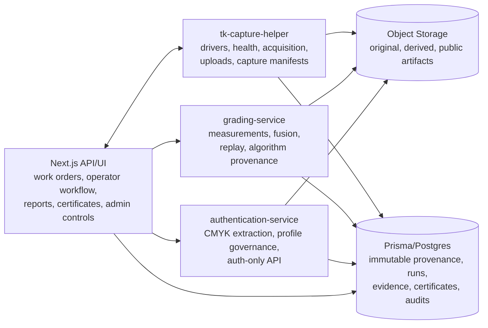
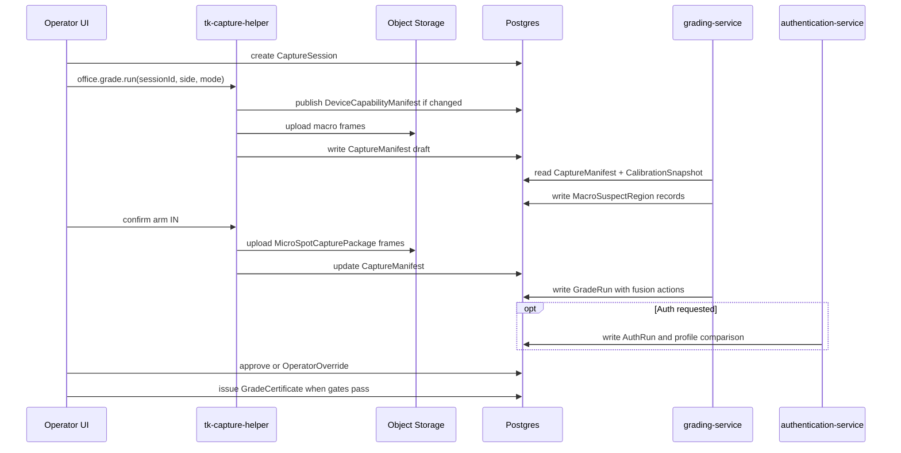
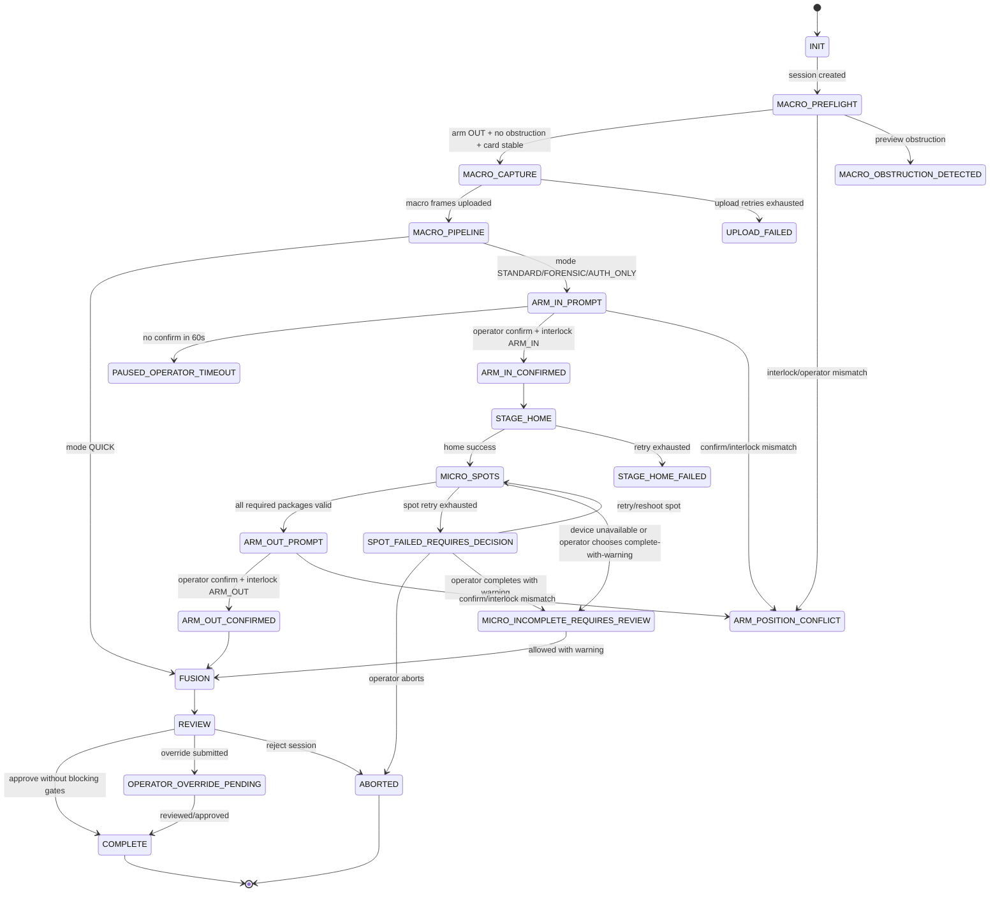

# Ten Kings AI Grader - Codex Technical Specification v5

Proprietary 4-element math grading. Raw-card office pipeline. LEAN single-stand rig. Macro dome plus targeted microscope spot checks. Optional full forensic raster. CMYK print-profile comparison. Deterministic replay provenance.

This document is the standalone implementation blueprint. A fresh Codex agent must be able to build from this file without reading older specifications, reviewer notes, amendment memos, or synthesis documents.

## Changelog v4.1 -> v5

| Amendment ID | v5 landing section / line range | Integrated change |
|---|---|---|
| M0.4.1 | Section 6.2, lines 574-609; Section 10, lines 865-1557 | MacroSuspectRegion contract with coordinate frames, routing threshold, JSON shape, persistence, and type signatures. |
| M0.5.1 | Section 7.2, lines 657-708 | MicroSpotCapturePackage contract for STANDARD microscope visits. |
| M0.5.2 | Section 8.3, lines 767-795 | STANDARD spot-check fusion rule, numbered 1-8, versioned and scoped to inspected evidence. |
| M0.6.1 | Section 2.6, lines 157-172; Section 15, lines 1751-1767 | Timing truth: STANDARD target <=150s, hard <=180s, committed 5.0s median per spot package, FORENSIC 5-8 min. |
| M0.7.1 | Section 10, lines 865-1557 | Migration-safe GradingMode enum strategy with legacy @map preservation. |
| M0.7.2 | Section 10, lines 865-1557 | Durable persistence model for CaptureSession, GradeRun, AuthRun, GradeCertificate, EvidenceArtifact, CustodyEvent, CalibrationSnapshot, GradingSuspectRegion, OperatorOverride, and AuditEvent. |
| M0.8.1 | Section 5, lines 388-532 | Orchestrator/helper failure policy and FSM with named states and error states. |
| M0.11 | Section 3, lines 189-249 | Bounded contexts and ownership boundaries. |
| M0.12 | Section 4, lines 251-386 | DeviceCapabilityManifest and CaptureManifest contracts. |
| M0.13 | Section 8.4, lines 797-814; Section 10, lines 865-1557 | Versioned math IP registry: AlgorithmVersion, ThresholdSetVersion, RuntimeEnvironment, replay provenance. |
| M0.14 | Section 11.1, lines 1560-1570; Section 10, lines 865-1557 | Multi-rig calibration and drift policy. |
| M0.15 | Section 11.2, lines 1572-1584 | Microscope arm hardware/vision interlock policy. |
| M0.16 | Section 9, lines 816-863; Section 10, lines 865-1557 | Authentication product boundary and CardPrintProfile governance. |
| M0.17 | Section 12, lines 1611-1662 | Evidence retention and public/private IP disclosure policy. |
| M0.18 | Sections 11.3-11.4, lines 1586-1609 | Physical alteration and abuse controls split into pre-code hooks and pre-launch algorithms. |
| M0.19 | Sections 12.2-12.3, lines 1622-1662; Section 2.7, lines 174-187 | Public claims, accessibility, and legal guardrails. |
| M0.20 | Section 16, lines 1770-1783 | Pre-code acceptance checklist carried forward verbatim as the final gate before appendices. |

## 1. Purpose, Scope, and Non-Goals

### 1.1 Purpose

Build a deterministic Ten Kings raw-card grading and print-profile comparison system that:

- Captures macro evidence with a Basler ace2, Computar lens, Leimac 8-segment dome, and Leimac IDMU-P Ethernet lighting controller. On the Dell capture-node rig, Arduino Mega + MOSFET lighting is superseded for Leimac production lighting and remains auxiliary-only unless a later approved slice defines interlock/button/sensor use.
- Captures microscope evidence with a Dino-Lite Edge AF7915MZTL on an OpenBuilds ACRO 1010 XY stage.
- Grades four elements from first principles: centering, corners, edges, and surface.
- Uses the microscope on corners, edges, and surface only.
- Never uses microscope frames for centering.
- Produces replayable, auditable GradeRun records tied to immutable capture, algorithm, threshold, runtime, calibration, and evidence provenance.
- Separates grading from CMYK print-profile comparison so authentication can become a standalone product.

### 1.2 In Scope

- Raw cards only: ungraded, not encapsulated, no penny sleeves, no top loaders.
- Single-stand office rig.
- Four grading modes: QUICK, STANDARD, FORENSIC, AUTH_ONLY.
- STANDARD sampled microscope inspection.
- FORENSIC full microscope raster and full edge/corner mosaics.
- AUTH_ONLY CMYK print-profile comparison and supporting physical-alteration gates.
- Prisma schema additions for durable capture, grade, auth, certificate, evidence, custody, calibration, operator, audit, and provenance records.
- Orchestrator FSM and device/capture contracts.
- Public report constraints, accessibility guardrails, and legal/claims boundaries.

### 1.3 Out of Scope

- Encapsulated-card workflows, recognition, or grading.
- Industrial upgrade drivers and vacuum fixtures.
- iPhone field-mode buildout.
- Any claim that STANDARD is exhaustive full-card microscope inspection.
- Any claim that CMYK comparison alone proves full physical authenticity.
- Any code implementation, database migration execution, deploy, restart, or runtime operation in this specification authoring pass.

### 1.4 Source of Truth Rules

This v5 document is authoritative. If any older text or implementation plan conflicts with this file, use this file.

Implementation order:

1. Satisfy the pre-code acceptance checklist in Section 16.
2. Build schema and provenance foundation.
3. Build capture/helper contracts and orchestrator FSM.
4. Build macro suspect routing.
5. Build microscope spot capture.
6. Build STANDARD fusion.
7. Build calibration, interlock, physical gate, auth, report, and audit surfaces.

## 2. Canonical Product Workflow

### 2.1 Raw-Card Workflow

The operator places a raw card directly into a 3D-printed magnetic holder seated on the OpenBuilds ACRO 1010 baseboard. The holder must keep the card flat without sleeves, top loaders, encapsulation, or transparent covers.

If the preview or physical gate detects a sleeve, top loader, encapsulated card, holder, foreign film, or unexpected transparent layer, the session enters `PHYSICAL_GATE_REVIEW` and no public grade or auth certificate may be issued until an authorized operator resolves the gate.

### 2.2 Single-Stand LEAN Rig Topology

One Kaiser RS-1 or equivalent copy stand column carries both optical paths.

| Path | Components | Role |
|---|---|---|
| Macro | Basler ace2 a2A2464-23gcPRO, Computar M2514-MP2 25mm lens, Leimac IDRA-T194/140-DW-1-8ch dome, Leimac IDMU-P Ethernet PWM controller | Whole-card capture, centering, macro corners, macro edges, macro surface heatmap, suspect generation. |
| Micro | Dino-Lite Edge AF7915MZTL, Manfrotto 196B-3 arm, Manfrotto 035 clamp, OpenBuilds ACRO 1010 with GRBL | Targeted STANDARD spot checks, FORENSIC raster/mosaics, CMYK patches. |
| Holder | 3D-printed magnetic raw-card holder with fiducials | Raw-card placement, card-to-stage transform calibration. |
| Capture PC | Windows 11 PC with helper service | Local device drivers, frame acquisition, capture manifests, upload retries. |

The microscope arm parks out of the macro frame during macro capture and swings in over the card for microscope capture. Macro capture is blocked unless the arm interlock and macro preview both confirm that the arm is out.

### 2.3 Grading Modes

| Mode | Enum | Macro | Microscope | Auth | Wall-clock acceptance | Public description |
|---|---|---|---|---|---|---|
| Quick Grade | `QUICK` | Yes | No | No | <=25s median | Macro-only grading for low-value or preview use. |
| Standard Grade | `STANDARD` | Yes | Targeted spot checks on corners, edge midpoints, and macro surface suspects | Optional only if explicitly requested | Target <=150s median; hard <=180s median | Sampled microscope verification of key risk zones, not exhaustive full-card inspection. |
| Forensic Grade | `FORENSIC` | Yes | Full-card raster, edge strips, corner mosaics, CMYK patches | Yes when card identity is supplied | 5-8 min median | Exhaustive microscope evidence for high-value, dispute, or showcase grades. |
| Authentication Only | `AUTH_ONLY` | Centering proof / physical gate frames | CMYK patches and physical alteration gates | Yes | <=120s median | Print-profile comparison and physical gate review; no grade produced. |

Default operator mode is `STANDARD`.

Deprecated legacy values are read-only compatibility values:

- `MACRO_ONLY`
- `MACRO_PLUS_CORNERS`
- `MACRO_PLUS_EDGES`
- `FULL_TWO_SCALE`

### 2.4 Microscope Use by Element

| Grading element | Microscope in STANDARD? | Rule |
|---|---|---|
| Centering | No | Centering is macro-only geometric measurement of printed border vs cut edge. |
| Corners | Yes | Visit all 4 corners and classify whitening, exposed fibers, dust, restoration indicators, and micro damage. |
| Edges | Yes | Visit 4 edge midpoints and classify nicks, chips, fuzz, dust, restoration indicators, and sampled edge defects. |
| Surface | Yes, conditionally | Visit top 1-3 macro suspect regions per side. If zero suspects exceed threshold, skip surface microscope pass and keep mode `STANDARD`. |

STANDARD microscope evidence only affects inspected regions. It does not clear unvisited areas.

### 2.5 Per-Side Capture Sequence

1. Operator places raw card in holder and confirms side.
2. Macro preflight verifies arm out, holder/card visible, no obstruction, no sleeve/top-loader/encapsulation, and motion stable.
3. Macro capture collects:
   - ColorChecker frame when session calibration is stale.
   - Diffuse all-LED frame.
   - Darkfield frame.
   - 8 single-LED photometric stereo frames.
4. Macro pipeline computes:
   - Centering final measurement.
   - Provisional corners, edges, and surface.
   - Ordered MacroSuspectRegion list.
   - Physical gate prechecks.
5. For `QUICK`, skip microscope and proceed to fusion/review.
6. For `STANDARD`, operator swings microscope in; interlock must confirm `ARM_IN`.
7. Stage homes and moves through:
   - 4 corner spots.
   - 4 edge midpoint spots.
   - Top 1-3 surface suspects above threshold.
8. Each visit captures one MicroSpotCapturePackage.
9. Operator swings microscope out; interlock and macro preview must confirm `ARM_OUT`.
10. Fusion runs:
   - Centering passes through from macro unchanged.
   - Corners/edges/surface use scoped STANDARD spot fusion.
11. Operator reviews grade, unresolved gates, failed spots, warnings, and evidence.
12. Operator flips card and repeats for the other side.
13. System creates GradeRun; certificate issuance is separate and requires all gates satisfied.

### 2.6 Timing Truth and Acceptance

STANDARD uses a committed per-spot package timing of 5.0 seconds median. This includes stage move, settle, focus lock when needed, EDR, polarized frame, 8 FLC frames, local checksum, and manifest record creation. Uploads may continue asynchronously if the CaptureManifest records pending uploads and the orchestrator blocks GradeRun certification until uploads complete.

| Phase | QUICK | STANDARD | FORENSIC | AUTH_ONLY |
|---|---:|---:|---:|---:|
| Card placement + UI confirm | 5s | 5s | 5s | 5s |
| Macro capture, both sides | 10s | 10s | 10s | 3s proof frames |
| Arm swing and interlock, both sides | 0s | 12s | 12s | 6s |
| Microscope packages, both sides | 0s | 18-24 spots x 5.0s = 90-120s | Full raster/mosaics = 4-7 min | 5 auth spots = 25s |
| Pipeline/fusion | 5s | 15s | 30-60s | 10s |
| Review/save | 0-5s | 20s | 30s | 10s |
| Flip | 3s | 3s | 3s | n/a |
| Acceptance | <=25s median | target <=150s; hard <=180s median | 5-8 min median | <=120s median |

Public copy must use these mode-specific timings. The system must not publish a generic office-grade timing that hides the selected mode.

### 2.7 Comparison-Claim Acceptance Matrix

| Capability claim | v5 public-safe wording | Acceptance test |
|---|---|---|
| Centering precision | Macro-only centering repeatability target is about 10 microns after validation on LEAN rig. | Capture calibrated centering target 30 times after re-placement; per-edge offset standard deviation <15 microns. |
| Corner analysis | STANDARD samples all four corners at microscope scale; FORENSIC captures corner mosaics. | STANDARD sessions contain valid MicroSpotCapturePackage for 4 corners per side; FORENSIC contains corner mosaic artifacts. |
| Edge analysis | STANDARD samples edge midpoints; FORENSIC captures edge strips. | STANDARD sessions contain 4 edge midpoint packages per side; FORENSIC contains edge strip artifacts. |
| Surface analysis | STANDARD routes top macro suspects to microscope; FORENSIC performs full raster. | MacroSuspectRegion routing test proves top-N suspects are captured; FORENSIC raster count matches mode plan. |
| Dust filtering | Dust correction applies only to inspected regions. | Fixture test with labeled dust confirms inspected dust is excluded and excessive dust forces reshoot/review. |
| Authentication | AUTH_ONLY and FORENSIC can perform CMYK print-profile comparison when card identity and curated reference exist. | Back-to-back same-card auth distance < configured authentic threshold; first profile returns `REFERENCE_NEEDED`. |
| Repeatability | Same stored evidence plus same algorithm, thresholds, and runtime tolerance replays deterministically. | ReplayRun reproduces GradeRun within numeric tolerance using stored manifests and hashes. |
| Transparency | Public reports show evidence summaries, inspected areas, mode limits, and accessible explanations. | Report accessibility test and mode-disclosure test pass. |
| Throughput | STANDARD target <=150s median and hard <=180s median on one rig. | 30-card regression records wall-clock median and spot timings. |
| Cost per grade | No public engineering claim in v5. | Not applicable; operational finance model is outside this spec. |

## 3. Bounded Context Architecture

### 3.1 Context Ownership



| Context | Owns | Does not own |
|---|---|---|
| `tk-capture-helper` | Local drivers, device health, previews, frame acquisition, checksums, upload retries, DeviceCapabilityManifest, CaptureManifest emission. | Grading math, threshold choice, grade fusion, certificate issuance, auth verdict policy. |
| `grading-service` | Measurement extraction, deterministic algorithms, fusion, replay, algorithm/runtime provenance. | Hardware control, tenant auth, operator workflow, certificate publishing. |
| `authentication-service` | CMYK fingerprint extraction, print-profile matching, profile lifecycle, auth-only API. | Composite grade calculation. |
| Next.js API/UI | Work orders, operator workflow, reports, certificates, admin controls, access control. | Numeric grading algorithms and device drivers. |
| Prisma/Postgres | Immutable provenance, runs, evidence, certificates, custody, calibration, audits. | Runtime orchestration logic. |

### 3.2 Data Flow



## 4. Hardware, Device, and Capture Contracts

### 4.1 LEAN BOM

| Component | Required item | Driver |
|---|---|---|
| Macro camera | Basler ace2 a2A2464-23gcPRO | `basler_camera.py` using pypylon |
| Lens | Computar M2514-MP2 25mm | Calibration metadata only |
| Lighting | Leimac IDRA-T194/140-DW-1-8ch | Leimac IDMU-P Ethernet PWM controller |
| LED controller | Leimac IDMU-P base + expansion, read/configured over LAN; Basler Exposure Active on Line 2 triggers Leimac TRG IN1 for synchronized exposure lighting | Leimac ASCII TCP/UDP or GenICam/GigE Vision; Arduino Mega may remain auxiliary only |
| Microscope | Dino-Lite Edge AF7915MZTL | `dino_lite_microscope.py` using SDK wrapper |
| XY stage | OpenBuilds ACRO 1010 GRBL | `grbl_stage.py` using serial G-code |
| Holder | Raw-card magnetic holder with fiducials | Calibration transform |
| Stand | Kaiser RS-1 or equivalent | Interlock/obstruction policy |
| Calibration | ColorChecker, stage micrometer, fiducial target, flat-field target | CalibrationSnapshot artifacts |

### 4.2 DeviceCapabilityManifest

Every driver must publish a capability manifest when helper starts and whenever driver configuration changes.

```typescript
export type DeviceType =
  | 'MACRO_CAMERA'
  | 'LED_CONTROLLER'
  | 'MICROSCOPE'
  | 'XY_STAGE'
  | 'ARM_INTERLOCK'
  | 'HOLDER_FIDUCIAL';

export interface DeviceCapabilityManifest {
  id: string;
  rigId: string;
  helperInstanceId: string;
  driverName: string;
  driverVersion: string;
  deviceType: DeviceType;
  componentSerial: string;
  supportedCapturePackages: string[];
  coordinateUnits: Record<string, 'px' | 'mm' | 'micron' | 'degree' | 'bitmask'>;
  timingCharacteristics: Record<string, number>;
  healthChecks: Array<{ name: string; required: boolean; timeoutMs: number }>;
  requiredCalibrationTypes: string[];
  checksum: string;
  observedAt: string;
}
```

### 4.3 CaptureManifest

The helper emits an immutable CaptureManifest. The grading-service consumes this manifest, not hardware-specific assumptions.

```typescript
export interface CaptureManifestFrame {
  frameId: string;
  kind: GradingCaptureKind;
  side: CaptureSide;
  storageKey: string;
  checksumSha256: string;
  capturedAt: string;
  exposureUs?: number;
  ledMask?: number;
  stageXMicrons?: number;
  stageYMicrons?: number;
  microMagnification?: number;
  polarizerAngle?: number;
  focusScore?: number;
  sourceSuspectRegionId?: string;
  widthPx?: number;
  heightPx?: number;
}

export interface CaptureManifest {
  id: string;
  captureSessionId: string;
  tenantId: string;
  rigId: string;
  locationId: string;
  operatorId: string;
  helperInstanceId: string;
  helperVersion: string;
  driverVersions: Record<string, string>;
  componentSerials: Record<string, string>;
  calibrationSnapshotIds: string[];
  frameList: CaptureManifestFrame[];
  operatorPrompts: Array<{ prompt: string; shownAt: string; confirmedAt?: string }>;
  deviceHealth: Array<{ check: string; status: 'PASS' | 'WARN' | 'FAIL'; detail?: string }>;
  checksumSha256: string;
  createdAt: string;
}
```

### 4.4 Device Driver Contract

```python
from typing import Protocol, Literal, TypedDict, Any

class DeviceCapabilityManifestDict(TypedDict):
    driverName: str
    driverVersion: str
    deviceType: str
    componentSerial: str
    supportedCapturePackages: list[str]
    coordinateUnits: dict[str, str]
    timingCharacteristics: dict[str, float]
    healthChecks: list[dict[str, Any]]
    requiredCalibrationTypes: list[str]
    checksum: str

class DeviceDriver(Protocol):
    def open(self) -> None: ...
    def close(self) -> None: ...
    def health_check(self) -> dict[str, Any]: ...
    def capability_manifest(self) -> DeviceCapabilityManifestDict: ...

class MacroCameraDriver(DeviceDriver, Protocol):
    def configure_for_grading(self, calibration: dict[str, Any]) -> None: ...
    def grab_one(self, kind: str, timeout_ms: int = 2000) -> Any: ...

class LEDControllerDriver(DeviceDriver, Protocol):
    def all_off(self) -> None: ...
    def on(self, channel: int) -> None: ...
    def off(self, channel: int) -> None: ...
    def strobe(self, channel: int, pulse_us: int) -> None: ...

class MicroscopeDriver(DeviceDriver, Protocol):
    def read_amr(self) -> float: ...
    def autofocus(self) -> float: ...
    def capture_edr(self) -> Any: ...
    def capture_polarized(self) -> Any: ...
    def capture_flc_stack(self) -> list[Any]: ...

class StageDriver(DeviceDriver, Protocol):
    def home(self) -> None: ...
    def move_to(self, x_mm: float, y_mm: float, feedrate_mm_min: int = 3000) -> None: ...
    def position_mm(self) -> tuple[float, float]: ...
```

## 5. Orchestrator FSM and Failure Policy

### 5.1 State Diagram



### 5.2 State Table

| State | Entry action | Guards to leave | Failure state |
|---|---|---|---|
| `INIT` | Load session, mode, rig, operator, current calibration snapshots. | Session belongs to tenant; rig active; operator authorized. | `ABORTED` |
| `MACRO_PREFLIGHT` | Check arm interlock, obstruction, card stability, physical gate preview. | `ARM_OUT`, no obstruction, card stable >1s. | `ARM_POSITION_CONFLICT`, `MACRO_OBSTRUCTION_DETECTED`, `PHYSICAL_GATE_REVIEW` |
| `MACRO_CAPTURE` | Capture macro frame set and upload originals. | Required macro frames checksummed and listed in manifest. | `UPLOAD_FAILED` |
| `MACRO_PIPELINE` | Run macro measurement and suspect generation. | Macro output valid; physical gates not blocking. | `PHYSICAL_GATE_REVIEW` |
| `ARM_IN_PROMPT` | Prompt operator to swing microscope in. | Operator confirms within 60s and interlock says `ARM_IN`. | `PAUSED_OPERATOR_TIMEOUT`, `ARM_POSITION_CONFLICT` |
| `ARM_IN_CONFIRMED` | Lock macro capture, enable stage motion. | Interlock remains `ARM_IN`. | `ARM_POSITION_CONFLICT` |
| `STAGE_HOME` | Run GRBL `$H`; retry once on failure. | Home success and position readable. | `STAGE_HOME_FAILED` |
| `MICRO_SPOTS` | Capture packages for mode plan. | All required packages valid or operator chooses warning path. | `SPOT_FAILED_REQUIRES_DECISION`, `MICRO_INCOMPLETE_REQUIRES_REVIEW` |
| `ARM_OUT_PROMPT` | Prompt operator to swing microscope out. | Operator confirms and interlock says `ARM_OUT`. | `ARM_POSITION_CONFLICT` |
| `ARM_OUT_CONFIRMED` | Re-enable macro capture. | Vision obstruction check passes if another side remains. | `MACRO_OBSTRUCTION_DETECTED` |
| `FUSION` | Run algorithm-versioned fusion. | GradeRun written with hashes and fusion actions. | `ABORTED` |
| `REVIEW` | Show grades, warnings, gates, and evidence. | Operator approves or submits override. | `OPERATOR_OVERRIDE_PENDING`, `ABORTED` |
| `OPERATOR_OVERRIDE_PENDING` | Persist OperatorOverride and audit event. | Reviewer approves or rejects. | `ABORTED` |
| `COMPLETE` | Finalize CaptureSession; optional GradeCertificate. | All certification gates pass. | n/a |

### 5.3 Named Error States

| Error state | Meaning | Required operator/system behavior |
|---|---|---|
| `STAGE_HOME_FAILED` | ACRO homing failed after one retry. | Abort side; require mechanical inspection before reuse. |
| `MICRO_INCOMPLETE_REQUIRES_REVIEW` | Microscope evidence missing or invalid. | Grade may complete only with visible warning; certificate requires reviewer approval. |
| `ARM_POSITION_CONFLICT` | Operator confirmation and interlock disagree. | Pause session; block capture and stage motion until resolved. |
| `MACRO_OBSTRUCTION_DETECTED` | Macro preview sees microscope/foreign obstruction. | Discard affected frame and recapture after arm out. |
| `UPLOAD_FAILED` | Required frame upload failed after 3 retries. | Abort side; keep local files for recovery if checksum exists. |
| `SPOT_FAILED_REQUIRES_DECISION` | One spot failed after retry. | Operator chooses retry, reshoot side, abort, or complete with warning. |
| `PHYSICAL_GATE_REVIEW` | Physical alteration or holder/sleeve gate triggered. | Block public certificate until authorized review. |
| `PAUSED_OPERATOR_TIMEOUT` | Operator did not confirm within timeout. | Keep session resumable; no hardware motion. |
| `ABORTED` | Session intentionally stopped. | Preserve evidence and audit reason. |

### 5.4 Orchestrator Interfaces

```typescript
export type OrchestratorState =
  | 'INIT'
  | 'MACRO_PREFLIGHT'
  | 'MACRO_CAPTURE'
  | 'MACRO_PIPELINE'
  | 'ARM_IN_PROMPT'
  | 'ARM_IN_CONFIRMED'
  | 'STAGE_HOME'
  | 'MICRO_SPOTS'
  | 'ARM_OUT_PROMPT'
  | 'ARM_OUT_CONFIRMED'
  | 'FUSION'
  | 'REVIEW'
  | 'OPERATOR_OVERRIDE_PENDING'
  | 'COMPLETE'
  | 'STAGE_HOME_FAILED'
  | 'MICRO_INCOMPLETE_REQUIRES_REVIEW'
  | 'ARM_POSITION_CONFLICT'
  | 'MACRO_OBSTRUCTION_DETECTED'
  | 'UPLOAD_FAILED'
  | 'SPOT_FAILED_REQUIRES_DECISION'
  | 'PHYSICAL_GATE_REVIEW'
  | 'PAUSED_OPERATOR_TIMEOUT'
  | 'ABORTED';

export interface OrchestratorEvent {
  sessionId: string;
  from: OrchestratorState;
  to: OrchestratorState;
  event:
    | 'SESSION_CREATED'
    | 'PREFLIGHT_PASS'
    | 'MACRO_UPLOADED'
    | 'MACRO_PIPELINE_COMPLETE'
    | 'ARM_IN_CONFIRMED'
    | 'STAGE_HOME_COMPLETE'
    | 'MICRO_SPOTS_COMPLETE'
    | 'ARM_OUT_CONFIRMED'
    | 'FUSION_COMPLETE'
    | 'OPERATOR_APPROVED'
    | 'OPERATOR_OVERRIDE_SUBMITTED'
    | 'ERROR'
    | 'ABORT';
  guardResults: Record<string, boolean | string | number>;
  errorCode?: string;
  occurredAt: string;
}

export interface OrchestratorTransitionResult {
  accepted: boolean;
  nextState: OrchestratorState;
  auditEventId: string;
  userVisibleMessage?: string;
}
```

```python
def transition_orchestrator_state(
    session_id: str,
    current_state: str,
    event: dict,
    guard_results: dict,
) -> dict:
    """
    Pure transition function.
    Writes no files and controls no hardware.
    Returns next state, error code, audit payload, and user-visible message.
    """
```

## 6. Macro Pipeline and Suspect Routing

### 6.1 Macro Pipeline Output

```typescript
export interface MacroPipelineOutput {
  sessionId: string;
  side: CaptureSide;
  captureManifestId: string;
  algorithmVersionId: string;
  thresholdSetVersionId: string;
  centeringMeasurement: CenteringMeasurement;
  provisionalGrades: {
    centering: number;
    corners: number;
    edges: number;
    surface: number;
  };
  macroMeasurements: Record<string, unknown>;
  suspectRegions: MacroSuspectRegion[];
  physicalGateResults: PhysicalGateResult[];
  evidenceArtifacts: EvidenceArtifactRef[];
}
```

```python
def run_macro_pipeline(
    session_id: str,
    side: str,
    capture_manifest: dict,
    calibration_snapshots: list[dict],
    threshold_set: dict,
    algorithm_version: dict,
) -> dict:
    """
    Returns MacroPipelineOutput including MacroSuspectRegion[].
    Centering is final for this side and never consumes microscope evidence.
    """
```

### 6.2 MacroSuspectRegion Contract

The macro surface pipeline must persist suspect regions as queryable records and include them in the macro output.

```typescript
export type CaptureSide = 'FRONT' | 'BACK';
export type GradingElement = 'CENTERING' | 'CORNERS' | 'EDGES' | 'SURFACE' | 'COMPOSITE' | 'CMYK_AUTHENTICATION';

export interface Rect {
  x: number;
  y: number;
  w: number;
  h: number;
}

export interface MacroSuspectRegion {
  id: string;
  sessionId: string;
  side: CaptureSide;
  element: 'SURFACE';
  rank: number;
  score: number;
  threshold: number;
  reasonCodes: string[];
  cardMm: Rect;
  warpedPx: Rect;
  sourcePx?: Rect;
  heatmapStorageKey?: string;
  macroCaptureIds: string[];
  thresholdSetId: string;
}
```

Default `surfaceSuspectThreshold` is `0.72` until tuned by threshold-set governance. The score is a normalized 0-1 composite of photometric-stereo curvature, darkfield anomaly, LAB delta, connected-component size, and linearity.

STANDARD routes only the top `standardSurfaceTopN` regions per side above threshold, default `3`.

### 6.3 Card-to-Stage Transform

Microscope routing uses a calibrated side-aware transform from `cardMm` to `stageMm`.

Required calibration:

- Holder fiducials visible in macro preview.
- ACRO home established.
- Daily transform fit using at least 4 fiducial points.
- RMS residual <=50 microns.
- Back-side orientation correction stored in CalibrationSnapshot.
- Bounds check that every requested microscope position remains inside safe stage travel.

```python
def card_mm_to_stage_mm(
    side: str,
    card_x_mm: float,
    card_y_mm: float,
    transform_snapshot: dict,
) -> tuple[float, float]:
    """
    Applies side-specific affine or homography transform and backlash compensation.
    Raises if residual is stale, transform is expired, or target is out of bounds.
    """
```

## 7. Microscope Capture

### 7.1 STANDARD Spot Plan

Per side, STANDARD captures:

- 4 corner spots.
- 4 edge midpoint spots.
- 0-3 surface suspect spots from MacroSuspectRegion routing.

Every spot must link back to:

- CaptureSession.
- CaptureManifest.
- side.
- element.
- spot index and total.
- stage coordinates.
- source suspect id for surface spots.

### 7.2 MicroSpotCapturePackage

```typescript
export interface MicroSpotCapturePackage {
  id: string;
  sessionId: string;
  captureManifestId: string;
  side: CaptureSide;
  element: 'CORNERS' | 'EDGES' | 'SURFACE' | 'CMYK_AUTHENTICATION';
  spotIndex: number;
  totalSpots: number;
  sourceSuspectRegionId?: string;
  stageXMicrons: number;
  stageYMicrons: number;
  microMagnification: number;
  amrReading: number;
  focusScore: number;
  frames: {
    edrBase: EvidenceArtifactRef;
    polarizedAllOn: EvidenceArtifactRef;
    flcLed0: EvidenceArtifactRef;
    flcLed1: EvidenceArtifactRef;
    flcLed2: EvidenceArtifactRef;
    flcLed3: EvidenceArtifactRef;
    flcLed4: EvidenceArtifactRef;
    flcLed5: EvidenceArtifactRef;
    flcLed6: EvidenceArtifactRef;
    flcLed7: EvidenceArtifactRef;
  };
  capturedAt: string;
  validForClassification: boolean;
}
```

```python
def capture_micro_spot_package(
    session_id: str,
    side: str,
    element: str,
    spot_index: int,
    total_spots: int,
    stage_x_mm: float,
    stage_y_mm: float,
    source_suspect_region_id: str | None,
    dino: MicroscopeDriver,
    stage: StageDriver,
) -> dict:
    """
    Moves the stage, verifies AMR, autofocuses, captures EDR, polarized, and 8-FLC frames,
    uploads/checksums frames, and returns MicroSpotCapturePackage.
    """
```

### 7.3 FORENSIC Capture

FORENSIC uses the same device contracts and package metadata but captures:

- 3x3 corner mosaics per corner.
- Edge strips per edge.
- Full-card surface raster.
- 5 CMYK auth patches on the front side unless product policy requires both sides.

FORENSIC evidence may support global full-raster fusion because the inspected area is exhaustive by mode definition.

### 7.4 AUTH_ONLY Capture

AUTH_ONLY captures:

- Macro proof frames for physical gates, centering proof, and report context.
- 5 CMYK microscope patches.
- Any required physical alteration gate frames.

AUTH_ONLY produces no element grades and cannot issue GradeCertificate with grade values.

## 8. Grading Math, Fusion, and Replay

### 8.1 Centering

Centering is macro-only.

LEAN rig canonical precision:

- Warped macro resolution: about 30-32 px/mm.
- One macro pixel: about 31-33 microns.
- Required validated edge-fit repeatability: <15 microns per edge across 30 recaptures.
- Public-safe claim after passing validation: about 10 micron repeatability.

Do not claim industrial-rig pixel density for the LEAN rig. Do not claim microscope-assisted centering.

### 8.2 STANDARD Fusion Actions

```typescript
export type FusionActionType = 'LOWER' | 'HOLD' | 'DUST_CORRECT' | 'WARNING_ONLY';

export interface FusionAction {
  action: FusionActionType;
  element: 'CORNERS' | 'EDGES' | 'SURFACE';
  side: CaptureSide;
  regionId?: string;
  spotPackageId: string;
  macroMeasurement: unknown;
  microMeasurement: unknown;
  gradeBefore: number;
  gradeAfter: number;
  algorithmVersionId: string;
  thresholdSetVersionId: string;
  reasonCodes: string[];
}
```

### 8.3 STANDARD Spot-Check Fusion Rule

The STANDARD fusion algorithm must be registered as an AlgorithmVersion before use. Initial semantic version: `STANDARD_SPOT_FUSION_V1`.

Rules:

1. Centering never consumes microscope evidence.
2. STANDARD micro evidence affects only the inspected corner, edge zone, or suspect region.
3. A microscope-confirmed real defect may lower or hold the relevant element grade.
4. A microscope-confirmed dust/lint particle may remove only the macro suspect region it directly overlaps from the macro defect count.
5. Dust correction may raise the final element grade relative to the contamination-biased provisional macro grade, but never above the macro grade recomputed with that inspected contamination excluded.
6. Excessive dust burden forces clean/reshoot instead of broad subtraction.
7. Unvisited card areas are not exonerated by spot checks.
8. Every fusion action records `{algorithmVersionId, thresholdSetVersionId, macroMeasurement, microMeasurement, action, regionId}`.

```python
def fuse_standard_grade(
    macro_output: dict,
    micro_packages: list[dict],
    algorithm_version: dict,
    threshold_set: dict,
    runtime_environment: dict,
) -> dict:
    """
    Consumes MacroPipelineOutput and MicroSpotCapturePackage[].
    Emits GradeRun payload with fusionActions and finalGrades.
    Does not issue a GradeCertificate.
    """
```

### 8.4 Deterministic Replay

Determinism means:

Same stored evidence + same CaptureManifest + same CalibrationSnapshot set + same AlgorithmVersion + same ThresholdSetVersion + same RuntimeEnvironment numeric tolerance = same replay result within recorded tolerance.

It does not mean physical recapture always produces the same result.

ReplayRun must record:

- Source GradeRun.
- Replayed AlgorithmVersion.
- Replayed ThresholdSetVersion.
- RuntimeEnvironment.
- Input checksums.
- Output checksums.
- Numeric deltas.
- Pass/fail against tolerance policy.

## 9. Authentication Product Boundary

### 9.1 Authentication Scope

Authentication is a separate bounded context. It can be sold as AUTH_ONLY, embedded in FORENSIC, or optionally requested alongside STANDARD only if the required auth evidence and physical gates are present.

CMYK comparison is print-profile comparison. Full authenticity claims require physical alteration gates sufficient to detect trimming, coatings, recoloring, layers, residues, holder artifacts, and other hostile-card attacks.

### 9.2 Card Identity

AUTH_ONLY and FORENSIC auth require operator-supplied:

- `cardSet`
- `cardNumber`
- optional `printRun`
- optional notes/source of identity

The grader does not identify the card from images in v5.

### 9.3 CardPrintProfile Lifecycle

| State | Meaning | Public verdict allowed |
|---|---|---|
| `CANDIDATE` | Fingerprint captured but not approved. | `REFERENCE_NEEDED` |
| `CURATED_REFERENCE` | Approved by authorized operator as usable reference. | Internal only until activated. |
| `ACTIVE` | Used for production comparison. | Auth verdicts allowed. |
| `QUARANTINED` | Suspected bad profile or dispute. | `REFERENCE_NEEDED` or manual review only. |
| `RETIRED` | Superseded or invalidated. | No new comparisons. |

First-seen cards do not become authentic baselines automatically.

### 9.4 AuthRun Signature

```python
def run_cmyk_print_profile_comparison(
    capture_manifest: dict,
    card_set: str,
    card_number: str,
    print_run: str | None,
    profile_state_policy: dict,
    algorithm_version: dict,
    runtime_environment: dict,
) -> dict:
    """
    Emits AuthRun.
    If no ACTIVE profile exists, verdict is REFERENCE_NEEDED.
    """
```

## 10. Prisma Schema Blueprint

This schema is the implementation blueprint for new grader/auth/capture entities. Existing Ten Kings `User` and commerce models may be connected during implementation, but this blueprint is complete for the grader domain.

```prisma
enum GradingMode {
  QUICK
  STANDARD
  FORENSIC
  AUTH_ONLY

  MACRO_ONLY          @map("MACRO_ONLY")
  MACRO_PLUS_CORNERS @map("MACRO_PLUS_CORNERS")
  MACRO_PLUS_EDGES   @map("MACRO_PLUS_EDGES")
  FULL_TWO_SCALE     @map("FULL_TWO_SCALE")
}

enum CaptureSide {
  FRONT
  BACK
}

enum GradingElement {
  CENTERING
  CORNERS
  EDGES
  SURFACE
  COMPOSITE
  MICRO_CORNERS
  MICRO_EDGES
  MICRO_SURFACE
  CMYK_AUTHENTICATION
}

enum GradingCaptureKind {
  COLOR_CHECKER_FRONT
  COLOR_CHECKER_BACK
  FRONT_DIFFUSE
  BACK_DIFFUSE
  FRONT_DARKFIELD
  BACK_DARKFIELD
  FRONT_LED_0
  FRONT_LED_1
  FRONT_LED_2
  FRONT_LED_3
  FRONT_LED_4
  FRONT_LED_5
  FRONT_LED_6
  FRONT_LED_7
  BACK_LED_0
  BACK_LED_1
  BACK_LED_2
  BACK_LED_3
  BACK_LED_4
  BACK_LED_5
  BACK_LED_6
  BACK_LED_7
  MICRO_CORNER_SPOT
  MICRO_EDGE_SPOT
  MICRO_SURFACE_SPOT
  MICRO_AUTH_PATCH
  MICRO_CORNER_TILE
  MICRO_EDGE_TILE
  MICRO_SURFACE_TILE
  EDR_BASE
  POLARIZED_ALL_ON
  FLC_LED_0
  FLC_LED_1
  FLC_LED_2
  FLC_LED_3
  FLC_LED_4
  FLC_LED_5
  FLC_LED_6
  FLC_LED_7
}

enum CaptureSessionStatus {
  CREATED
  RUNNING
  PAUSED
  MICRO_INCOMPLETE_REQUIRES_REVIEW
  PHYSICAL_GATE_REVIEW
  REVIEW
  COMPLETE
  ABORTED
}

enum GradeRunStatus {
  PENDING
  RUNNING
  COMPLETE
  FAILED
  REPLAYED
}

enum AuthRunStatus {
  PENDING
  RUNNING
  COMPLETE
  FAILED
}

enum AuthVerdict {
  REFERENCE_NEEDED
  AUTHENTIC
  PROBABLY_AUTHENTIC
  SUSPICIOUS
  LIKELY_COUNTERFEIT
}

enum PrintProfileStatus {
  CANDIDATE
  CURATED_REFERENCE
  ACTIVE
  QUARANTINED
  RETIRED
}

enum EvidenceClass {
  ORIGINAL
  DERIVED
  PUBLIC
  PRIVATE
}

enum CertificateStatus {
  DRAFT
  ACTIVE
  REVOKED
  SUPERSEDED
}

enum RigComponentType {
  MACRO_CAMERA
  LENS
  LED_DOME
  LED_CONTROLLER
  MICROSCOPE
  XY_STAGE
  ARM_INTERLOCK
  HOLDER
  CALIBRATION_TARGET
}

enum CalibrationType {
  COLOR_CHECKER_CCM
  MACRO_INTRINSICS
  MACRO_FLAT_FIELD
  STAGE_HOME
  CARD_JIG_TRANSFORM
  MICROSCOPE_PX_PER_MICRON
  MICROSCOPE_FOCUS_BASELINE
  LED_INTENSITY_HEALTH
  ARM_INTERLOCK_HEALTH
}

enum OperatorOverrideReviewStatus {
  PENDING
  APPROVED
  REJECTED
}

enum AuditEventOutcome {
  SUCCESS
  FAILURE
  DENIED
  WARNING
}

enum CustodyEventType {
  INTAKE
  CAPTURE_START
  CAPTURE_COMPLETE
  VAULT_IN
  VAULT_OUT
  SHIPPED
  RECEIVED
  SLAB_SENT
  SLAB_RETURNED
  CERTIFICATE_ISSUED
  CERTIFICATE_REVOKED
  CUSTODY_BREAK
}

model Tenant {
  id        String   @id @default(cuid())
  name      String
  slug      String   @unique
  createdAt DateTime @default(now())
  updatedAt DateTime @updatedAt

  locations RigLocation[]
  rigs      CaptureRig[]
  operators Operator[]
}

model RigLocation {
  id        String   @id @default(cuid())
  tenantId  String
  tenant    Tenant   @relation(fields: [tenantId], references: [id], onDelete: Cascade)
  name      String
  address   Json?
  createdAt DateTime @default(now())
  updatedAt DateTime @updatedAt

  rigs CaptureRig[]

  @@index([tenantId])
}

model Operator {
  id          String   @id @default(cuid())
  tenantId    String
  tenant      Tenant   @relation(fields: [tenantId], references: [id], onDelete: Cascade)
  userId      String?
  email       String
  displayName String
  roles       Json
  status      String   @default("ACTIVE")
  createdAt   DateTime @default(now())
  updatedAt   DateTime @updatedAt

  @@unique([tenantId, email])
  @@index([userId])
}

model CaptureRig {
  id          String      @id @default(cuid())
  tenantId    String
  tenant      Tenant      @relation(fields: [tenantId], references: [id], onDelete: Cascade)
  locationId  String
  location    RigLocation @relation(fields: [locationId], references: [id], onDelete: Restrict)
  label       String
  rigVersion  String      @default("LEAN_V5")
  status      String      @default("ACTIVE")
  createdAt   DateTime    @default(now())
  updatedAt   DateTime    @updatedAt

  components          RigComponent[]
  helperInstances     HelperInstance[]
  calibrationSnapshots CalibrationSnapshot[]
  captureSessions     CaptureSession[]

  @@index([tenantId, locationId])
}

model RigComponent {
  id           String           @id @default(cuid())
  rigId         String
  rig           CaptureRig       @relation(fields: [rigId], references: [id], onDelete: Cascade)
  type          RigComponentType
  manufacturer  String
  model         String
  serial        String
  driverName    String?
  metadata      Json?
  mountedAt     DateTime         @default(now())
  retiredAt     DateTime?

  @@unique([rigId, type, serial])
  @@index([serial])
}

model HelperInstance {
  id            String     @id @default(cuid())
  rigId          String
  rig            CaptureRig @relation(fields: [rigId], references: [id], onDelete: Cascade)
  machineId      String
  helperVersion  String
  config         Json?
  status         String     @default("ACTIVE")
  lastSeenAt     DateTime?
  createdAt      DateTime   @default(now())
  updatedAt      DateTime   @updatedAt

  capabilityManifests DeviceCapabilityManifest[]
  captureSessions     CaptureSession[]

  @@unique([machineId])
  @@index([rigId])
}

model DeviceCapabilityManifest {
  id                         String         @id @default(cuid())
  helperInstanceId           String
  helperInstance             HelperInstance @relation(fields: [helperInstanceId], references: [id], onDelete: Cascade)
  rigId                       String
  manifestVersion             String
  driverName                  String
  driverVersion               String
  deviceType                  String
  componentSerial             String
  supportedCapturePackages    Json
  coordinateUnits             Json
  timingCharacteristics       Json
  healthChecks                Json
  requiredCalibrationTypes    Json
  checksum                    String
  observedAt                  DateTime       @default(now())

  @@index([rigId, deviceType])
  @@unique([helperInstanceId, checksum])
}

model CalibrationSnapshot {
  id                    String          @id @default(cuid())
  rigId                  String
  rig                    CaptureRig      @relation(fields: [rigId], references: [id], onDelete: Cascade)
  calibrationType        CalibrationType
  componentSerials       Json
  artifactKeys           Json
  artifactChecksums      Json
  residuals              Json?
  operatorId             String?
  validityStartsAt       DateTime        @default(now())
  validityEndsAt         DateTime?
  supersededById         String?
  supersessionReason     String?
  createdAt              DateTime        @default(now())

  @@index([rigId, calibrationType, validityStartsAt])
}

model CaptureSession {
  id                  String               @id @default(cuid())
  tenantId             String
  rigId                String
  rig                  CaptureRig           @relation(fields: [rigId], references: [id], onDelete: Restrict)
  locationId           String
  operatorId           String
  helperInstanceId     String?
  helperInstance       HelperInstance?      @relation(fields: [helperInstanceId], references: [id], onDelete: SetNull)
  gradingMode          GradingMode          @default(STANDARD)
  status               CaptureSessionStatus @default(CREATED)
  currentState         String               @default("INIT")
  errorCode            String?
  rawCardOnly          Boolean              @default(true)
  cardIdentity         Json?
  physicalGateResults  Json?
  startedAt            DateTime?
  finishedAt           DateTime?
  createdAt            DateTime             @default(now())
  updatedAt            DateTime             @updatedAt

  captureManifests CaptureManifest[]
  suspectRegions   GradingSuspectRegion[]
  gradeRuns        GradeRun[]
  authRuns         AuthRun[]
  evidenceArtifacts EvidenceArtifact[]
  overrides        OperatorOverride[]
  custodyEvents    CustodyEvent[]

  @@index([tenantId, rigId, status])
  @@index([operatorId, createdAt])
}

model CaptureManifest {
  id                     String         @id @default(cuid())
  captureSessionId       String
  captureSession         CaptureSession @relation(fields: [captureSessionId], references: [id], onDelete: Cascade)
  tenantId               String
  rigId                  String
  locationId             String
  operatorId             String
  helperInstanceId       String?
  helperVersion          String
  driverVersions         Json
  componentSerials       Json
  calibrationSnapshotIds Json
  frameList              Json
  operatorPrompts        Json
  deviceHealth           Json
  checksum               String         @unique
  createdAt              DateTime       @default(now())

  gradeRuns GradeRun[]
  authRuns  AuthRun[]

  @@index([captureSessionId])
  @@index([tenantId, rigId, createdAt])
}

model GradingSuspectRegion {
  id                String         @id @default(cuid())
  sessionId          String
  session            CaptureSession @relation(fields: [sessionId], references: [id], onDelete: Cascade)
  side               CaptureSide
  element            GradingElement
  rank               Int
  score              Float
  threshold          Float
  reasonCodes        Json
  cardMm             Json
  warpedPx           Json
  sourcePx           Json?
  heatmapStorageKey  String?
  macroCaptureIds    Json
  routedCaptureIds   Json?
  thresholdSetId     String?
  createdAt          DateTime       @default(now())

  @@index([sessionId, side, element])
  @@unique([sessionId, side, element, rank])
}

model AlgorithmVersion {
  id                 String   @id @default(cuid())
  name               String
  semanticVersion    String
  sourceHash         String
  internalReference  String?
  patentReference    String?
  numericTolerance   Json
  activeFrom         DateTime @default(now())
  activeTo           DateTime?
  createdAt          DateTime @default(now())

  gradeRuns GradeRun[]
  authRuns  AuthRun[]
  replayRuns ReplayRun[]

  @@unique([name, semanticVersion])
}

model ThresholdSetVersion {
  id              String   @id @default(cuid())
  name            String
  semanticVersion String
  thresholds      Json
  sourceHash      String?
  activeFrom      DateTime @default(now())
  activeTo        DateTime?
  createdAt       DateTime @default(now())

  gradeRuns GradeRun[]
  replayRuns ReplayRun[]

  @@unique([name, semanticVersion])
}

model RuntimeEnvironment {
  id                 String   @id @default(cuid())
  label              String
  containerDigest    String
  pythonVersion      String?
  nodeVersion        String?
  opencvVersion      String?
  numpyVersion       String?
  dependencyLockHash String
  osInfo             Json?
  createdAt          DateTime @default(now())

  gradeRuns GradeRun[]
  authRuns  AuthRun[]
  replayRuns ReplayRun[]

  @@unique([containerDigest, dependencyLockHash])
}

model GradeRun {
  id                    String               @id @default(cuid())
  captureSessionId      String
  captureSession        CaptureSession       @relation(fields: [captureSessionId], references: [id], onDelete: Cascade)
  captureManifestId     String
  captureManifest       CaptureManifest      @relation(fields: [captureManifestId], references: [id], onDelete: Restrict)
  algorithmVersionId    String
  algorithmVersion      AlgorithmVersion     @relation(fields: [algorithmVersionId], references: [id], onDelete: Restrict)
  thresholdSetVersionId String
  thresholdSetVersion   ThresholdSetVersion  @relation(fields: [thresholdSetVersionId], references: [id], onDelete: Restrict)
  runtimeEnvironmentId  String
  runtimeEnvironment    RuntimeEnvironment   @relation(fields: [runtimeEnvironmentId], references: [id], onDelete: Restrict)
  status                GradeRunStatus       @default(PENDING)
  mode                  GradingMode
  inputChecksum         String
  outputChecksum        String?
  macroMeasurements     Json
  microMeasurements     Json?
  fusionActions         Json
  finalGrades           Json?
  confidence            Json?
  warnings              Json?
  errorCode             String?
  startedAt             DateTime             @default(now())
  finishedAt            DateTime?

  certificate GradeCertificate?
  evidenceArtifacts EvidenceArtifact[]
  overrides OperatorOverride[]
  replayRuns ReplayRun[]

  @@index([captureSessionId, status])
  @@index([algorithmVersionId, thresholdSetVersionId])
}

model ReplayRun {
  id                    String              @id @default(cuid())
  sourceGradeRunId      String
  sourceGradeRun        GradeRun             @relation(fields: [sourceGradeRunId], references: [id], onDelete: Cascade)
  algorithmVersionId    String
  algorithmVersion      AlgorithmVersion     @relation(fields: [algorithmVersionId], references: [id], onDelete: Restrict)
  thresholdSetVersionId String
  thresholdSetVersion   ThresholdSetVersion  @relation(fields: [thresholdSetVersionId], references: [id], onDelete: Restrict)
  runtimeEnvironmentId  String
  runtimeEnvironment    RuntimeEnvironment   @relation(fields: [runtimeEnvironmentId], references: [id], onDelete: Restrict)
  inputChecksum         String
  outputChecksum        String
  deltas                Json
  tolerancePassed       Boolean
  createdAt             DateTime             @default(now())

  @@index([sourceGradeRunId])
}

model AuthRun {
  id                   String             @id @default(cuid())
  captureSessionId     String?
  captureSession       CaptureSession?    @relation(fields: [captureSessionId], references: [id], onDelete: SetNull)
  captureManifestId    String?
  captureManifest      CaptureManifest?   @relation(fields: [captureManifestId], references: [id], onDelete: SetNull)
  algorithmVersionId   String
  algorithmVersion     AlgorithmVersion   @relation(fields: [algorithmVersionId], references: [id], onDelete: Restrict)
  runtimeEnvironmentId String
  runtimeEnvironment   RuntimeEnvironment @relation(fields: [runtimeEnvironmentId], references: [id], onDelete: Restrict)
  cardPrintProfileId   String?
  cardPrintProfile     CardPrintProfile?  @relation(fields: [cardPrintProfileId], references: [id], onDelete: SetNull)
  tenantId             String
  cardSet              String
  cardNumber           String
  printRun             String?
  verdict              AuthVerdict
  distance             Float?
  status               AuthRunStatus      @default(PENDING)
  measurements         Json
  evidence             Json
  inputChecksum        String?
  outputChecksum       String?
  errorCode            String?
  startedAt            DateTime           @default(now())
  finishedAt           DateTime?

  certificates GradeCertificate[]
  evidenceArtifacts EvidenceArtifact[]

  @@index([tenantId, cardSet, cardNumber])
  @@index([captureSessionId])
}

model CardPrintProfile {
  id                     String             @id @default(cuid())
  tenantId                String
  cardSet                 String
  cardNumber              String
  printRun                String?
  printRunKey             String             @default("")
  state                   PrintProfileStatus @default(CANDIDATE)
  referenceFingerprint    Json
  referenceAuthRunId      String?
  approvedByOperatorId    String?
  approvedAt              DateTime?
  version                 Int                @default(1)
  notes                   String?
  createdAt               DateTime           @default(now())
  updatedAt               DateTime           @updatedAt

  authRuns AuthRun[]

  @@unique([tenantId, cardSet, cardNumber, printRunKey, version])
  @@index([tenantId, cardSet, cardNumber, state])
}

model GradeCertificate {
  id               String            @id @default(cuid())
  tenantId          String
  gradeRunId        String            @unique
  gradeRun          GradeRun           @relation(fields: [gradeRunId], references: [id], onDelete: Restrict)
  authRunId         String?
  authRun           AuthRun?           @relation(fields: [authRunId], references: [id], onDelete: SetNull)
  publicSlug        String            @unique
  certificateNumber String            @unique
  status            CertificateStatus @default(DRAFT)
  mode              GradingMode
  finalGrades       Json?
  publicReportKey   String?
  custodyStatus     String            @default("IN_TEN_KINGS_CUSTODY")
  issuedAt          DateTime?
  revokedAt         DateTime?
  revocationReason  String?
  createdAt         DateTime          @default(now())
  updatedAt         DateTime          @updatedAt

  evidenceArtifacts EvidenceArtifact[]
  custodyEvents CustodyEvent[]
  overrides OperatorOverride[]

  @@index([tenantId, status])
}

model EvidenceArtifact {
  id               String          @id @default(cuid())
  tenantId          String
  captureSessionId  String?
  captureSession    CaptureSession? @relation(fields: [captureSessionId], references: [id], onDelete: SetNull)
  gradeRunId        String?
  gradeRun          GradeRun?       @relation(fields: [gradeRunId], references: [id], onDelete: SetNull)
  authRunId         String?
  authRun           AuthRun?        @relation(fields: [authRunId], references: [id], onDelete: SetNull)
  certificateId     String?
  certificate       GradeCertificate? @relation(fields: [certificateId], references: [id], onDelete: SetNull)
  evidenceClass     EvidenceClass
  kind              String
  storageKey        String
  checksumSha256    String
  mimeType          String
  byteSize          Int?
  widthPx           Int?
  heightPx          Int?
  retentionUntil    DateTime?
  publicUrl         String?
  metadata          Json?
  createdAt         DateTime        @default(now())

  @@unique([storageKey])
  @@index([tenantId, evidenceClass, createdAt])
  @@index([captureSessionId])
}

model CustodyEvent {
  id                  String           @id @default(cuid())
  tenantId             String
  certificateId        String?
  certificate          GradeCertificate? @relation(fields: [certificateId], references: [id], onDelete: SetNull)
  captureSessionId     String?
  captureSession       CaptureSession? @relation(fields: [captureSessionId], references: [id], onDelete: SetNull)
  type                 CustodyEventType
  fromOperatorId       String?
  toOperatorId         String?
  fromLocationId       String?
  toLocationId         String?
  evidenceArtifactIds  Json?
  notes                String?
  checksum             String
  occurredAt           DateTime         @default(now())

  @@index([tenantId, certificateId, occurredAt])
  @@index([captureSessionId])
}

model OperatorOverride {
  id                  String                       @id @default(cuid())
  tenantId             String
  captureSessionId     String
  captureSession       CaptureSession               @relation(fields: [captureSessionId], references: [id], onDelete: Cascade)
  gradeRunId           String?
  gradeRun             GradeRun?                    @relation(fields: [gradeRunId], references: [id], onDelete: SetNull)
  certificateId        String?
  certificate          GradeCertificate?            @relation(fields: [certificateId], references: [id], onDelete: SetNull)
  operatorId           String
  originalGrades       Json
  overrideGrades       Json
  reasonCode           String
  reasonText           String?
  evidenceArtifactIds  Json?
  reviewStatus         OperatorOverrideReviewStatus @default(PENDING)
  reviewedBy           String?
  reviewedAt           DateTime?
  createdAt            DateTime                     @default(now())

  @@index([tenantId, captureSessionId])
  @@index([operatorId, createdAt])
}

model AuditEvent {
  id               String            @id @default(cuid())
  tenantId          String
  actorOperatorId   String?
  actorUserId       String?
  entityType        String
  entityId          String
  action            String
  outcome           AuditEventOutcome
  before            Json?
  after             Json?
  reasonCode        String?
  ipAddress         String?
  userAgent         String?
  checksum          String
  createdAt         DateTime          @default(now())

  @@index([tenantId, entityType, entityId])
  @@index([actorOperatorId, createdAt])
}
```

## 11. Calibration, Interlocks, and Physical Gates

### 11.1 Calibration Policy

| Calibration | Cadence | Blocking threshold |
|---|---|---|
| ColorChecker CCM | Shift start and every 50 cards or 2 hours | Mean patch DeltaE >2.0 |
| ACRO home | Daemon start, shift start, after alarms, every 25 cards | Home failure or unreadable position |
| Card-jig transform | Daily and whenever holder moves | RMS residual >50 microns |
| Microscope px/um | Daily at 80x, 100x, 220x | Scale mismatch >2% |
| Focus baseline | Every 10 microscope visits | Focus score drop >15% |
| LED intensity | Weekly and after LED/controller change | Channel deviation >10% |
| Arm interlock | Shift start and after service | Interlock/operator mismatch |

### 11.2 Arm Interlock

Required gates:

1. Hardware interlock reports `ARM_IN` or `ARM_OUT`.
2. Macro preview obstruction detection runs before macro capture.

Rules:

- Macro capture blocked unless hardware says `ARM_OUT` and obstruction detection passes.
- Microscope capture blocked unless hardware says `ARM_IN`.
- Hardware/operator disagreement emits `ARM_POSITION_CONFLICT`.
- Any macro frame containing the microscope arm/body is discarded and must be recaptured.

### 11.3 Physical Alteration Gates: Pre-Code vs Pre-Launch

Pre-code means schema, state, evidence, and report hooks must exist before product implementation starts. Pre-launch means detection algorithms or operator SOPs must exist before public sale/certification.

| Gate | Pre-code hook required now | Pre-launch detection required before public sale |
|---|---|---|
| Trimmed card size/diagonal/corner radius | `physicalGateResults`, EvidenceArtifact, `PHYSICAL_GATE_REVIEW` state | Macro size/diagonal/radius measurement with calibrated target. |
| Thickness/mass/layer anomaly | Gate record and custody/report state | Thickness/mass measurement or operator-entered instrument values; layer/sandwich review SOP. |
| Unexpected holder/sleeve/top loader/encapsulation | Gate record and macro preview reject state | Preview classifier or operator confirmation with forced reject/reshoot. |
| Coating/gloss anomaly | Gate record and evidence hooks | Cross-polarized/gloss anomaly detector or manual review SOP. |
| Residue/adhesive | Gate record and evidence hooks | Microscope/cross-polarized residue classifier or manual review SOP. |
| Recoloring/restoration | Gate record and evidence hooks | LAB/spectral mismatch or microscope restored-fiber flag. |
| Excessive dust | Gate record and clean/reshoot state | Dust burden threshold; no broad dust subtraction. |
| Foreign reflective material | Gate record and review state | Macro/micro reflectance anomaly hard fail or manual review. |
| Front/back sandwich mismatch | Gate record and custody/report state | Thickness/layer and front/back identity consistency SOP. |
| Custody break after certification | CustodyEvent and certificate status hooks | Certificate invalidation/review policy. |

### 11.4 Operator and Insider Abuse Controls

- Mode downgrades require audit event.
- OperatorOverride requires reason code and reviewer approval.
- Auth profile approval requires role separation from capture operator.
- Certificate issuance records actor, source GradeRun, source AuthRun if any, and custody status.
- AuditEvent checksums must support tamper-evident review.

## 12. Evidence Retention, Public Reports, and IP Disclosure

### 12.1 Evidence Classes

| Class | Examples | Retention | Public access |
|---|---|---|---|
| Original | TIFF/RAW macro and micro frames | Long-term cold storage for certified grades | No |
| Derived | Heatmaps, crops, mosaics, DZI pyramids | Hot while active, cold after inactivity | Some |
| Public | Report crops, overlays, PDF excerpts | While certificate active | Yes |
| Private | Full manifests, calibration artifacts, algorithm internals | Audit/admin only | No |

### 12.2 Public Report Requirements

Every public report must show:

- Mode: QUICK, STANDARD, FORENSIC, or AUTH_ONLY.
- Whether microscope inspection was sampled or exhaustive.
- Inspected regions and uninspected limitations.
- Grade values and evidence summaries.
- Warnings: incomplete micro evidence, physical gate review, operator override, custody break.
- Auth verdict scope, including `REFERENCE_NEEDED` when no active curated profile exists.
- Accessible text equivalents for images and overlays.

Public reports must not disclose:

- Source code.
- Full private manifests.
- Exact internal fusion logic beyond public explanation.
- Proprietary threshold internals beyond published bands.
- Calibration artifacts that expose rig clone details.

### 12.3 Public Claims and Legal Guardrails

Allowed claims must be mode-specific and acceptance-test backed.

Determinism claim:

> Same stored evidence, algorithm version, threshold version, calibration snapshot set, and runtime tolerance replay to the same result.

Disallowed claims:

- "STANDARD is full-card microscope inspection."
- "Physical recapture always produces the same grade."
- "CMYK print-profile comparison alone proves full authenticity."
- "12 second office grade" for STANDARD.
- Industrial-rig pixel density for LEAN centering.

Before public launch:

- ADA report accessibility must pass.
- CA/GA/NV state-law and advertising/AI claim review must complete.
- Dispute and report correction policy must be published.

## 13. Implementation Interfaces

### 13.1 Mode Plan Interface

```typescript
export interface ModePlan {
  mode: GradingMode;
  macroRequired: boolean;
  microscopePlan:
    | { type: 'NONE' }
    | { type: 'STANDARD_SPOTS'; cornersPerSide: 4; edgesPerSide: 4; surfaceTopN: number }
    | { type: 'FORENSIC_RASTER'; includeCorners: true; includeEdges: true; includeSurface: true; includeAuth: true }
    | { type: 'AUTH_PATCHES'; patchCount: 5 };
  producesGrade: boolean;
  producesAuthVerdict: boolean;
  publicModeDescription: string;
}

export function buildModePlan(mode: GradingMode): ModePlan;
```

### 13.2 End-to-End Pipeline Interfaces

```typescript
export interface OfficeGradeRunRequest {
  sessionId: string;
  side: CaptureSide;
  mode: GradingMode;
  operatorId: string;
  rigId: string;
}

export interface StandardFusionInput {
  macroOutput: MacroPipelineOutput;
  microPackages: MicroSpotCapturePackage[];
  captureManifest: CaptureManifest;
  algorithmVersionId: string;
  thresholdSetVersionId: string;
  runtimeEnvironmentId: string;
}

export interface StandardFusionOutput {
  gradeRunDraft: {
    macroMeasurements: Record<string, unknown>;
    microMeasurements: Record<string, unknown>;
    fusionActions: FusionAction[];
    finalGrades: Record<string, number>;
    warnings: string[];
  };
}
```

```python
async def run_office_grade_side(request: dict) -> dict:
    """
    Orchestrator entry point for one side.
    Uses FSM transitions and helper events.
    Returns side completion status, manifest id, and pending next state.
    """

def compose_grade_from_legacy_mode(mode: str) -> str:
    """
    MACRO_ONLY -> QUICK
    MACRO_PLUS_CORNERS -> STANDARD
    MACRO_PLUS_EDGES -> STANDARD
    FULL_TWO_SCALE -> FORENSIC
    """
```

## 14. Build Sequence

This sequence starts only after Section 16 is accepted.

| Phase | Output | Notes |
|---|---|---|
| 1 | Prisma schema and migrations drafted | Do not run production migration until explicitly approved. |
| 2 | Seed AlgorithmVersion, ThresholdSetVersion, RuntimeEnvironment records | Required before certifiable GradeRun. |
| 3 | Implement helper manifest contracts | DeviceCapabilityManifest and CaptureManifest first. |
| 4 | Implement orchestrator FSM | Pure transition function plus audit writes. |
| 5 | Implement macro pipeline output contract | MacroSuspectRegion records and physical gate hooks. |
| 6 | Implement micro spot package capture | STANDARD spots with retry/failure policy. |
| 7 | Implement STANDARD fusion | Versioned algorithm and fusion actions. |
| 8 | Implement calibration/interlock enforcement | Blocking gates before capture/fusion/certificate. |
| 9 | Implement authentication bounded context | CardPrintProfile lifecycle and AuthRun. |
| 10 | Implement public report/certificate surfaces | Mode disclosure, accessibility, evidence boundaries. |
| 11 | Regression fixtures | 30-card timing, replay, dust, auth, physical gate, ADA checks. |

## 15. Acceptance Tests

| Test | Required result |
|---|---|
| STANDARD timing | 30-card median <=180s hard, target <=150s, with 5.0s median MicroSpotCapturePackage timing. |
| STANDARD visit count | 4 corner + 4 edge + 0-3 surface packages per side. |
| Centering isolation | No microscope artifact id appears in centering measurement inputs. |
| Macro suspect routing | Top-N thresholded surface suspects persist and link to routed micro packages. |
| Fusion scope | STANDARD fusion actions affect only inspected regions. |
| Dust abuse | Excessive dust triggers clean/reshoot; inspected dust only corrects overlapping suspect. |
| Enum migration | Legacy enum rows read and compose correctly without renaming stored labels. |
| Replay | ReplayRun reproduces GradeRun within numeric tolerance. |
| Calibration | Expired/stale calibration blocks certifiable GradeRun. |
| Arm interlock | Macro capture blocked when arm is in or obstruction is detected. |
| Auth profile | First-seen profile returns `REFERENCE_NEEDED`; only ACTIVE curated profile can produce auth verdict. |
| Physical gates | Pre-launch gate algorithms/SOPs block certificate when triggered. |
| Override audit | Override creates OperatorOverride and AuditEvent and blocks certificate until reviewed. |
| Public report | Mode-specific limitations and accessibility checks pass. |

## 16. Pre-Code Acceptance Checklist

Code may not begin until:

1. Timing, mode, and public-claim language are corrected.
2. MacroSuspectRegion and MicroSpotCapturePackage are specified.
3. STANDARD fusion is versioned and scoped to inspected evidence.
4. Enum migration strategy is verified against production labels.
5. Orchestrator/helper boundary and failure policy are specified.
6. Bounded contexts and durable product entities are added.
7. Algorithm/runtime/replay provenance is required.
8. Calibration, arm interlock, and physical alteration gates are defined.
9. Authentication governance and claim boundaries are defined.
10. Override, audit, evidence retention, and custody policies are defined.

## Appendix A. Legacy Arduino LED Controller Protocol

On the Dell capture-node rig this is no longer the primary Leimac production lighting path. Leimac production lighting is expected to use the Leimac IDMU-P Ethernet controller, with Basler Line 2 `Exposure Active` triggering Leimac `TRG IN1`. Arduino may remain useful later for auxiliary interlocks, buttons, sensors, emergency stop, or non-Leimac devices.

Leimac IDMU-P command framing uses ASCII in the order `Header + CommandNumber + TargetDesignation/UnitNumber + Data` when target/data fields apply. The manual write example `W 01 01 0001` serializes as the exact ASCII frame `W01010001` with no implicit CR/LF terminator. PR #35 readiness is read-only and does not send write commands, configure Leimac trigger/output settings, configure Basler Line 2, or control lighting. Manual diagnostics may send one explicit validated `R` read frame to one explicit host/port. PR #36 adds an explicit, supervised, transient sync foundation only: Basler Line2 can be set to `ExposureActive` without saving a User Set, Basler Line2 status can be read when supported, Leimac can apply a low-duty `<=5%` allowlisted trigger profile plus safe-off, and the first sync smoke remains uncalibrated outside-git evidence with `isCalibrated=false`. Because the first supervised `LineInverter=false` / `LevelLow` attempt left the light on at idle, polarity is an acceptance variable: supported diagnostics are `LineInverter=false|true` paired with Leimac `TriggerActivation=LevelLow|LevelHigh`, starting at 1% duty, with safe-off before each candidate and after any idle-on failure. The Dell PR #36 accepted transient sync foundation is Basler `LineInverter=true` plus Leimac `TriggerActivation=LevelLow`, proven by a supervised Basler Line2 `UserOutput1` pulse and a dark-vs-synced image-stat smoke at 3% duty and 50000 us exposure. PR #37 local smoke packages treat this Basler/Leimac path as the preferred uncalibrated macro/overview evidence path while Dino-Lite remains the detail evidence path; v0 scoring is not rerouted to Basler macro centering until a later tested scorer contract proves it. PR #38 V1 direction is fixed overhead Basler plus fixed Leimac synchronized lighting: operators place the card face-up, run front capture, flip the card, run back capture, and use Dino-Lite only for optional close-up confirmation of flagged/operator-requested regions. Dobot/OpenBuilds/robotic-arm movement and Dino-Lite full-card tiling are V2/non-required for V1. Dell PR #38 smoke selected a transient low-duty setting of 1.2% Leimac duty and 45000 us Basler exposure for front/back proof because it kept clipped pixels below the soft 2% target while preserving a material dark-vs-synced brightness delta. This is still not calibrated production macro evidence and no persistent Basler or Leimac User Set is saved.

The Arduino LED controller uses ASCII serial at 115200 baud.

Commands:

```text
PING
LED <ch> ON
LED <ch> OFF
LED ALL OFF
STROBE <ch> <us>
```

Responses:

```text
PONG
OK
ERR <message>
```

Acceptance:

- `PING` returns `PONG` within 100ms.
- `LED 0 ON` lights segment 0.
- `LED ALL OFF` extinguishes all segments.
- `STROBE 3 200` pulses segment 3 for 200us +/- 4us measured on trigger pin.
- `STROBE 3 6000` returns `ERR pulse out of range`.
- All outputs are LOW after reset.

## Appendix B. Object Storage and Checksums

Every artifact written to object storage must have:

- storage key.
- SHA-256 checksum.
- byte size.
- MIME type.
- artifact class.
- source run/session linkage.
- retention class.

No GradeRun or AuthRun is certifiable until required original artifacts have checksum-verified storage records.
